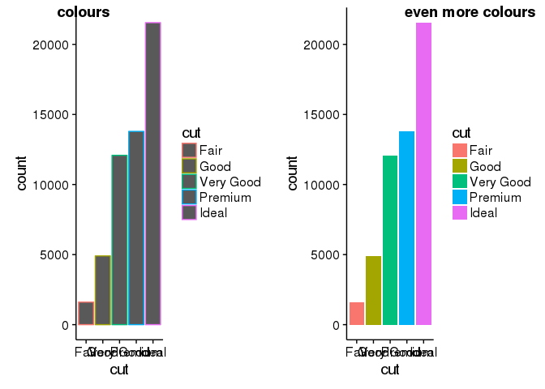
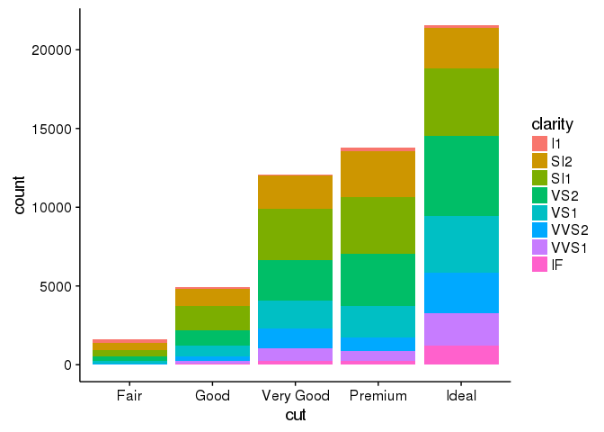
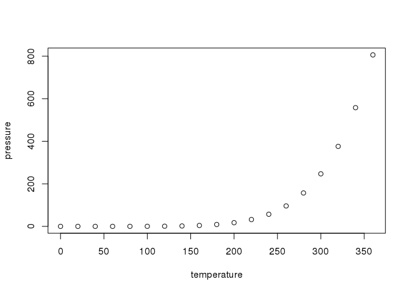

Create visualizations with R
================
Marc A.T.eunis, adapted from R for Data Science by Hadley Wickam
2-1-2017

**This text was reproduced and adapted from "R for Data Science" by Hadley Wickam, 2016**

First steps
-----------

Let's use our first graph to answer a question: Do cars with big engines use more fuel than cars with small engines? You probably already have an answer, but try to make your answer precise. What does the relationship between engine size and fuel efficiency look like? Is it positive? Negative? Linear? Nonlinear?

### The `mpg` data frame

You can test your answer with the `mpg` **data frame** found in ggplot2 (aka `ggplot2::mpg`). A data frame is a rectangular collection of variables (in the columns) and observations (in the rows). `mpg` contains observations collected by the US Environment Protection Agency on 38 models of cars.

``` r
library(tidyverse)
```

    ## Loading tidyverse: ggplot2
    ## Loading tidyverse: tibble
    ## Loading tidyverse: tidyr
    ## Loading tidyverse: readr
    ## Loading tidyverse: purrr
    ## Loading tidyverse: dplyr

    ## Conflicts with tidy packages ----------------------------------------------

    ## filter(): dplyr, stats
    ## lag():    dplyr, stats

``` r
mpg
```

    ## # A tibble: 234 × 11
    ##    manufacturer      model displ  year   cyl      trans   drv   cty   hwy
    ##           <chr>      <chr> <dbl> <int> <int>      <chr> <chr> <int> <int>
    ## 1          audi         a4   1.8  1999     4   auto(l5)     f    18    29
    ## 2          audi         a4   1.8  1999     4 manual(m5)     f    21    29
    ## 3          audi         a4   2.0  2008     4 manual(m6)     f    20    31
    ## 4          audi         a4   2.0  2008     4   auto(av)     f    21    30
    ## 5          audi         a4   2.8  1999     6   auto(l5)     f    16    26
    ## 6          audi         a4   2.8  1999     6 manual(m5)     f    18    26
    ## 7          audi         a4   3.1  2008     6   auto(av)     f    18    27
    ## 8          audi a4 quattro   1.8  1999     4 manual(m5)     4    18    26
    ## 9          audi a4 quattro   1.8  1999     4   auto(l5)     4    16    25
    ## 10         audi a4 quattro   2.0  2008     4 manual(m6)     4    20    28
    ## # ... with 224 more rows, and 2 more variables: fl <chr>, class <chr>

Among the variables in `mpg` are:

1.  `displ`, a car's engine size (**displacement**), in litres.

2.  `hwy`, a car's fuel efficiency on the highway, in miles per gallon (mpg).

A car with a low fuel efficiency consumes more fuel than a car with a high fuel efficiency when they travel the same distance.

To learn more about `mpg`, open its help page by running `?mpg`.

### Creating a ggplot

To plot `mpg`, run this code to put `displ` on the x-axis and `hwy` on the y-axis:

``` r
ggplot(data = mpg) + 
  geom_point(mapping = aes(x = displ, y = hwy))
```


The plot shows a negative relationship between engine size (`displ`) and fuel efficiency (`hwy`).

With ggplot2, you begin a plot with the function `ggplot()`. `ggplot()` creates a coordinate system that you can add layers to. The first argument of `ggplot()` is the dataset to use in the graph.

You complete your graph by adding one or more layers to `ggplot()`. The function `geom_point()` adds a layer of points to your plot, which creates a scatterplot. ggplot2 comes with many geom functions that each add a different type of layer to a plot. Each geom function in ggplot2 takes a `mapping` argument. This defines how variables in your dataset are mapped to visual properties. The `mapping` argument is always paired with `aes()`, and the `x` and `y` arguments of `aes()` specify which variables to map to the x and y axes. ggplot2 looks for the mapped variable in the `data` argument, in this case, `mpg`.

### A graphing template

Let's turn this code into a reusable template for making graphs with ggplot2. To make a graph, replace the bracketed sections in the code below with a dataset, a geom function, or a collection of mappings.

``` r
ggplot(data = <DATA>) + 
  <GEOM_FUNCTION>(mapping = aes(<MAPPINGS>))
```

We will extend this template to make different types of graphs. Let's start with the `<MAPPINGS>` component.

### Exercises

1.  Run `ggplot(data = mpg)` what do you see?

2.  How many rows are in `mtcars`? How many columns?

3.  What does the `drv` variable describe? Read the help for `?mpg` to find out.

4.  Make a scatterplot of `hwy` vs `cyl`.

5.  What happens if you make a scatterplot of `class` vs `drv`. Why is the plot not useful?

Aesthetic mappings
------------------

In the plot below, one group of points (highlighted in red) seems to fall outside of the linear trend. These cars have a higher mileage than you might expect. How can you explain these cars?


Let's hypothesize that the cars are hybrids. One way to test this hypothesis is to look at the `class` value for each car. The `class` variable of the `mpg` dataset classifies cars into groups such as compact, midsize, and SUV. If the outlying points are hybrids, they should be classified as compact cars or, perhaps, subcompact cars (keep in mind that this data was collected before hybrid trucks and SUVs became popular).

You can add a third variable, like `class`, to a two dimensional scatterplot by mapping it to an **aesthetic**. An aesthetic is a visual property of the objects in your plot. Aesthetics include things like the size, the shape, or the color of your points. You can display a point (like the one below) in different ways by changing the values of its aesthetic properties. Since we already use the word "value" to describe data, let's use the word "level" to describe aesthetic properties. Here we change the levels of a point's size, shape, and color to make the point small, triangular, or blue:


You can convey information about your data by mapping the aesthetics in your plot to the variables in your dataset. For example, you can map the colors of your points to the `class` variable to reveal the class of each car.

``` r
ggplot(data = mpg) + 
  geom_point(mapping = aes(x = displ, y = hwy, color = class))
```


To map an aesthetic to a variable, associate the name of the aesthetic to the name of the variable inside `aes()`. ggplot2 will automatically assign a unique level of the aesthetic (here a unique color) to each unique value of the variable, a process known as **scaling**. ggplot2 will also add a legend that explains which levels correspond to which values.

The colors reveal that many of the unusual points are two-seater cars. These cars don't seem like hybrids, and are, in fact, sports cars! Sports cars have large engines like SUVs and pickup trucks, but small bodies like midsize and compact cars, which improves their gas mileage. In hindsight, these cars were unlikely to be hybrids since hybrids have smaller engine sizes.

In the above example, we mapped `class` to the color aesthetic, but we could have mapped `class` to the size aesthetic in the same way. In this case, the exact size of each point would reveal its class affiliation. We get a *warning* here, because mapping an unordered variable (`class`) to an ordered aesthetic (`size`) is not a good idea.

``` r
ggplot(data = mpg) + 
  geom_point(mapping = aes(x = displ, y = hwy, size = class))
```

    ## Warning: Using size for a discrete variable is not advised.


Or we could have mapped `class` to the *alpha* aesthetic, which controls the transparency of the points, or the shape of the points.

``` r
# class as colour shades with setting alpha 
alpha <- ggplot(data = mpg) + 
  geom_point(mapping = aes(x = displ, y = hwy, alpha = class))

# class as shapes
shape <- ggplot(data = mpg) + 
  geom_point(mapping = aes(x = displ, y = hwy, shape = class))

library(cowplot)
```

    ## 
    ## Attaching package: 'cowplot'

    ## The following object is masked from 'package:ggplot2':
    ## 
    ##     ggsave

``` r
panel <- cowplot::plot_grid(alpha, shape, labels = c("alpha", "shape"), hjust = -3.0)

panel
```


What happened to the SUVs? ggplot2 will only use six shapes at a time. By default, additional groups will go unplotted when you use the shape aesthetic.

For each aesthetic, you use `aes()` to associate the name of the aesthetic with a variable to display. The `aes()` function gathers together each of the aesthetic mappings used by a layer and passes them to the layer's mapping argument. The syntax highlights a useful insight about `x` and `y`: the x and y locations of a point are themselves aesthetics, visual properties that you can map to variables to display information about the data.

Once you map an aesthetic, ggplot2 takes care of the rest. It selects a reasonable scale to use with the aesthetic, and it constructs a legend that explains the mapping between levels and values. For x and y aesthetics, ggplot2 does not create a legend, but it creates an axis line with tick marks and a label. The axis line acts as a legend; it explains the mapping between locations and values.

You can also *set* the aesthetic properties of your geom manually. For example, we can make all of the points in our plot blue and an open triangle (see shapes below):

``` r
ggplot(data = mpg) + 
  geom_point(mapping = aes(x = displ, y = hwy), color = "blue", shape = 24)
```


Here, the color doesn't convey information about a variable, but only changes the appearance of the plot.

You'll need to pick a value that makes sense for that aesthetic:

-   The name of a color as a character string.

-   The size of a point in mm.

-   The shape of a point as a number, as shown below:


<p class="caption">
R has 25 built in shapes that are identified by numbers. There are some seeming duplicates: for example, 0, 15, and 22 are all squares. The difference comes from the interaction of the `colour` and `fill` aesthetics. The hollow shapes (0--14) have a border determined by `colour`; the solid shapes (15--18) are filled with `colour`; the filled shapes (21--24) have a border of `colour` and are filled with `fill`.
</p>

Common problems
---------------

As you start to run R code, you're likely to run into problems. Don't worry --- it happens to everyone. I have been writing R code for years, and every day I still write code that doesn't work!

Start by carefully comparing the code that you're running to the code in the book. R is extremely picky, and a misplaced character can make all the difference. Make sure that every `(` is matched with a `)` and every `"` is paired with another `"`. Sometimes you'll run the code and nothing happens. Check the left-hand of your console: if it's a `+`, it means that R doesn't think you've typed a complete expression and it's waiting for you to finish it. In this case, it's usually easy to start from scratch again by pressing ESCAPE to abort processing the current command.

One common problem when creating ggplot2 graphics is to put the `+` in the wrong place: it has to come at the end of the line, not the start. In other words, make sure you haven't accidentally written code like this:

``` r
ggplot(data = mpg) 
+ geom_point(mapping = aes(x = displ, y = hwy))
```

If you're still stuck, try the help. You can get help about any R function by running `?function_name`, skip down to the examples and look for code that matches what you're trying to do.

Another great tool is Google: trying googling the error message, as it's likely someone else has had the same problem, and has gotten help online.

Facets
------

One way to add additional variables is with aesthetics. Another way, particularly useful for categorical variables, is to split your plot into **facets**, subplots that each display one subset of the data.

To facet your plot by a single variable, use `facet_wrap()`. The first argument of `facet_wrap()` should be a formula, which you create with `~` followed by a variable name (here "formula" is the name of a data structure in R, not a synonym for "equation"). The variable that you pass to `facet_wrap()` should be discrete.

``` r
ggplot(data = mpg) + 
  geom_point(mapping = aes(x = displ, y = hwy)) + 
  facet_wrap(~ class, nrow = 2)
```


To facet your plot on the combination of two variables, add `facet_grid()` to your plot call. The first argument of `facet_grid()` is also a formula. This time the formula should contain two variable names separated by a `~`.

``` r
ggplot(data = mpg) + 
  geom_point(mapping = aes(x = displ, y = hwy)) + 
  facet_grid(drv ~ cyl)
```


If you prefer to not facet in the rows or columns dimension, use a `.` instead of a variable name, e.g. `+ facet_grid(. ~ cyl)`.

    ```r
    ggplot(data = mpg) + 
      geom_point(mapping = aes(x = drv, y = cyl))
    ```


    ```r
    ggplot(data = mpg) + 
      geom_point(mapping = aes(x = displ, y = hwy)) + 
      facet_wrap(~ class, nrow = 2)
    ```

    What are the advantages to using faceting instead of the colour aesthetic?
    What are the disadvantages? How might the balance change if you had a 
    larger dataset?

Geometric objects
-----------------

How are these two plots similar?


Grammar of Graphics
-------------------

Both plots contain the same x variable, the same y variable, and both describe the same data. But the plots are not identical. Each plot uses a different visual object to represent the data. In ggplot2 syntax, we say that they use different **geoms**.

A **geom** is the geometrical object that a plot uses to represent data. People often describe plots by the type of geom that the plot uses. For example, bar charts use bar geoms, line charts use line geoms, boxplots use boxplot geoms, and so on. Scatterplots break the trend; they use the point geom. As we see above, you can use different geoms to plot the same data. The plot on the left uses the point geom, and the plot on the right uses the smooth geom, a smooth line fitted to the data.

Every geom function in ggplot2 takes a `mapping` argument. However, not every aesthetic works with every geom. You could set the shape of a point, but you couldn't set the "shape" of a line. On the other hand, you *could* set the linetype of a line. `geom_smooth()` will draw a different line, with a different linetype, for each unique value of the variable that you map to linetype.

``` r
ggplot(data = mpg) + 
  geom_smooth(mapping = aes(x = displ, y = hwy, linetype = drv))
```


Here `geom_smooth()` separates the cars into three lines based on their `drv` value, which describes a car's drivetrain. One line describes all of the points with a `4` value, one line describes all of the points with an `f` value, and one line describes all of the points with an `r` value. Here, `4` stands for four-wheel drive, `f` for front-wheel drive, and `r` for rear-wheel drive.

If this sounds strange, we can make it more clear by overlaying the lines on top of the raw data and then coloring everything according to `drv`.


Notice that this plot contains three geoms in the same graph! If this makes you excited, buckle up. In the next section, we will learn how to place multiple geoms in the same plot.

ggplot2 provides over 30 geoms, and extension packages provide even more (see <https://www.ggplot2-exts.org> for a sampling). The best way to get a comprehensive overview is the ggplot2 cheatsheet, which you can find at <http://rstudio.com/cheatsheets>. To learn more about any single geom, use help: `?geom_smooth`.

To display multiple geoms in the same plot, add multiple geom functions to `ggplot()`:

``` r
ggplot(data = mpg, mapping = aes(x = displ, y = hwy)) + 
  geom_point() + 
  geom_smooth()

# note the mapping of the aes in ggplot here. We can do individual mapping to the geoms seperately but in this way we save typing and increase readibility of the code.
```

If you place mappings in a geom function, ggplot2 will treat them as local mappings for the layer. It will use these mappings to extend or overwrite the global mappings *for that layer only*. This makes it possible to display different aesthetics in different layers.

``` r
ggplot(data = mpg, mapping = aes(x = displ, y = hwy)) + 
  geom_point(mapping = aes(color = class)) + 
  geom_smooth()
```


You can use the same idea to specify different `data` for each layer. Here, our smooth line displays just a subset of the `mpg` dataset, the subcompact cars. The local data argument in `geom_smooth()` overrides the global data argument in `ggplot()` for that layer only.

``` r
ggplot(data = mpg, mapping = aes(x = displ, y = hwy)) + 
  geom_point(mapping = aes(color = class)) + 
  geom_smooth(data = filter(mpg, class == "subcompact"), se = FALSE)
```


(You'll learn how `filter()` works in the next chapter: for now, just know that this command selects only the subcompact cars.)

Statistical transformations
---------------------------

Next, let's take a look at a bar chart. Bar charts seem simple, but they are interesting because they reveal something subtle about plots. Consider a basic bar chart, as drawn with `geom_bar()`. The following chart displays the total number of diamonds in the `diamonds` dataset, grouped by `cut`. The `diamonds` dataset comes in ggplot2 and contains information about ~54,000 diamonds, including the `price`, `carat`, `color`, `clarity`, and `cut` of each diamond. The chart shows that more diamonds are available with high quality cuts than with low quality cuts.

``` r
ggplot(data = diamonds) + 
  geom_bar(mapping = aes(x = cut))
```


On the x-axis, the chart displays `cut`, a variable from `diamonds`. On the y-axis, it displays count, but count is not a variable in `diamonds`! Where does count come from? Many graphs, like scatterplots, plot the raw values of your dataset. Other graphs, like bar charts, calculate new values to plot:

-   bar charts, histograms, and frequency polygons bin your data and then plot bin counts, the number of points that fall in each bin.

-   smoothers fit a model to your data and then plot predictions from the model.

-   boxplots compute a robust summary of the distribution and then display a specially formatted box.

ggplot2 provides over 20 stats for you to use. Each stat is a function, so you can get help in usual way, e.g. `?stat_bin`. To see a complete list of stats, try the ggplot2 cheatsheet.

Position adjustments
--------------------

There's one more piece of magic associated with bar charts. You can colour a bar chart using either the `colour` aesthetic, or more usefully, `fill`:

``` r
colours <- ggplot(data = diamonds) + 
  geom_bar(mapping = aes(x = cut, colour = cut))

more_colours <- ggplot(data = diamonds) + 
  geom_bar(mapping = aes(x = cut, fill = cut))

panel3 <- cowplot::plot_grid(colours, more_colours, labels = c("colours", 
"even more colours"), hjust = -1)

panel3
```



Note what happens if you map the fill aesthetic to another variable, like `clarity`: the bars are automatically stacked. Each colored rectangle represents a combination of `cut` and `clarity`.

``` r
ggplot(data = diamonds) + 
  geom_bar(mapping = aes(x = cut, fill = clarity))
```



The stacking is performed automatically by the **position adjustment** specified by the `position` argument. If you don't want a stacked bar chart, you can use one of three other options: `"identity"`, `"dodge"` or `"fill"`.

-   `position = "identity"` will place each object exactly where it falls in the context of the graph. This is not very useful for bars, because it overlaps them. To see that overlapping we either need to make the bars slightly transparent by setting `alpha` to a small value, or completely transparent by setting `fill = NA`.

``` r
  stacked <- ggplot(data = diamonds, mapping = aes(x = cut, fill = clarity)) + 
      geom_bar(alpha = 1/5, position = "identity")
  
  stacked_not_filled <- ggplot(data = diamonds, mapping = aes(x = cut, colour = clarity)) + 
      geom_bar(fill = NA, position = "identity")
    
cowplot::plot_grid(stacked, stacked_not_filled)    
```


    The identity position adjustment is more useful for 2d geoms, like points,
    where it is the default.

-   `position = "fill"` works like stacking, but makes each set of stacked bars the same height. This makes it easier to compare proportions across groups.

    ``` r
    ggplot(data = diamonds) + 
      geom_bar(mapping = aes(x = cut, fill = clarity), position = "fill")
    ```

    

-   `position = "dodge"` places overlapping objects directly *beside* one another. This makes it easier to compare individual values.

    ``` r
    ggplot(data = diamonds) + 
      geom_bar(mapping = aes(x = cut, fill = clarity), position = "dodge")
    ```

    

There's one other type of adjustment that's not useful for bar charts, but it can be very useful for scatterplots. Recall our first scatterplot. Did you notice that the plot displays only 126 points, even though there are 234 observations in the dataset?


The values of `hwy` and `displ` are rounded so the points appear on a grid and many points overlap each other. This problem is known as **overplotting**. This arrangement makes it hard to see where the mass of the data is. Are the data points spread equally throughout the graph, or is there one special combination of `hwy` and `displ` that contains 109 values?

You can avoid this gridding by setting the position adjustment to "jitter". `position = "jitter"` adds a small amount of random noise to each point. This spreads the points out because no two points are likely to receive the same amount of random noise.

``` r
ggplot(data = mpg) + 
  geom_point(mapping = aes(x = displ, y = hwy), position = "jitter")
```


Adding randomness seems like a strange way to improve your plot, but while it makes your graph less accurate at small scales, it makes your graph *more* revealing at large scales. Because this is such a useful operation, ggplot2 comes with a shorthand for `geom_point(position = "jitter")`: `geom_jitter()`.

To learn more about a position adjustment, look up the help page associated with each adjustment: `?position_dodge`, `?position_fill`, `?position_identity`, `?position_jitter`, and `?position_stack`.

The layered grammar of graphics
-------------------------------

In the previous sections, you learned much more than how to make scatterplots, bar charts, and boxplots. You learned a foundation that you can use to make *any* type of plot with ggplot2. To see this, let's add position adjustments, stats, coordinate systems, and faceting to our code template:

    ggplot(data = <DATA>) + 
      <GEOM_FUNCTION>(
         mapping = aes(<MAPPINGS>),
         stat = <STAT>, 
         position = <POSITION>
      ) +
      <COORDINATE_FUNCTION> +
      <FACET_FUNCTION>

Our new template takes seven parameters, the bracketed words that appear in the template. In practice, you rarely need to supply all seven parameters to make a graph because ggplot2 will provide useful defaults for everything except the data, the mappings, and the geom function.

The seven parameters in the template compose the grammar of graphics, a formal system for building plots. The grammar of graphics is based on the insight that you can uniquely describe *any* plot as a combination of a dataset, a geom, a set of mappings, a stat, a position adjustment, a coordinate system, and a faceting scheme.

To see how this works, consider how you could build a basic plot from scratch: you could start with a dataset and then transform it into the information that you want to display (with a stat).

R Markdown
----------

This is an R Markdown document. Markdown is a simple formatting syntax for authoring HTML, PDF, and MS Word documents. For more details on using R Markdown see <http://rmarkdown.rstudio.com>.

When you click the **Knit** button a document will be generated that includes both content as well as the output of any embedded R code chunks within the document. You can embed an R code chunk like this:

``` r
summary(cars)
```

    ##      speed           dist       
    ##  Min.   : 4.0   Min.   :  2.00  
    ##  1st Qu.:12.0   1st Qu.: 26.00  
    ##  Median :15.0   Median : 36.00  
    ##  Mean   :15.4   Mean   : 42.98  
    ##  3rd Qu.:19.0   3rd Qu.: 56.00  
    ##  Max.   :25.0   Max.   :120.00

Including Plots
---------------

You can also embed plots, for example:



Note that the `echo = FALSE` parameter was added to the code chunk to prevent printing of the R code that generated the plot.
