Data analysis using R and Cloud Computing
================
Marc A.T. Teunis
2017-01-04

Let's look a an R plot example first before doing anything else: The code below will reproduce the circos plot in the presentation.

``` r
## to call this plot run
## this line without the 2 ##:
source(paste0(root, "/code/circos_example.R"))
```

### **Important note: R is case-sensitive, meaning that it will matter whether you use capital or lower case, keep this in mind if you get a cryptic warning or error!**

########################################################## 

Getting Started
===============

########################################################## 

How to run the code in the tutorial below?
==========================================

This document contains code chunks that start with

```` ```{r, .....options......} ````

and end with

```` ``` ```` These so called code chunks contain R code that does something: for example: calculate the mean of 100 random numbers between 0 and 50. Without running the code, can you guess what the mean will approximately be?

``` r
set.seed(seed = 10)
numbers <- runif(100, min = 0, max = 50)
mean_numbers <- mean(numbers)

mean_df <- as.data.frame(numbers)

## create histogram of object "numbers"
library(ggplot2)
g <- ggplot(data = mean_df, mapping = aes(x = numbers))
plot <- g + geom_histogram(color = "green")
plot
```

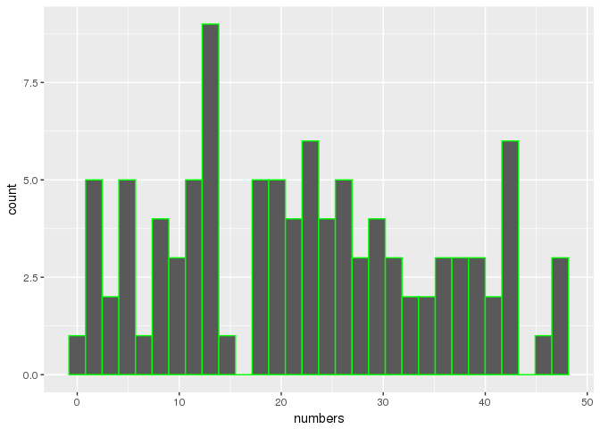 What happens if we would increase the number of random numbers? What value would we get for the mean? Give it a try!

Run a code chucks as follows: place the cursor somewhere in a code chunk and between the ```` ```{r} ```` and the ```` ``` ```` and press the keys:

`Ctrl` `Shift` and `Enter` simultaneously.

The code will run and the results will show either in the console, or below the code chunk.

Run a line of code as follows: place the cursor somewhere on the line that you want to run. press the keys:

`Cntrl` and `Enter` simultaneously.

You can also run a piece of code by selecting the code by dragging the cursor and left-click mouse, and entering:

`Cntrl` and `Enter` simultaneously.

**Try running the code chunck above to see if your guess of the mean was right. Now change the number of random numbers from 100 to 10000. What happens to the mean? What happends if yopu keep increasing the amount of numbers generated?**

Introduction
============

This walkthrough is part of the workshop "Data Analysis using R and Cloud Computing". The workshop is meant as an introduction to R and to be able to use R for data exploration on your own data, obtained in a research project. It also shows the strngths of using cloud computing in an educational setting.

Cloud server for RStudio
------------------------

During the workshop, we will be using a preinstalled version of the R-IDE (integrated development environment) RStudio. This version runs on a remote server and has all the add-ons that are needed to run the code. You can login with the credentials supplied at the beginning of the workshop.

The advantage of cloud servers is that the users do not need to install anything on their own laptops. They will be able to access the IDE, using their preferred web-browser on their computer. No installation of packages is neccessary.

Contents of the workshop
------------------------

The files needed for this workshop need to be downloaded first. Follow the steps below to get started!

There will be too much in this tutorial to be covered in whole during the workshop. The complete walkthough in this document covers many topic in R. It demonstrates how to run code, write functions, work with data-objects, load in data, clean and summarize data, make visualizations, work with "bigger" data sets and also work with biological data. Too much to cover in so little time, so I will make a selection.

Further reading
---------------

At the end of the document you will get tips on how to proceed (with R if you like). A good start could be to repeat this tutorial in full and at your own pace, after that it will be up to you how you will move foRward.

About this document: Literate programming
-----------------------------------------

This document is an R-markdown document. It is a nice way to create documents containing normal text, code and output of that code together. It is a form of so-called *"Literate Programming"*, which is part of the "Reproducible research" philosophy.

Getting Started
===============

RStudio Server Instance
-----------------------

An RStudio Server Image had been launched on a remote server at Trans.IP (VULTR.com).

To login to this server:
------------------------

login into the rserver with the credentials you recieved upon entering the room: the webaddress is: <https://rserver.innovativetesting.nl>

### Cloning the material from Github.com

1.  Create an account on Github.com
2.  Login in to github.com and go to www.github.com/maddocent/ilc\_r\_workshop
3.  Copy the *clone* link
4.  Start a new project in RStudio-server, choose *"Version Control"*
5.  Let the clone finish

**Follow the steps above first before continuing**
==================================================

Did it work? Please let me know if not.

Installing required packages
----------------------------

Installed packages
------------------

To see all packages that are already installed:

``` r
installed_packages <- installed.packages()
print(as.data.frame(installed_packages))
```

    ##                                                 Package
    ## deSolve                                         deSolve
    ## ggvis                                             ggvis
    ## scatterplot3d                             scatterplot3d
    ## shinythemes                                 shinythemes
    ## teachR                                           teachR
    ## AnnotationDbi                             AnnotationDbi
    ## AnnotationHub                             AnnotationHub
    ## assertthat                                   assertthat
    ## backports                                     backports
    ## base                                               base
    ## base64enc                                     base64enc
    ## BH                                                   BH
    ## bibtex                                           bibtex
    ## Biobase                                         Biobase
    ## BiocGenerics                               BiocGenerics
    ## BiocInstaller                             BiocInstaller
    ## BiocParallel                               BiocParallel
    ## biomaRt                                         biomaRt
    ## Biostrings                                   Biostrings
    ## bitops                                           bitops
    ## boot                                               boot
    ## brew                                               brew
    ## broom                                             broom
    ## BSgenome                                       BSgenome
    ## BSgenome.Hsapiens.UCSC.hg19 BSgenome.Hsapiens.UCSC.hg19
    ## car                                                 car
    ## caTools                                         caTools
    ## circlize                                       circlize
    ## class                                             class
    ## cluster                                         cluster
    ## codetools                                     codetools
    ## colorspace                                   colorspace
    ## compiler                                       compiler
    ## cowplot                                         cowplot
    ## crayon                                           crayon
    ## curl                                               curl
    ## datasets                                       datasets
    ## DBI                                                 DBI
    ## devtools                                       devtools
    ## dichromat                                     dichromat
    ## digest                                           digest
    ## doParallel                                   doParallel
    ## downloader                                   downloader
    ## dplyr                                             dplyr
    ## evaluate                                       evaluate
    ## filehash                                       filehash
    ## forcats                                         forcats
    ## foreach                                         foreach
    ## foreign                                         foreign
    ## formatR                                         formatR
    ## futile.logger                             futile.logger
    ## futile.options                           futile.options
    ## gdata                                             gdata
    ## GenomeInfoDb                               GenomeInfoDb
    ## GenomicAlignments                     GenomicAlignments
    ## GenomicFeatures                         GenomicFeatures
    ## GenomicRanges                             GenomicRanges
    ## ggplot2                                         ggplot2
    ## git2r                                             git2r
    ## GlobalOptions                             GlobalOptions
    ## gplots                                           gplots
    ## graphics                                       graphics
    ## grDevices                                     grDevices
    ## grid                                               grid
    ## gridBase                                       gridBase
    ## gridExtra                                     gridExtra
    ## gtable                                           gtable
    ## gtools                                           gtools
    ## haven                                             haven
    ## highr                                             highr
    ## hms                                                 hms
    ## htmltools                                     htmltools
    ## htmlwidgets                                 htmlwidgets
    ## httpuv                                           httpuv
    ## httr                                               httr
    ## hunspell                                       hunspell
    ## hwriter                                         hwriter
    ## igraph                                           igraph
    ## interactiveDisplayBase           interactiveDisplayBase
    ## IRanges                                         IRanges
    ## irlba                                             irlba
    ## iterators                                     iterators
    ## jsonlite                                       jsonlite
    ## KernSmooth                                   KernSmooth
    ## knitcitations                             knitcitations
    ## knitr                                             knitr
    ## labeling                                       labeling
    ## lambda.r                                       lambda.r
    ## lattice                                         lattice
    ## latticeExtra                               latticeExtra
    ## lazyeval                                       lazyeval
    ## lme4                                               lme4
    ## lubridate                                     lubridate
    ## magrittr                                       magrittr
    ## maps                                               maps
    ## markdown                                       markdown
    ## MASS                                               MASS
    ## Matrix                                           Matrix
    ## MatrixModels                               MatrixModels
    ## memoise                                         memoise
    ## methods                                         methods
    ## mgcv                                               mgcv
    ## mime                                               mime
    ## minqa                                             minqa
    ## mnormt                                           mnormt
    ## modelr                                           modelr
    ## munsell                                         munsell
    ## nlme                                               nlme
    ## nloptr                                           nloptr
    ## NMF                                                 NMF
    ## nnet                                               nnet
    ## openssl                                         openssl
    ## pacman                                           pacman
    ## parallel                                       parallel
    ## pbkrtest                                       pbkrtest
    ## pkgmaker                                       pkgmaker
    ## plogr                                             plogr
    ## plyr                                               plyr
    ## praise                                           praise
    ## psych                                             psych
    ## purrr                                             purrr
    ## quantreg                                       quantreg
    ## R6                                                   R6
    ## RColorBrewer                               RColorBrewer
    ## Rcpp                                               Rcpp
    ## RcppEigen                                     RcppEigen
    ## RCurl                                             RCurl
    ## readr                                             readr
    ## readxl                                           readxl
    ## RefManageR                                   RefManageR
    ## registry                                       registry
    ## reshape2                                       reshape2
    ## rex                                                 rex
    ## RJSONIO                                         RJSONIO
    ## rmarkdown                                     rmarkdown
    ## RNAseqData.HNRNPC.bam.chr14 RNAseqData.HNRNPC.bam.chr14
    ## rngtools                                       rngtools
    ## roxygen2                                       roxygen2
    ## rpart                                             rpart
    ## rprojroot                                     rprojroot
    ## Rsamtools                                     Rsamtools
    ## RSQLite                                         RSQLite
    ## rstudioapi                                   rstudioapi
    ## rtracklayer                                 rtracklayer
    ## rvest                                             rvest
    ## S4Vectors                                     S4Vectors
    ## scales                                           scales
    ## selectr                                         selectr
    ## sequencing                                   sequencing
    ## shape                                             shape
    ## shiny                                             shiny
    ## ShortRead                                     ShortRead
    ## snow                                               snow
    ## sourcetools                                 sourcetools
    ## SparseM                                         SparseM
    ## spatial                                         spatial
    ## splines                                         splines
    ## stats                                             stats
    ## stats4                                           stats4
    ## stringdist                                   stringdist
    ## stringi                                         stringi
    ## stringr                                         stringr
    ## SummarizedExperiment               SummarizedExperiment
    ## survival                                       survival
    ## tcltk                                             tcltk
    ## testit                                           testit
    ## testthat                                       testthat
    ## tibble                                           tibble
    ## tidyr                                             tidyr
    ## tidyverse                                     tidyverse
    ## tools                                             tools
    ## utils                                             utils
    ## VariantAnnotation                     VariantAnnotation
    ## webshot                                         webshot
    ## whisker                                         whisker
    ## withr                                             withr
    ## XML                                                 XML
    ## xml2                                               xml2
    ## xtable                                           xtable
    ## XVector                                         XVector
    ## yaml                                               yaml
    ## zlibbioc                                       zlibbioc
    ##                                                                            LibPath
    ## deSolve                     /home/FNT_ond_01/R/x86_64-redhat-linux-gnu-library/3.3
    ## ggvis                       /home/FNT_ond_01/R/x86_64-redhat-linux-gnu-library/3.3
    ## scatterplot3d               /home/FNT_ond_01/R/x86_64-redhat-linux-gnu-library/3.3
    ## shinythemes                 /home/FNT_ond_01/R/x86_64-redhat-linux-gnu-library/3.3
    ## teachR                      /home/FNT_ond_01/R/x86_64-redhat-linux-gnu-library/3.3
    ## AnnotationDbi                                                 /usr/lib64/R/library
    ## AnnotationHub                                                 /usr/lib64/R/library
    ## assertthat                                                    /usr/lib64/R/library
    ## backports                                                     /usr/lib64/R/library
    ## base                                                          /usr/lib64/R/library
    ## base64enc                                                     /usr/lib64/R/library
    ## BH                                                            /usr/lib64/R/library
    ## bibtex                                                        /usr/lib64/R/library
    ## Biobase                                                       /usr/lib64/R/library
    ## BiocGenerics                                                  /usr/lib64/R/library
    ## BiocInstaller                                                 /usr/lib64/R/library
    ## BiocParallel                                                  /usr/lib64/R/library
    ## biomaRt                                                       /usr/lib64/R/library
    ## Biostrings                                                    /usr/lib64/R/library
    ## bitops                                                        /usr/lib64/R/library
    ## boot                                                          /usr/lib64/R/library
    ## brew                                                          /usr/lib64/R/library
    ## broom                                                         /usr/lib64/R/library
    ## BSgenome                                                      /usr/lib64/R/library
    ## BSgenome.Hsapiens.UCSC.hg19                                   /usr/lib64/R/library
    ## car                                                           /usr/lib64/R/library
    ## caTools                                                       /usr/lib64/R/library
    ## circlize                                                      /usr/lib64/R/library
    ## class                                                         /usr/lib64/R/library
    ## cluster                                                       /usr/lib64/R/library
    ## codetools                                                     /usr/lib64/R/library
    ## colorspace                                                    /usr/lib64/R/library
    ## compiler                                                      /usr/lib64/R/library
    ## cowplot                                                       /usr/lib64/R/library
    ## crayon                                                        /usr/lib64/R/library
    ## curl                                                          /usr/lib64/R/library
    ## datasets                                                      /usr/lib64/R/library
    ## DBI                                                           /usr/lib64/R/library
    ## devtools                                                      /usr/lib64/R/library
    ## dichromat                                                     /usr/lib64/R/library
    ## digest                                                        /usr/lib64/R/library
    ## doParallel                                                    /usr/lib64/R/library
    ## downloader                                                    /usr/lib64/R/library
    ## dplyr                                                         /usr/lib64/R/library
    ## evaluate                                                      /usr/lib64/R/library
    ## filehash                                                      /usr/lib64/R/library
    ## forcats                                                       /usr/lib64/R/library
    ## foreach                                                       /usr/lib64/R/library
    ## foreign                                                       /usr/lib64/R/library
    ## formatR                                                       /usr/lib64/R/library
    ## futile.logger                                                 /usr/lib64/R/library
    ## futile.options                                                /usr/lib64/R/library
    ## gdata                                                         /usr/lib64/R/library
    ## GenomeInfoDb                                                  /usr/lib64/R/library
    ## GenomicAlignments                                             /usr/lib64/R/library
    ## GenomicFeatures                                               /usr/lib64/R/library
    ## GenomicRanges                                                 /usr/lib64/R/library
    ## ggplot2                                                       /usr/lib64/R/library
    ## git2r                                                         /usr/lib64/R/library
    ## GlobalOptions                                                 /usr/lib64/R/library
    ## gplots                                                        /usr/lib64/R/library
    ## graphics                                                      /usr/lib64/R/library
    ## grDevices                                                     /usr/lib64/R/library
    ## grid                                                          /usr/lib64/R/library
    ## gridBase                                                      /usr/lib64/R/library
    ## gridExtra                                                     /usr/lib64/R/library
    ## gtable                                                        /usr/lib64/R/library
    ## gtools                                                        /usr/lib64/R/library
    ## haven                                                         /usr/lib64/R/library
    ## highr                                                         /usr/lib64/R/library
    ## hms                                                           /usr/lib64/R/library
    ## htmltools                                                     /usr/lib64/R/library
    ## htmlwidgets                                                   /usr/lib64/R/library
    ## httpuv                                                        /usr/lib64/R/library
    ## httr                                                          /usr/lib64/R/library
    ## hunspell                                                      /usr/lib64/R/library
    ## hwriter                                                       /usr/lib64/R/library
    ## igraph                                                        /usr/lib64/R/library
    ## interactiveDisplayBase                                        /usr/lib64/R/library
    ## IRanges                                                       /usr/lib64/R/library
    ## irlba                                                         /usr/lib64/R/library
    ## iterators                                                     /usr/lib64/R/library
    ## jsonlite                                                      /usr/lib64/R/library
    ## KernSmooth                                                    /usr/lib64/R/library
    ## knitcitations                                                 /usr/lib64/R/library
    ## knitr                                                         /usr/lib64/R/library
    ## labeling                                                      /usr/lib64/R/library
    ## lambda.r                                                      /usr/lib64/R/library
    ## lattice                                                       /usr/lib64/R/library
    ## latticeExtra                                                  /usr/lib64/R/library
    ## lazyeval                                                      /usr/lib64/R/library
    ## lme4                                                          /usr/lib64/R/library
    ## lubridate                                                     /usr/lib64/R/library
    ## magrittr                                                      /usr/lib64/R/library
    ## maps                                                          /usr/lib64/R/library
    ## markdown                                                      /usr/lib64/R/library
    ## MASS                                                          /usr/lib64/R/library
    ## Matrix                                                        /usr/lib64/R/library
    ## MatrixModels                                                  /usr/lib64/R/library
    ## memoise                                                       /usr/lib64/R/library
    ## methods                                                       /usr/lib64/R/library
    ## mgcv                                                          /usr/lib64/R/library
    ## mime                                                          /usr/lib64/R/library
    ## minqa                                                         /usr/lib64/R/library
    ## mnormt                                                        /usr/lib64/R/library
    ## modelr                                                        /usr/lib64/R/library
    ## munsell                                                       /usr/lib64/R/library
    ## nlme                                                          /usr/lib64/R/library
    ## nloptr                                                        /usr/lib64/R/library
    ## NMF                                                           /usr/lib64/R/library
    ## nnet                                                          /usr/lib64/R/library
    ## openssl                                                       /usr/lib64/R/library
    ## pacman                                                        /usr/lib64/R/library
    ## parallel                                                      /usr/lib64/R/library
    ## pbkrtest                                                      /usr/lib64/R/library
    ## pkgmaker                                                      /usr/lib64/R/library
    ## plogr                                                         /usr/lib64/R/library
    ## plyr                                                          /usr/lib64/R/library
    ## praise                                                        /usr/lib64/R/library
    ## psych                                                         /usr/lib64/R/library
    ## purrr                                                         /usr/lib64/R/library
    ## quantreg                                                      /usr/lib64/R/library
    ## R6                                                            /usr/lib64/R/library
    ## RColorBrewer                                                  /usr/lib64/R/library
    ## Rcpp                                                          /usr/lib64/R/library
    ## RcppEigen                                                     /usr/lib64/R/library
    ## RCurl                                                         /usr/lib64/R/library
    ## readr                                                         /usr/lib64/R/library
    ## readxl                                                        /usr/lib64/R/library
    ## RefManageR                                                    /usr/lib64/R/library
    ## registry                                                      /usr/lib64/R/library
    ## reshape2                                                      /usr/lib64/R/library
    ## rex                                                           /usr/lib64/R/library
    ## RJSONIO                                                       /usr/lib64/R/library
    ## rmarkdown                                                     /usr/lib64/R/library
    ## RNAseqData.HNRNPC.bam.chr14                                   /usr/lib64/R/library
    ## rngtools                                                      /usr/lib64/R/library
    ## roxygen2                                                      /usr/lib64/R/library
    ## rpart                                                         /usr/lib64/R/library
    ## rprojroot                                                     /usr/lib64/R/library
    ## Rsamtools                                                     /usr/lib64/R/library
    ## RSQLite                                                       /usr/lib64/R/library
    ## rstudioapi                                                    /usr/lib64/R/library
    ## rtracklayer                                                   /usr/lib64/R/library
    ## rvest                                                         /usr/lib64/R/library
    ## S4Vectors                                                     /usr/lib64/R/library
    ## scales                                                        /usr/lib64/R/library
    ## selectr                                                       /usr/lib64/R/library
    ## sequencing                                                    /usr/lib64/R/library
    ## shape                                                         /usr/lib64/R/library
    ## shiny                                                         /usr/lib64/R/library
    ## ShortRead                                                     /usr/lib64/R/library
    ## snow                                                          /usr/lib64/R/library
    ## sourcetools                                                   /usr/lib64/R/library
    ## SparseM                                                       /usr/lib64/R/library
    ## spatial                                                       /usr/lib64/R/library
    ## splines                                                       /usr/lib64/R/library
    ## stats                                                         /usr/lib64/R/library
    ## stats4                                                        /usr/lib64/R/library
    ## stringdist                                                    /usr/lib64/R/library
    ## stringi                                                       /usr/lib64/R/library
    ## stringr                                                       /usr/lib64/R/library
    ## SummarizedExperiment                                          /usr/lib64/R/library
    ## survival                                                      /usr/lib64/R/library
    ## tcltk                                                         /usr/lib64/R/library
    ## testit                                                        /usr/lib64/R/library
    ## testthat                                                      /usr/lib64/R/library
    ## tibble                                                        /usr/lib64/R/library
    ## tidyr                                                         /usr/lib64/R/library
    ## tidyverse                                                     /usr/lib64/R/library
    ## tools                                                         /usr/lib64/R/library
    ## utils                                                         /usr/lib64/R/library
    ## VariantAnnotation                                             /usr/lib64/R/library
    ## webshot                                                       /usr/lib64/R/library
    ## whisker                                                       /usr/lib64/R/library
    ## withr                                                         /usr/lib64/R/library
    ## XML                                                           /usr/lib64/R/library
    ## xml2                                                          /usr/lib64/R/library
    ## xtable                                                        /usr/lib64/R/library
    ## XVector                                                       /usr/lib64/R/library
    ## yaml                                                          /usr/lib64/R/library
    ## zlibbioc                                                      /usr/lib64/R/library
    ##                                 Version    Priority
    ## deSolve                            1.14        <NA>
    ## ggvis                             0.4.3        <NA>
    ## scatterplot3d                    0.3-37        <NA>
    ## shinythemes                       1.1.1        <NA>
    ## teachR                              0.1        <NA>
    ## AnnotationDbi                    1.36.0        <NA>
    ## AnnotationHub                     2.6.4        <NA>
    ## assertthat                          0.1        <NA>
    ## backports                         1.0.4        <NA>
    ## base                              3.3.2        base
    ## base64enc                         0.1-3        <NA>
    ## BH                             1.62.0-1        <NA>
    ## bibtex                            0.4.0        <NA>
    ## Biobase                          2.34.0        <NA>
    ## BiocGenerics                     0.20.0        <NA>
    ## BiocInstaller                    1.24.0        <NA>
    ## BiocParallel                      1.8.1        <NA>
    ## biomaRt                          2.30.0        <NA>
    ## Biostrings                       2.42.1        <NA>
    ## bitops                            1.0-6        <NA>
    ## boot                             1.3-18 recommended
    ## brew                              1.0-6        <NA>
    ## broom                             0.4.1        <NA>
    ## BSgenome                         1.42.0        <NA>
    ## BSgenome.Hsapiens.UCSC.hg19       1.4.0        <NA>
    ## car                               2.1-4        <NA>
    ## caTools                          1.17.1        <NA>
    ## circlize                          0.3.9        <NA>
    ## class                            7.3-14 recommended
    ## cluster                           2.0.5 recommended
    ## codetools                        0.2-15 recommended
    ## colorspace                        1.3-2        <NA>
    ## compiler                          3.3.2        base
    ## cowplot                           0.7.0        <NA>
    ## crayon                            1.3.2        <NA>
    ## curl                                2.3        <NA>
    ## datasets                          3.3.2        base
    ## DBI                               0.5-1        <NA>
    ## devtools                         1.12.0        <NA>
    ## dichromat                         2.0-0        <NA>
    ## digest                           0.6.10        <NA>
    ## doParallel                       1.0.10        <NA>
    ## downloader                          0.4        <NA>
    ## dplyr                             0.5.0        <NA>
    ## evaluate                           0.10        <NA>
    ## filehash                            2.3        <NA>
    ## forcats                           0.1.1        <NA>
    ## foreach                           1.4.3        <NA>
    ## foreign                          0.8-67 recommended
    ## formatR                             1.4        <NA>
    ## futile.logger                     1.4.3        <NA>
    ## futile.options                    1.0.0        <NA>
    ## gdata                            2.17.0        <NA>
    ## GenomeInfoDb                     1.10.2        <NA>
    ## GenomicAlignments                1.10.0        <NA>
    ## GenomicFeatures                  1.26.2        <NA>
    ## GenomicRanges                    1.26.1        <NA>
    ## ggplot2                           2.2.0        <NA>
    ## git2r                            0.16.0        <NA>
    ## GlobalOptions                    0.0.10        <NA>
    ## gplots                            3.0.1        <NA>
    ## graphics                          3.3.2        base
    ## grDevices                         3.3.2        base
    ## grid                              3.3.2        base
    ## gridBase                          0.4-7        <NA>
    ## gridExtra                         2.2.1        <NA>
    ## gtable                            0.2.0        <NA>
    ## gtools                            3.5.0        <NA>
    ## haven                             1.0.0        <NA>
    ## highr                               0.6        <NA>
    ## hms                                 0.3        <NA>
    ## htmltools                         0.3.5        <NA>
    ## htmlwidgets                         0.8        <NA>
    ## httpuv                            1.3.3        <NA>
    ## httr                              1.2.1        <NA>
    ## hunspell                            2.3        <NA>
    ## hwriter                           1.3.2        <NA>
    ## igraph                            1.0.1        <NA>
    ## interactiveDisplayBase           1.12.0        <NA>
    ## IRanges                           2.8.1        <NA>
    ## irlba                             2.1.2        <NA>
    ## iterators                         1.0.8        <NA>
    ## jsonlite                            1.1        <NA>
    ## KernSmooth                      2.23-15 recommended
    ## knitcitations                     1.0.7        <NA>
    ## knitr                            1.15.1        <NA>
    ## labeling                            0.3        <NA>
    ## lambda.r                          1.1.9        <NA>
    ## lattice                         0.20-34 recommended
    ## latticeExtra                     0.6-28        <NA>
    ## lazyeval                          0.2.0        <NA>
    ## lme4                             1.1-12        <NA>
    ## lubridate                         1.6.0        <NA>
    ## magrittr                            1.5        <NA>
    ## maps                              3.1.1        <NA>
    ## markdown                          0.7.7        <NA>
    ## MASS                             7.3-45 recommended
    ## Matrix                          1.2-7.1 recommended
    ## MatrixModels                      0.4-1        <NA>
    ## memoise                           1.0.0        <NA>
    ## methods                           3.3.2        base
    ## mgcv                             1.8-15 recommended
    ## mime                                0.5        <NA>
    ## minqa                             1.2.4        <NA>
    ## mnormt                            1.5-5        <NA>
    ## modelr                            0.1.0        <NA>
    ## munsell                           0.4.3        <NA>
    ## nlme                            3.1-128 recommended
    ## nloptr                            1.0.4        <NA>
    ## NMF                              0.20.6        <NA>
    ## nnet                             7.3-12 recommended
    ## openssl                           0.9.5        <NA>
    ## pacman                            0.4.1        <NA>
    ## parallel                          3.3.2        base
    ## pbkrtest                          0.4-6        <NA>
    ## pkgmaker                           0.22        <NA>
    ## plogr                             0.1-1        <NA>
    ## plyr                              1.8.4        <NA>
    ## praise                            1.0.0        <NA>
    ## psych                             1.6.9        <NA>
    ## purrr                             0.2.2        <NA>
    ## quantreg                           5.29        <NA>
    ## R6                                2.2.0        <NA>
    ## RColorBrewer                      1.1-2        <NA>
    ## Rcpp                             0.12.8        <NA>
    ## RcppEigen                     0.3.2.9.0        <NA>
    ## RCurl                          1.95-4.8        <NA>
    ## readr                             1.0.0        <NA>
    ## readxl                            0.1.1        <NA>
    ## RefManageR                       0.13.1        <NA>
    ## registry                            0.3        <NA>
    ## reshape2                          1.4.2        <NA>
    ## rex                               1.1.1        <NA>
    ## RJSONIO                           1.3-0        <NA>
    ## rmarkdown                           1.3        <NA>
    ## RNAseqData.HNRNPC.bam.chr14      0.12.0        <NA>
    ## rngtools                          1.2.4        <NA>
    ## roxygen2                          5.0.1        <NA>
    ## rpart                            4.1-10 recommended
    ## rprojroot                           1.1        <NA>
    ## Rsamtools                        1.26.1        <NA>
    ## RSQLite                           1.1-1        <NA>
    ## rstudioapi                          0.6        <NA>
    ## rtracklayer                      1.34.1        <NA>
    ## rvest                             0.3.2        <NA>
    ## S4Vectors                        0.12.1        <NA>
    ## scales                            0.4.1        <NA>
    ## selectr                           0.3-1        <NA>
    ## sequencing                  0.99.120890        <NA>
    ## shape                             1.4.2        <NA>
    ## shiny                            0.14.2        <NA>
    ## ShortRead                        1.32.0        <NA>
    ## snow                              0.4-2        <NA>
    ## sourcetools                       0.1.5        <NA>
    ## SparseM                            1.74        <NA>
    ## spatial                          7.3-11 recommended
    ## splines                           3.3.2        base
    ## stats                             3.3.2        base
    ## stats4                            3.3.2        base
    ## stringdist                      0.9.4.4        <NA>
    ## stringi                           1.1.2        <NA>
    ## stringr                           1.1.0        <NA>
    ## SummarizedExperiment              1.4.0        <NA>
    ## survival                         2.39-5 recommended
    ## tcltk                             3.3.2        base
    ## testit                              0.6        <NA>
    ## testthat                          1.0.2        <NA>
    ## tibble                              1.2        <NA>
    ## tidyr                             0.6.0        <NA>
    ## tidyverse                         1.0.0        <NA>
    ## tools                             3.3.2        base
    ## utils                             3.3.2        base
    ## VariantAnnotation                1.20.2        <NA>
    ## webshot                           0.3.2        <NA>
    ## whisker                           0.3-2        <NA>
    ## withr                             1.0.2        <NA>
    ## XML                            3.98-1.5        <NA>
    ## xml2                              1.0.0        <NA>
    ## xtable                            1.8-2        <NA>
    ## XVector                          0.14.0        <NA>
    ## yaml                             2.1.14        <NA>
    ## zlibbioc                         1.20.0        <NA>
    ##                                                                                                                                                                                                                                                        Depends
    ## deSolve                                                                                                                                                                                                                                          R (>= 2.15.0)
    ## ggvis                                                                                                                                                                                                                                               R (>= 3.0)
    ## scatterplot3d                                                                                                                                                                                                                                     R (>= 2.7.0)
    ## shinythemes                                                                                                                                                                                                                                       R (>= 3.0.0)
    ## teachR                                                                                                                                                                                                                                                    <NA>
    ## AnnotationDbi                                                                                                                                                   R (>= 2.7.0), methods, utils, stats4, BiocGenerics (>=\n0.15.10), Biobase (>= 1.17.0), IRanges
    ## AnnotationHub                                                                                                                                                                                                                        BiocGenerics (>= 0.15.10)
    ## assertthat                                                                                                                                                                                                                                                <NA>
    ## backports                                                                                                                                                                                                                                         R (>= 3.0.0)
    ## base                                                                                                                                                                                                                                                      <NA>
    ## base64enc                                                                                                                                                                                                                                         R (>= 2.9.0)
    ## BH                                                                                                                                                                                                                                                        <NA>
    ## bibtex                                                                                                                                                                                                                                            R (>= 3.0.2)
    ## Biobase                                                                                                                                                                                                            R (>= 2.10), BiocGenerics (>= 0.3.2), utils
    ## BiocGenerics                                                                                                                                                                                                         methods, utils, graphics, stats, parallel
    ## BiocInstaller                                                                                                                                                                                                                                     R (>= 3.3.0)
    ## BiocParallel                                                                                                                                                                                                                                           methods
    ## biomaRt                                                                                                                                                                                                                                                methods
    ## Biostrings                                                                                                                                   R (>= 2.8.0), methods, BiocGenerics (>= 0.15.6), S4Vectors (>=\n0.11.1), IRanges (>= 2.5.27), XVector (>= 0.11.6)
    ## bitops                                                                                                                                                                                                                                                    <NA>
    ## boot                                                                                                                                                                                                                             R (>= 3.0.0), graphics, stats
    ## brew                                                                                                                                                                                                                                                      <NA>
    ## broom                                                                                                                                                                                                                                                     <NA>
    ## BSgenome                                                 R (>= 2.8.0), methods, BiocGenerics (>= 0.13.8), S4Vectors (>=\n0.9.36), IRanges (>= 2.1.33), GenomeInfoDb (>= 1.3.19),\nGenomicRanges (>= 1.23.15), Biostrings (>= 2.35.3), rtracklayer\n(>= 1.25.8)
    ## BSgenome.Hsapiens.UCSC.hg19                                                                                                                                                                                                               BSgenome (>= 1.33.5)
    ## car                                                                                                                                                                                                                                               R (>= 3.2.0)
    ## caTools                                                                                                                                                                                                                                           R (>= 2.2.0)
    ## circlize                                                                                                                                                                                                                               R (>= 2.10.0), graphics
    ## class                                                                                                                                                                                                                               R (>= 3.0.0), stats, utils
    ## cluster                                                                                                                                                                                                                                           R (>= 3.0.1)
    ## codetools                                                                                                                                                                                                                                           R (>= 2.1)
    ## colorspace                                                                                                                                                                                                                              R (>= 2.13.0), methods
    ## compiler                                                                                                                                                                                                                                                  <NA>
    ## cowplot                                                                                                                                                                                                                      R (>= 3.3.0), ggplot2 (>= 2.1.0),
    ## crayon                                                                                                                                                                                                                                                    <NA>
    ## curl                                                                                                                                                                                                                                              R (>= 3.0.0)
    ## datasets                                                                                                                                                                                                                                                  <NA>
    ## DBI                                                                                                                                                                                                                                     R (>= 2.15.0), methods
    ## devtools                                                                                                                                                                                                                                          R (>= 3.0.2)
    ## dichromat                                                                                                                                                                                                                                   R (>= 2.10), stats
    ## digest                                                                                                                                                                                                                                            R (>= 2.4.1)
    ## doParallel                                                                                                                                                                             R (>= 2.14.0), foreach(>= 1.2.0), iterators(>= 1.0.0),\nparallel, utils
    ## downloader                                                                                                                                                                                                                                                <NA>
    ## dplyr                                                                                                                                                                                                                                             R (>= 3.1.2)
    ## evaluate                                                                                                                                                                                                                                          R (>= 3.0.2)
    ## filehash                                                                                                                                                                                                                                 R (>= 3.0.0), methods
    ## forcats                                                                                                                                                                                                                                            R (>= 2.10)
    ## foreach                                                                                                                                                                                                                                           R (>= 2.5.0)
    ## foreign                                                                                                                                                                                                                                           R (>= 3.0.0)
    ## formatR                                                                                                                                                                                                                                           R (>= 3.0.2)
    ## futile.logger                                                                                                                                                                                                                                     R (>= 3.0.0)
    ## futile.options                                                                                                                                                                                                                                    R (>= 2.8.0)
    ## gdata                                                                                                                                                                                                                                             R (>= 2.3.0)
    ## GenomeInfoDb                                                                                                                                                       R (>= 3.1), methods, BiocGenerics (>= 0.13.8), S4Vectors (>=\n0.9.25), IRanges (>= 1.99.26)
    ## GenomicAlignments           R (>= 2.10), methods, BiocGenerics (>= 0.15.3), S4Vectors (>=\n0.9.40), IRanges (>= 2.5.36), GenomeInfoDb (>= 1.1.20),\nGenomicRanges (>= 1.25.6), SummarizedExperiment (>= 0.3.1),\nBiostrings (>= 2.37.1), Rsamtools (>= 1.21.4)
    ## GenomicFeatures                                                                                        BiocGenerics (>= 0.1.0), S4Vectors (>= 0.9.47), IRanges (>=\n2.3.21), GenomeInfoDb (>= 1.5.16), GenomicRanges (>= 1.21.32),\nAnnotationDbi (>= 1.33.15)
    ## GenomicRanges                                                                                                                    R (>= 2.10), methods, stats4, BiocGenerics (>= 0.17.5),\nS4Vectors (>= 0.9.47), IRanges (>= 2.7.8), GenomeInfoDb (>=\n1.1.20)
    ## ggplot2                                                                                                                                                                                                                                             R (>= 3.1)
    ## git2r                                                                                                                                                                                                                                    R (>= 3.0.2), methods
    ## GlobalOptions                                                                                                                                                                                                                           R (>= 2.10.0), methods
    ## gplots                                                                                                                                                                                                                                              R (>= 3.0)
    ## graphics                                                                                                                                                                                                                                                  <NA>
    ## grDevices                                                                                                                                                                                                                                                 <NA>
    ## grid                                                                                                                                                                                                                                                      <NA>
    ## gridBase                                                                                                                                                                                                                                          R (>= 2.3.0)
    ## gridExtra                                                                                                                                                                                                                                                 <NA>
    ## gtable                                                                                                                                                                                                                                             R (>= 2.14)
    ## gtools                                                                                                                                                                                                                                             R (>= 2.10)
    ## haven                                                                                                                                                                                                                                             R (>= 3.1.0)
    ## highr                                                                                                                                                                                                                                             R (>= 3.0.2)
    ## hms                                                                                                                                                                                                                                                       <NA>
    ## htmltools                                                                                                                                                                                                                                        R (>= 2.14.1)
    ## htmlwidgets                                                                                                                                                                                                                                               <NA>
    ## httpuv                                                                                                                                                                                                                                  R (>= 2.15.1), methods
    ## httr                                                                                                                                                                                                                                              R (>= 3.0.0)
    ## hunspell                                                                                                                                                                                                                                                  <NA>
    ## hwriter                                                                                                                                                                                                                                           R (>= 2.6.0)
    ## igraph                                                                                                                                                                                                                                                 methods
    ## interactiveDisplayBase                                                                                                                                                                                                      R (>= 2.10), methods, BiocGenerics
    ## IRanges                                                                                                                                                                 R (>= 3.1.0), methods, utils, stats, BiocGenerics (>= 0.19.1),\nS4Vectors (>= 0.11.19)
    ## irlba                                                                                                                                                                                                                                                   Matrix
    ## iterators                                                                                                                                                                                                                                  R (>= 2.5.0), utils
    ## jsonlite                                                                                                                                                                                                                                               methods
    ## KernSmooth                                                                                                                                                                                                                                 R (>= 2.5.0), stats
    ## knitcitations                                                                                                                                                                                                                                       R (>= 3.0)
    ## knitr                                                                                                                                                                                                                                             R (>= 3.1.0)
    ## labeling                                                                                                                                                                                                                                                  <NA>
    ## lambda.r                                                                                                                                                                                                                                          R (>= 3.0.0)
    ## lattice                                                                                                                                                                                                                                           R (>= 3.0.0)
    ## latticeExtra                                                                                                                                                                                                              R (>= 2.10.0), lattice, RColorBrewer
    ## lazyeval                                                                                                                                                                                                                                          R (>= 3.1.0)
    ## lme4                                                                                                                                                                                                           R (>= 3.0.2), Matrix (>= 1.1.1), methods, stats
    ## lubridate                                                                                                                                                                                                                                methods, R (>= 3.0.0)
    ## magrittr                                                                                                                                                                                                                                                  <NA>
    ## maps                                                                                                                                                                                                                                             R (>= 2.14.0)
    ## markdown                                                                                                                                                                                                                                         R (>= 2.11.1)
    ## MASS                                                                                                                                                                                                           R (>= 3.1.0), grDevices, graphics, stats, utils
    ## Matrix                                                                                                                                                                                                                                            R (>= 3.0.1)
    ## MatrixModels                                                                                                                                                                                                                                      R (>= 3.0.1)
    ## memoise                                                                                                                                                                                                                                                   <NA>
    ## methods                                                                                                                                                                                                                                                   <NA>
    ## mgcv                                                                                                                                                                                                                           R (>= 2.14.0), nlme (>= 3.1-64)
    ## mime                                                                                                                                                                                                                                                      <NA>
    ## minqa                                                                                                                                                                                                                                                     <NA>
    ## mnormt                                                                                                                                                                                                                                            R (>= 2.2.0)
    ## modelr                                                                                                                                                                                                                                            R (>= 3.1.0)
    ## munsell                                                                                                                                                                                                                                                   <NA>
    ## nlme                                                                                                                                                                                                                                              R (>= 3.0.2)
    ## nloptr                                                                                                                                                                                                                                                    <NA>
    ## NMF                                                                                                                                                                  R (>= 3.0.0), methods, utils, pkgmaker (>= 0.20), registry,\nrngtools (>= 1.2.3), cluster
    ## nnet                                                                                                                                                                                                                               R (>= 2.14.0), stats, utils
    ## openssl                                                                                                                                                                                                                                                   <NA>
    ## pacman                                                                                                                                                                                                                                            R (>= 3.0.2)
    ## parallel                                                                                                                                                                                                                                                  <NA>
    ## pbkrtest                                                                                                                                                                                                                        R (>= 3.2.3), lme4 (>= 1.1.10)
    ## pkgmaker                                                                                                                                                                                                                         R (>= 3.0.0), stats, registry
    ## plogr                                                                                                                                                                                                                                                     <NA>
    ## plyr                                                                                                                                                                                                                                              R (>= 3.1.0)
    ## praise                                                                                                                                                                                                                                                    <NA>
    ## psych                                                                                                                                                                                                                                              R (>= 2.10)
    ## purrr                                                                                                                                                                                                                                                     <NA>
    ## quantreg                                                                                                                                                                                                                            R (>= 2.6), stats, SparseM
    ## R6                                                                                                                                                                                                                                                  R (>= 3.0)
    ## RColorBrewer                                                                                                                                                                                                                                      R (>= 2.0.0)
    ## Rcpp                                                                                                                                                                                                                                              R (>= 3.0.0)
    ## RcppEigen                                                                                                                                                                                                                                        R (>= 2.15.1)
    ## RCurl                                                                                                                                                                                                                            R (>= 3.0.0), methods, bitops
    ## readr                                                                                                                                                                                                                                             R (>= 3.0.2)
    ## readxl                                                                                                                                                                                                                                                    <NA>
    ## RefManageR                                                                                                                                                                                                                                          R (>= 3.0)
    ## registry                                                                                                                                                                                                                                          R (>= 2.6.0)
    ## reshape2                                                                                                                                                                                                                                                  <NA>
    ## rex                                                                                                                                                                                                                                                       <NA>
    ## RJSONIO                                                                                                                                                                                                                                                   <NA>
    ## rmarkdown                                                                                                                                                                                                                                           R (>= 3.0)
    ## RNAseqData.HNRNPC.bam.chr14                                                                                                                                                                                                                               <NA>
    ## rngtools                                                                                                                                                                                                             R (>= 3.0.0), methods, pkgmaker (>= 0.20)
    ## roxygen2                                                                                                                                                                                                                                          R (>= 3.0.2)
    ## rpart                                                                                                                                                                                                                R (>= 2.15.0), graphics, stats, grDevices
    ## rprojroot                                                                                                                                                                                                                                         R (>= 3.0.0)
    ## Rsamtools                                                                                                                                                                 methods, GenomeInfoDb (>= 1.1.3), GenomicRanges (>= 1.21.6),\nBiostrings (>= 2.37.1)
    ## RSQLite                                                                                                                                                                                                                                           R (>= 3.1.0)
    ## rstudioapi                                                                                                                                                                                                                                                <NA>
    ## rtracklayer                                                                                                                                                                                                    R (>= 3.3), methods, GenomicRanges (>= 1.21.20)
    ## rvest                                                                                                                                                                                                                                       R (>= 3.0.1), xml2
    ## S4Vectors                                                                                                                                                                              R (>= 3.3.0), methods, utils, stats, stats4, BiocGenerics (>=\n0.15.10)
    ## scales                                                                                                                                                                                                                                             R (>= 2.13)
    ## selectr                                                                                                                                                                                                                                          R (>= 2.15.2)
    ## sequencing                                                                                                                                                                                                                                        R (>= 3.3.1)
    ## shape                                                                                                                                                                                                                                       R (>= 2.01), stats
    ## shiny                                                                                                                                                                                                                                    R (>= 3.0.0), methods
    ## ShortRead                                                                                                                                 BiocGenerics (>= 0.11.3), BiocParallel, Biostrings (>=\n2.37.1), Rsamtools (>= 1.21.4), GenomicAlignments (>= 1.5.4)
    ## snow                                                                                                                                                                                                                                      R (>= 2.13.1), utils
    ## sourcetools                                                                                                                                                                                                                                       R (>= 3.0.2)
    ## SparseM                                                                                                                                                                                                                                   R (>= 2.15), methods
    ## spatial                                                                                                                                                                                                                   R (>= 3.0.0), graphics, stats, utils
    ## splines                                                                                                                                                                                                                                                   <NA>
    ## stats                                                                                                                                                                                                                                                     <NA>
    ## stats4                                                                                                                                                                                                                                                    <NA>
    ## stringdist                                                                                                                                                                                                                                       R (>= 2.15.3)
    ## stringi                                                                                                                                                                                                                                          R (>= 2.13.1)
    ## stringr                                                                                                                                                                                                                                            R (>= 2.14)
    ## SummarizedExperiment                                                                                                                                                                                  R (>= 3.2), methods, GenomicRanges (>= 1.23.15), Biobase
    ## survival                                                                                                                                                                                                                                         R (>= 2.13.0)
    ## tcltk                                                                                                                                                                                                                                                     <NA>
    ## testit                                                                                                                                                                                                                                                    <NA>
    ## testthat                                                                                                                                                                                                                                          R (>= 3.1.0)
    ## tibble                                                                                                                                                                                                                                            R (>= 3.1.2)
    ## tidyr                                                                                                                                                                                                                                             R (>= 3.1.0)
    ## tidyverse                                                                                                                                                                                                                                                 <NA>
    ## tools                                                                                                                                                                                                                                                     <NA>
    ## utils                                                                                                                                                                                                                                                     <NA>
    ## VariantAnnotation                                                                              R (>= 2.8.0), methods, BiocGenerics (>= 0.15.3), GenomeInfoDb\n(>= 1.7.1), GenomicRanges (>= 1.19.47), SummarizedExperiment\n(>= 0.3.1), Rsamtools (>= 1.23.10)
    ## webshot                                                                                                                                                                                                                                             R (>= 3.0)
    ## whisker                                                                                                                                                                                                                                                   <NA>
    ## withr                                                                                                                                                                                                                                             R (>= 3.0.2)
    ## XML                                                                                                                                                                                                                              R (>= 2.13.0), methods, utils
    ## xml2                                                                                                                                                                                                                                              R (>= 3.1.0)
    ## xtable                                                                                                                                                                                                                                           R (>= 2.10.0)
    ## XVector                                                                                                                                                           R (>= 2.8.0), methods, BiocGenerics (>= 0.19.2), S4Vectors (>=\n0.9.29), IRanges (>= 2.5.27)
    ## yaml                                                                                                                                                                                                                                                      <NA>
    ## zlibbioc                                                                                                                                                                                                                                                  <NA>
    ##                                                                                                                                                                                                                                                                            Imports
    ## deSolve                                                                                                                                                                                                                                        methods, graphics, grDevices, stats
    ## ggvis                                                                                                                                                    assertthat, jsonlite (>= 0.9.11), shiny (>= 0.11.1), magrittr,\ndplyr (>= 0.4.0), lazyeval, htmltools (>= 0.2.4), methods
    ## scatterplot3d                                                                                                                                                                                                                                           grDevices, graphics, stats
    ## shinythemes                                                                                                                                                                                                                                                        shiny (>= 0.11)
    ## teachR                                                                                                                                                                                                            \nshiny (>= 0.11.1),\npacman (>= 0.4.1),\nshinythemes (>= 1.1.1)
    ## AnnotationDbi                                                                                                                                                                         methods, utils, DBI, RSQLite, stats4, BiocGenerics, Biobase,\nS4Vectors (>= 0.9.25), IRanges
    ## AnnotationHub                                                                                                                                                     utils, methods, grDevices, RSQLite, BiocInstaller,\nAnnotationDbi, S4Vectors, interactiveDisplayBase, httr, yaml
    ## assertthat                                                                                                                                                                                                                                                                    <NA>
    ## backports                                                                                                                                                                                                                                                                     <NA>
    ## base                                                                                                                                                                                                                                                                          <NA>
    ## base64enc                                                                                                                                                                                                                                                                     <NA>
    ## BH                                                                                                                                                                                                                                                                            <NA>
    ## bibtex                                                                                                                                                                                                                                                                        <NA>
    ## Biobase                                                                                                                                                                                                                                                                    methods
    ## BiocGenerics                                                                                                                                                                                                                             methods, utils, graphics, stats, parallel
    ## BiocInstaller                                                                                                                                                                                                                                                                 <NA>
    ## BiocParallel                                                                                                                                                                                                                           stats, utils, futile.logger, parallel, snow
    ## biomaRt                                                                                                                                                                                                                                           utils, XML, RCurl, AnnotationDbi
    ## Biostrings                                                                                                                                                                                                        graphics, methods, stats, utils, BiocGenerics, IRanges,\nXVector
    ## bitops                                                                                                                                                                                                                                                                        <NA>
    ## boot                                                                                                                                                                                                                                                                          <NA>
    ## brew                                                                                                                                                                                                                                                                          <NA>
    ## broom                                                                                                                                                                                                                  plyr, dplyr, tidyr, psych, stringr, reshape2, nlme, methods
    ## BSgenome                                                                                                                                       methods, utils, stats, BiocGenerics, S4Vectors, IRanges,\nXVector, GenomeInfoDb, GenomicRanges, Biostrings, Rsamtools,\nrtracklayer
    ## BSgenome.Hsapiens.UCSC.hg19                                                                                                                                                                                                                                               BSgenome
    ## car                                                                                                                                                                                            MASS, mgcv, nnet, pbkrtest (>= 0.4-4), quantreg, grDevices,\nutils, stats, graphics
    ## caTools                                                                                                                                                                                                                                                                     bitops
    ## circlize                                                                                                                                                                                     GlobalOptions (>= 0.0.10), shape, grDevices, utils, stats,\ncolorspace, methods, grid
    ## class                                                                                                                                                                                                                                                                         MASS
    ## cluster                                                                                                                                                                                                                                          graphics, grDevices, stats, utils
    ## codetools                                                                                                                                                                                                                                                                     <NA>
    ## colorspace                                                                                                                                                                                                                                                     graphics, grDevices
    ## compiler                                                                                                                                                                                                                                                                      <NA>
    ## cowplot                                                                                                                                                                                            grid (>= 3.0.0), gtable (>= 0.1.2), plyr (>= 1.8.2),\ngrDevices, methods, utils
    ## crayon                                                                                                                                                                                                                                                   grDevices, methods, utils
    ## curl                                                                                                                                                                                                                                                                          <NA>
    ## datasets                                                                                                                                                                                                                                                                      <NA>
    ## DBI                                                                                                                                                                                                                                                                           <NA>
    ## devtools                                                                                                                             httr (>= 0.4), utils, tools, methods, memoise (>= 1.0.0),\nwhisker, digest, rstudioapi (>= 0.2.0), jsonlite, stats, git2r\n(>= 0.11.0), withr
    ## dichromat                                                                                                                                                                                                                                                                     <NA>
    ## digest                                                                                                                                                                                                                                                                        <NA>
    ## doParallel                                                                                                                                                                                                                                                                    <NA>
    ## downloader                                                                                                                                                                                                                                                           utils, digest
    ## dplyr                                                                                                                                                                             assertthat, utils, R6, Rcpp (>= 0.12.3), tibble, magrittr,\nlazyeval (>= 0.1.10), DBI (>= 0.4.1)
    ## evaluate                                                                                                                                                                                                                                               methods, stringr (>= 0.6.2)
    ## filehash                                                                                                                                                                                                                                                                      <NA>
    ## forcats                                                                                                                                                                                                                                                           tibble, magrittr
    ## foreach                                                                                                                                                                                                                                                codetools, utils, iterators
    ## foreign                                                                                                                                                                                                                                                      methods, utils, stats
    ## formatR                                                                                                                                                                                                                                                                       <NA>
    ## futile.logger                                                                                                                                                                                                                           utils, lambda.r (>= 1.1.0), futile.options
    ## futile.options                                                                                                                                                                                                                                                                <NA>
    ## gdata                                                                                                                                                                                                                                                gtools, stats, methods, utils
    ## GenomeInfoDb                                                                                                                                                                                                                                                 stats, stats4, utils,
    ## GenomicAlignments                                                                                                                                                     methods, utils, stats, BiocGenerics, S4Vectors, IRanges,\nGenomicRanges, Biostrings, Rsamtools, BiocParallel
    ## GenomicFeatures                                                                                                           methods, utils, stats, tools, DBI, RSQLite, RCurl, XVector,\nBiostrings (>= 2.23.3), rtracklayer (>= 1.29.24), biomaRt (>=\n2.17.1), Biobase (>= 2.15.1)
    ## GenomicRanges                                                                                                                                                                                                                                                utils, stats, XVector
    ## ggplot2                                                                                                                                                              digest, grid, gtable (>= 0.1.1), MASS, plyr (>= 1.7.1),\nreshape2, scales (>= 0.4.1), stats, tibble, lazyeval
    ## git2r                                                                                                                                                                                                                                                              graphics, utils
    ## GlobalOptions                                                                                                                                                                                                                                                                 <NA>
    ## gplots                                                                                                                                                                                                                                   gtools, gdata, stats, caTools, KernSmooth
    ## graphics                                                                                                                                                                                                                                                                 grDevices
    ## grDevices                                                                                                                                                                                                                                                                     <NA>
    ## grid                                                                                                                                                                                                                                                              grDevices, utils
    ## gridBase                                                                                                                                                                                                                                                            graphics, grid
    ## gridExtra                                                                                                                                                                                                                                 gtable, grid, grDevices, graphics, utils
    ## gtable                                                                                                                                                                                                                                                                        grid
    ## gtools                                                                                                                                                                                                                                                                        <NA>
    ## haven                                                                                                                                                                                                                              Rcpp (>= 0.11.4), readr (>= 0.1.0), hms, tibble
    ## highr                                                                                                                                                                                                                                                                         <NA>
    ## hms                                                                                                                                                                                                                                                                        methods
    ## htmltools                                                                                                                                                                                                                                                      utils, digest, Rcpp
    ## htmlwidgets                                                                                                                                                                                                                         htmltools (>= 0.3), jsonlite (>= 0.9.16), yaml
    ## httpuv                                                                                                                                                                                                                                                     Rcpp (>= 0.11.0), utils
    ## httr                                                                                                                                                                                                                         jsonlite, mime, curl (>= 0.9.1), openssl (>= 0.8), R6
    ## hunspell                                                                                                                                                                                                                                                              Rcpp, digest
    ## hwriter                                                                                                                                                                                                                                                                       <NA>
    ## igraph                                                                                                                                                                                                                                                Matrix, magrittr, NMF, irlba
    ## interactiveDisplayBase                                                                                                                                                                                                                                                       shiny
    ## IRanges                                                                                                                                                                                                                                                                     stats4
    ## irlba                                                                                                                                                                                                                                                               stats, methods
    ## iterators                                                                                                                                                                                                                                                                     <NA>
    ## jsonlite                                                                                                                                                                                                                                                                      <NA>
    ## KernSmooth                                                                                                                                                                                                                                                                    <NA>
    ## knitcitations                                                                                                                                                                                                         RefManageR (>= 0.8.2), digest, httr (>= 0.3), methods, utils
    ## knitr                                                                                                                                                                                         evaluate (>= 0.10), digest, highr, markdown, stringr (>= 0.6),\nyaml, methods, tools
    ## labeling                                                                                                                                                                                                                                                                      <NA>
    ## lambda.r                                                                                                                                                                                                                                                                      <NA>
    ## lattice                                                                                                                                                                                                                                    grid, grDevices, graphics, stats, utils
    ## latticeExtra                                                                                                                                                                                                                                         grid, stats, utils, grDevices
    ## lazyeval                                                                                                                                                                                                                                                                      <NA>
    ## lme4                                                                                                                                                             graphics, grid, splines, utils, parallel, MASS, lattice, nlme\n(>= 3.1-123), minqa (>= 1.1.15), nloptr (>= 1.0.4)
    ## lubridate                                                                                                                                                                                                                                                                  stringr
    ## magrittr                                                                                                                                                                                                                                                                      <NA>
    ## maps                                                                                                                                                                                                                                                               graphics, utils
    ## markdown                                                                                                                                                                                                                                                             mime (>= 0.3)
    ## MASS                                                                                                                                                                                                                                                                       methods
    ## Matrix                                                                                                                                                                                                                              methods, graphics, grid, stats, utils, lattice
    ## MatrixModels                                                                                                                                                                                                                                     stats, methods, Matrix (>= 1.1-5)
    ## memoise                                                                                                                                                                                                                                                          digest (>= 0.6.3)
    ## methods                                                                                                                                                                                                                                                               utils, stats
    ## mgcv                                                                                                                                                                                                                                              methods, stats, graphics, Matrix
    ## mime                                                                                                                                                                                                                                                                         tools
    ## minqa                                                                                                                                                                                                                                                             Rcpp (>= 0.9.10)
    ## mnormt                                                                                                                                                                                                                                                                        <NA>
    ## modelr                                                                                                                                                                                    magrittr, purrr (>= 0.2.2), lazyeval (>= 0.2.0), tibble,\nbroom, dplyr, tidyr (>= 0.6.0)
    ## munsell                                                                                                                                                                                                                                                        colorspace, methods
    ## nlme                                                                                                                                                                                                                                               graphics, stats, utils, lattice
    ## nloptr                                                                                                                                                                                                                                                                        <NA>
    ## NMF                                                                                                                                     graphics, stats, stringr (>= 1.0.0), digest, grid, grDevices,\ngridBase, colorspace, RColorBrewer, foreach, doParallel,\nggplot2, reshape2
    ## nnet                                                                                                                                                                                                                                                                          <NA>
    ## openssl                                                                                                                                                                                                                                                                       <NA>
    ## pacman                                                                                                                                                                                                                                             devtools, methods, stats, utils
    ## parallel                                                                                                                                                                                                                                                                     tools
    ## pbkrtest                                                                                                                                                                                                                                Matrix (>= 1.2.3), parallel, MASS, methods
    ## pkgmaker                                                                                                                                                                                                             methods, tools, codetools, digest, stringr, xtable, grDevices
    ## plogr                                                                                                                                                                                                                                                                         <NA>
    ## plyr                                                                                                                                                                                                                                                              Rcpp (>= 0.11.0)
    ## praise                                                                                                                                                                                                                                                                        <NA>
    ## psych                                                                                                                                                                                                                     mnormt,parallel,stats,graphics,grDevices,methods,foreign
    ## purrr                                                                                                                                                                                                               magrittr (>= 1.5), dplyr (>= 0.4.3), Rcpp, lazyeval (>= 0.2.0)
    ## quantreg                                                                                                                                                                                                                                   methods, graphics, Matrix, MatrixModels
    ## R6                                                                                                                                                                                                                                                                            <NA>
    ## RColorBrewer                                                                                                                                                                                                                                                                  <NA>
    ## Rcpp                                                                                                                                                                                                                                                                methods, utils
    ## RcppEigen                                                                                                                                                                                                                        Matrix (>= 1.1-0), Rcpp (>= 0.11.0), stats, utils
    ## RCurl                                                                                                                                                                                                                                                                         <NA>
    ## readr                                                                                                                                                                                                                                      Rcpp (>= 0.11.5), curl, tibble, hms, R6
    ## readxl                                                                                                                                                                                                                                                            Rcpp (>= 0.11.5)
    ## RefManageR                                                                                                                                                                          XML, RCurl, RJSONIO, utils, plyr, tools, httr, bibtex,\nlubridate (>= 1.5.0), stringr, methods
    ## registry                                                                                                                                                                                                                                                                     utils
    ## reshape2                                                                                                                                                                                                                                            plyr (>= 1.8.1), stringr, Rcpp
    ## rex                                                                                                                                                                                                                                                             magrittr, lazyeval
    ## RJSONIO                                                                                                                                                                                                                                                                    methods
    ## rmarkdown                                                                                                                              tools, utils, knitr (>= 1.14), yaml (>= 2.1.5), htmltools (>=\n0.3.5), caTools, evaluate (>= 0.8), base64enc, jsonlite,\nrprojroot, methods
    ## RNAseqData.HNRNPC.bam.chr14                                                                                                                                                                                                                                                   <NA>
    ## rngtools                                                                                                                                                                                                                                                           stringr, digest
    ## roxygen2                                                                                                                                                                                                       stringr (>= 0.5), stringi, brew, digest, methods, Rcpp (>=\n0.11.0)
    ## rpart                                                                                                                                                                                                                                                                         <NA>
    ## rprojroot                                                                                                                                                                                                                                                                backports
    ## Rsamtools                                                                                                                                           utils, BiocGenerics (>= 0.1.3), S4Vectors (>= 0.7.11), IRanges\n(>= 2.3.7), XVector (>= 0.9.1), zlibbioc, bitops, BiocParallel
    ## RSQLite                                                                                                                                                                                                                         DBI (>= 0.4-9), memoise, methods, Rcpp (>= 0.12.7)
    ## rstudioapi                                                                                                                                                                                                                                                                    <NA>
    ## rtracklayer                 XML (>= 1.98-0), BiocGenerics (>= 0.13.8), S4Vectors (>=\n0.9.33), IRanges (>= 2.3.7), XVector (>= 0.9.4), GenomeInfoDb\n(>= 1.3.14), Biostrings (>= 2.37.1), zlibbioc, RCurl (>=\n1.4-2), Rsamtools (>= 1.17.8), GenomicAlignments (>= 1.5.4),\ntools
    ## rvest                                                                                                                                                                                                                                             httr (>= 0.5), selectr, magrittr
    ## S4Vectors                                                                                                                                                                                                                                                                     <NA>
    ## scales                                                                                                                                                                                                   RColorBrewer, dichromat, plyr, munsell (>= 0.2), labeling,\nmethods, Rcpp
    ## selectr                                                                                                                                                                                                                                                           methods, stringr
    ## sequencing                                                                            GenomicRanges, GenomicAlignments, Biostrings, Rsamtools,\nShortRead, BiocParallel, rtracklayer, VariantAnnotation,\nAnnotationHub, BSgenome.Hsapiens.UCSC.hg19,\nRNAseqData.HNRNPC.bam.chr14
    ## shape                                                                                                                                                                                                                                                                         <NA>
    ## shiny                                                                                                                                               utils, httpuv (>= 1.3.3), mime (>= 0.3), jsonlite (>= 0.9.16),\nxtable, digest, htmltools (>= 0.3.5), R6 (>= 2.0), sourcetools
    ## ShortRead                                                                                                             Biobase, S4Vectors (>= 0.7.1), IRanges (>= 2.3.7),\nGenomeInfoDb (>= 1.1.19), GenomicRanges (>= 1.21.6), hwriter,\nmethods, zlibbioc, lattice, latticeExtra,
    ## snow                                                                                                                                                                                                                                                                          <NA>
    ## sourcetools                                                                                                                                                                                                                                                                   <NA>
    ## SparseM                                                                                                                                                                                                                                                     graphics, stats, utils
    ## spatial                                                                                                                                                                                                                                                                       <NA>
    ## splines                                                                                                                                                                                                                                                            graphics, stats
    ## stats                                                                                                                                                                                                                                                   utils, grDevices, graphics
    ## stats4                                                                                                                                                                                                                                                    graphics, methods, stats
    ## stringdist                                                                                                                                                                                                                                                                parallel
    ## stringi                                                                                                                                                                                                                                                        tools, utils, stats
    ## stringr                                                                                                                                                                                                                                               stringi (>= 0.4.1), magrittr
    ## SummarizedExperiment                                                                                                                                                      utils, stats, Matrix, BiocGenerics (>= 0.15.3), S4Vectors (>=\n0.11.7), IRanges (>= 2.7.2), GenomeInfoDb
    ## survival                                                                                                                                                                                                                          graphics, Matrix, methods, splines, stats, utils
    ## tcltk                                                                                                                                                                                                                                                                        utils
    ## testit                                                                                                                                                                                                                                                                        <NA>
    ## testthat                                                                                                                                                                                                                             digest, crayon, praise, magrittr, R6, methods
    ## tibble                                                                                                                                                                                                                      methods, assertthat, utils, lazyeval (>= 0.1.10), Rcpp
    ## tidyr                                                                                                                                                                                                                    tibble, dplyr (>= 0.4), stringi, lazyeval, magrittr, Rcpp
    ## tidyverse                                                                                                                broom, DBI, dplyr, forcats, ggplot2, haven, httr, hms,\njsonlite, lubridate, magrittr, modelr, purrr, readr, readxl,\nstringr, tibble, rvest, tidyr, xml2
    ## tools                                                                                                                                                                                                                                                                         <NA>
    ## utils                                                                                                                                                                                                                                                                         <NA>
    ## VariantAnnotation                                utils, DBI, zlibbioc, Biobase, S4Vectors (>= 0.9.47), IRanges\n(>= 2.3.25), XVector (>= 0.5.6), Biostrings (>= 2.33.5),\nAnnotationDbi (>= 1.27.9), BSgenome (>= 1.37.6), rtracklayer\n(>= 1.25.16), GenomicFeatures (>= 1.19.17)
    ## webshot                                                                                                                                                                                                                                                                   magrittr
    ## whisker                                                                                                                                                                                                                                                                       <NA>
    ## withr                                                                                                                                                                                                                                                              stats, graphics
    ## XML                                                                                                                                                                                                                                                                           <NA>
    ## xml2                                                                                                                                                                                                                                                                          Rcpp
    ## xtable                                                                                                                                                                                                                                                                stats, utils
    ## XVector                                                                                                                                                                                                                        methods, zlibbioc, BiocGenerics, S4Vectors, IRanges
    ## yaml                                                                                                                                                                                                                                                                          <NA>
    ## zlibbioc                                                                                                                                                                                                                                                                      <NA>
    ##                                                                      LinkingTo
    ## deSolve                                                                   <NA>
    ## ggvis                                                                     <NA>
    ## scatterplot3d                                                             <NA>
    ## shinythemes                                                               <NA>
    ## teachR                                                                    <NA>
    ## AnnotationDbi                                                             <NA>
    ## AnnotationHub                                                             <NA>
    ## assertthat                                                                <NA>
    ## backports                                                                 <NA>
    ## base                                                                      <NA>
    ## base64enc                                                                 <NA>
    ## BH                                                                        <NA>
    ## bibtex                                                                    <NA>
    ## Biobase                                                                   <NA>
    ## BiocGenerics                                                              <NA>
    ## BiocInstaller                                                             <NA>
    ## BiocParallel                                                              <NA>
    ## biomaRt                                                                   <NA>
    ## Biostrings                                         S4Vectors, IRanges, XVector
    ## bitops                                                                    <NA>
    ## boot                                                                      <NA>
    ## brew                                                                      <NA>
    ## broom                                                                     <NA>
    ## BSgenome                                                                  <NA>
    ## BSgenome.Hsapiens.UCSC.hg19                                               <NA>
    ## car                                                                       <NA>
    ## caTools                                                                   <NA>
    ## circlize                                                                  <NA>
    ## class                                                                     <NA>
    ## cluster                                                                   <NA>
    ## codetools                                                                 <NA>
    ## colorspace                                                                <NA>
    ## compiler                                                                  <NA>
    ## cowplot                                                                   <NA>
    ## crayon                                                                    <NA>
    ## curl                                                                      <NA>
    ## datasets                                                                  <NA>
    ## DBI                                                                       <NA>
    ## devtools                                                                  <NA>
    ## dichromat                                                                 <NA>
    ## digest                                                                    <NA>
    ## doParallel                                                                <NA>
    ## downloader                                                                <NA>
    ## dplyr                                       Rcpp (>= 0.12.0), BH (>= 1.58.0-1)
    ## evaluate                                                                  <NA>
    ## filehash                                                                  <NA>
    ## forcats                                                                   <NA>
    ## foreach                                                                   <NA>
    ## foreign                                                                   <NA>
    ## formatR                                                                   <NA>
    ## futile.logger                                                             <NA>
    ## futile.options                                                            <NA>
    ## gdata                                                                     <NA>
    ## GenomeInfoDb                                                              <NA>
    ## GenomicAlignments                                           S4Vectors, IRanges
    ## GenomicFeatures                                                           <NA>
    ## GenomicRanges                                               S4Vectors, IRanges
    ## ggplot2                                                                   <NA>
    ## git2r                                                                     <NA>
    ## GlobalOptions                                                             <NA>
    ## gplots                                                                    <NA>
    ## graphics                                                                  <NA>
    ## grDevices                                                                 <NA>
    ## grid                                                                      <NA>
    ## gridBase                                                                  <NA>
    ## gridExtra                                                                 <NA>
    ## gtable                                                                    <NA>
    ## gtools                                                                    <NA>
    ## haven                                                                 Rcpp, BH
    ## highr                                                                     <NA>
    ## hms                                                                       <NA>
    ## htmltools                                                                 Rcpp
    ## htmlwidgets                                                               <NA>
    ## httpuv                                                                    Rcpp
    ## httr                                                                      <NA>
    ## hunspell                                                                  Rcpp
    ## hwriter                                                                   <NA>
    ## igraph                                                                    <NA>
    ## interactiveDisplayBase                                                    <NA>
    ## IRanges                                                              S4Vectors
    ## irlba                                                                   Matrix
    ## iterators                                                                 <NA>
    ## jsonlite                                                                  <NA>
    ## KernSmooth                                                                <NA>
    ## knitcitations                                                             <NA>
    ## knitr                                                                     <NA>
    ## labeling                                                                  <NA>
    ## lambda.r                                                                  <NA>
    ## lattice                                                                   <NA>
    ## latticeExtra                                                              <NA>
    ## lazyeval                                                                  <NA>
    ## lme4                                               Rcpp (>= 0.10.5), RcppEigen
    ## lubridate                                                                 <NA>
    ## magrittr                                                                  <NA>
    ## maps                                                                      <NA>
    ## markdown                                                                  <NA>
    ## MASS                                                                      <NA>
    ## Matrix                                                                    <NA>
    ## MatrixModels                                                              <NA>
    ## memoise                                                                   <NA>
    ## methods                                                                   <NA>
    ## mgcv                                                                      <NA>
    ## mime                                                                      <NA>
    ## minqa                                                                     Rcpp
    ## mnormt                                                                    <NA>
    ## modelr                                                                    <NA>
    ## munsell                                                                   <NA>
    ## nlme                                                                      <NA>
    ## nloptr                                                                    <NA>
    ## NMF                                                                       <NA>
    ## nnet                                                                      <NA>
    ## openssl                                                                   <NA>
    ## pacman                                                                    <NA>
    ## parallel                                                                  <NA>
    ## pbkrtest                                                                  <NA>
    ## pkgmaker                                                                  <NA>
    ## plogr                                                                     <NA>
    ## plyr                                                                      Rcpp
    ## praise                                                                    <NA>
    ## psych                                                                     <NA>
    ## purrr                                                          Rcpp, dplyr, BH
    ## quantreg                                                                  <NA>
    ## R6                                                                        <NA>
    ## RColorBrewer                                                              <NA>
    ## Rcpp                                                                      <NA>
    ## RcppEigen                                                                 Rcpp
    ## RCurl                                                                     <NA>
    ## readr                                                                 Rcpp, BH
    ## readxl                                                                    Rcpp
    ## RefManageR                                                                <NA>
    ## registry                                                                  <NA>
    ## reshape2                                                                  Rcpp
    ## rex                                                                       <NA>
    ## RJSONIO                                                                   <NA>
    ## rmarkdown                                                                 <NA>
    ## RNAseqData.HNRNPC.bam.chr14                                               <NA>
    ## rngtools                                                                  <NA>
    ## roxygen2                                                                  Rcpp
    ## rpart                                                                     <NA>
    ## rprojroot                                                                 <NA>
    ## Rsamtools                              S4Vectors, IRanges, XVector, Biostrings
    ## RSQLite                                                        Rcpp, BH, plogr
    ## rstudioapi                                                                <NA>
    ## rtracklayer                                        S4Vectors, IRanges, XVector
    ## rvest                                                                     <NA>
    ## S4Vectors                                                                 <NA>
    ## scales                                                                    Rcpp
    ## selectr                                                                   <NA>
    ## sequencing                                                                <NA>
    ## shape                                                                     <NA>
    ## shiny                                                                     <NA>
    ## ShortRead                              S4Vectors, IRanges, XVector, Biostrings
    ## snow                                                                      <NA>
    ## sourcetools                                                               <NA>
    ## SparseM                                                                   <NA>
    ## spatial                                                                   <NA>
    ## splines                                                                   <NA>
    ## stats                                                                     <NA>
    ## stats4                                                                    <NA>
    ## stringdist                                                                <NA>
    ## stringi                                                                   <NA>
    ## stringr                                                                   <NA>
    ## SummarizedExperiment                                                      <NA>
    ## survival                                                                  <NA>
    ## tcltk                                                                     <NA>
    ## testit                                                                    <NA>
    ## testthat                                                                  <NA>
    ## tibble                                                                    Rcpp
    ## tidyr                                                                     Rcpp
    ## tidyverse                                                                 <NA>
    ## tools                                                                     <NA>
    ## utils                                                                     <NA>
    ## VariantAnnotation           S4Vectors, IRanges, XVector, Biostrings, Rsamtools
    ## webshot                                                                   <NA>
    ## whisker                                                                   <NA>
    ## withr                                                                     <NA>
    ## XML                                                                       <NA>
    ## xml2                                                    Rcpp (>= 0.11.4.6), BH
    ## xtable                                                                    <NA>
    ## XVector                                                     S4Vectors, IRanges
    ## yaml                                                                      <NA>
    ## zlibbioc                                                                  <NA>
    ##                                                                                                                                                                                                                                                                                                                                                                                                                                                                                                                                                                                                                                                                                                                             Suggests
    ## deSolve                                                                                                                                                                                                                                                                                                                                                                                                                                                                                                                                                                                                                                                                                                                scatterplot3d
    ## ggvis                                                                                                                                                                                                                                                                                                                                                                                                                                                                                                                                                                                                                                                         MASS, mgcv, lubridate, testthat (>= 0.8.1), knitr (>= 1.6),\nrmarkdown
    ## scatterplot3d                                                                                                                                                                                                                                                                                                                                                                                                                                                                                                                                                                                                                                                                                                                   <NA>
    ## shinythemes                                                                                                                                                                                                                                                                                                                                                                                                                                                                                                                                                                                                                                                                                                                     <NA>
    ## teachR                                                                                                                                                                                                                                                                                                                                                                                                                                                                                                                                                                                                                                                                                                                          <NA>
    ## AnnotationDbi                                                                                                                                                                                                                                                                                                                                                                                                                                                                   DBI (>= 0.2-4), RSQLite (>= 0.6-4), hgu95av2.db, GO.db,\norg.Sc.sgd.db, org.At.tair.db, KEGG.db, RUnit,\nTxDb.Hsapiens.UCSC.hg19.knownGene, hom.Hs.inp.db, org.Hs.eg.db,\nreactome.db, AnnotationForge, graph, EnsDb.Hsapiens.v75,\nBiocStyle, knitr
    ## AnnotationHub                                                                                                                                                                                                                                                                                                                                                                                                                                                                                                           IRanges, GenomicRanges, GenomeInfoDb, VariantAnnotation,\nRsamtools, rtracklayer, BiocStyle, knitr, AnnotationForge,\nrBiopaxParser, RUnit, GenomicFeatures, MSnbase, mzR,\nBiostrings, SummarizedExperiment
    ## assertthat                                                                                                                                                                                                                                                                                                                                                                                                                                                                                                                                                                                                                                                                                                                  testthat
    ## backports                                                                                                                                                                                                                                                                                                                                                                                                                                                                                                                                                                                                                                                                                                                  checkmate
    ## base                                                                                                                                                                                                                                                                                                                                                                                                                                                                                                                                                                                                                                                                                                                         methods
    ## base64enc                                                                                                                                                                                                                                                                                                                                                                                                                                                                                                                                                                                                                                                                                                                       <NA>
    ## BH                                                                                                                                                                                                                                                                                                                                                                                                                                                                                                                                                                                                                                                                                                                              <NA>
    ## bibtex                                                                                                                                                                                                                                                                                                                                                                                                                                                                                                                                                                                                                                                                                                                          <NA>
    ## Biobase                                                                                                                                                                                                                                                                                                                                                                                                                                                                                                                                                                                                                                                                                     tools, tkWidgets, ALL, RUnit, golubEsets
    ## BiocGenerics                                                                                                                                                                                                                                                                                                                                                                                                                                                                                                                                                                            Biobase, S4Vectors, IRanges, GenomicRanges, AnnotationDbi,\noligoClasses, oligo, affyPLM, flowClust, affy, DESeq2, MSnbase,\nannotate, RUnit
    ## BiocInstaller                                                                                                                                                                                                                                                                                                                                                                                                                                                                                                                                                                                                                                                                                          devtools, RUnit, BiocGenerics
    ## BiocParallel                                                                                                                                                                                                                                                                                                                                                                                                                                                                                                                           BiocGenerics, tools, foreach, BatchJobs, BBmisc, doParallel,\nRmpi, GenomicRanges, RNAseqData.HNRNPC.bam.chr14, Rsamtools,\nGenomicAlignments, ShortRead, codetools, RUnit, BiocStyle,\nknitr
    ## biomaRt                                                                                                                                                                                                                                                                                                                                                                                                                                                                                                                                                                                                                                                                                        annotate, BiocStyle, knitr, rmarkdown
    ## Biostrings                                                                                                                                                                                                                                                                                                                                                                                                                                       BSgenome (>= 1.13.14), BSgenome.Celegans.UCSC.ce2 (>=\n1.3.11), BSgenome.Dmelanogaster.UCSC.dm3 (>= 1.3.11),\nBSgenome.Hsapiens.UCSC.hg18, drosophila2probe, hgu95av2probe,\nhgu133aprobe, GenomicFeatures (>= 1.3.14), hgu95av2cdf, affy\n(>= 1.41.3), affydata (>= 1.11.5), RUnit
    ## bitops                                                                                                                                                                                                                                                                                                                                                                                                                                                                                                                                                                                                                                                                                                                          <NA>
    ## boot                                                                                                                                                                                                                                                                                                                                                                                                                                                                                                                                                                                                                                                                                                                  MASS, survival
    ## brew                                                                                                                                                                                                                                                                                                                                                                                                                                                                                                                                                                                                                                                                                                                            <NA>
    ## broom                                                                                                                                                                                                                                                                                                                                                                                        knitr, boot, survival, gam, glmnet, lfe, Lahman, MASS, sp,\nmaps, maptools, multcomp, testthat, lme4, zoo, lmtest, plm,\nbiglm, ggplot2, nnet, geepack, AUC, ergm, network,\nstatnet.common, xergm, btergm, binGroup, Hmisc, bbmle, gamlss,\nrstan, rstanarm, coda, gmm, Matrix, ks, purrr, orcutt, mgcv,\nlmodel2, poLCA, mclust, covr
    ## BSgenome                                                                                                                                                                                                                                                                                                                                                                BiocInstaller, Biobase, BSgenome.Celegans.UCSC.ce2,\nBSgenome.Hsapiens.UCSC.hg38,\nBSgenome.Hsapiens.UCSC.hg38.masked,\nBSgenome.Mmusculus.UCSC.mm10, BSgenome.Rnorvegicus.UCSC.rn5,\nTxDb.Hsapiens.UCSC.hg38.knownGene,\nTxDb.Mmusculus.UCSC.mm10.knownGene,\nSNPlocs.Hsapiens.dbSNP141.GRCh38,\nXtraSNPlocs.Hsapiens.dbSNP141.GRCh38, hgu95av2probe, RUnit
    ## BSgenome.Hsapiens.UCSC.hg19                                                                                                                                                                                                                                                                                                                                                                                                                                                                                                                                                                                                                                                                        TxDb.Hsapiens.UCSC.hg19.knownGene
    ## car                                                                                                                                                                                                                                                                                                                                                                                                                                                                                                                                                                                             alr4, boot, coxme, leaps, lme4, lmtest, Matrix, MatrixModels,\nnlme, rgl (>= 0.93.960), sandwich, SparseM, survival, survey,\nnloptr
    ## caTools                                                                                                                                                                                                                                                                                                                                                                                                                                                                                                                                                                                                                                                                                                                  MASS, rpart
    ## circlize                                                                                                                                                                                                                                                                                                                                                                                                                                                                                                                                                                                                                                                                                                knitr, dendextend (>= 1.0.1)
    ## class                                                                                                                                                                                                                                                                                                                                                                                                                                                                                                                                                                                                                                                                                                                           <NA>
    ## cluster                                                                                                                                                                                                                                                                                                                                                                                                                                                                                                                                                                                                                                                                                                                         MASS
    ## codetools                                                                                                                                                                                                                                                                                                                                                                                                                                                                                                                                                                                                                                                                                                                       <NA>
    ## colorspace                                                                                                                                                                                                                                                                                                                                                                                                                                                                                                                                                                                                                        datasets, stats, utils, KernSmooth, MASS, kernlab, mvtnorm,\nvcd, dichromat, tcltk, shiny, shinyjs
    ## compiler                                                                                                                                                                                                                                                                                                                                                                                                                                                                                                                                                                                                                                                                                                                        <NA>
    ## cowplot                                                                                                                                                                                                                                                                                                                                                                                                                                                                                                                                                                                                                                                                                                                        knitr
    ## crayon                                                                                                                                                                                                                                                                                                                                                                                                                                                                                                                                                                                                                                                                                                                      testthat
    ## curl                                                                                                                                                                                                                                                                                                                                                                                                                                                                                                                                                                                                                                                                       testthat (>= 1.0.0), knitr, jsonlite, rmarkdown, magrittr
    ## datasets                                                                                                                                                                                                                                                                                                                                                                                                                                                                                                                                                                                                                                                                                                                        <NA>
    ## DBI                                                                                                                                                                                                                                                                                                                                                                                                                                                                                                                                                                                                                                                                                        testthat, RSQLite, knitr, rmarkdown, covr
    ## devtools                                                                                                                                                                                                                                                                                                                                                                                                                                                                                                         curl (>= 0.9), crayon, testthat (>= 0.7), BiocInstaller, Rcpp\n(>= 0.10.0), MASS, rmarkdown, knitr, hunspell (>= 1.2), lintr\n(>= 0.2.1), bitops, roxygen2 (>= 5.0.0), evaluate, rversions,\ncovr, gmailr (> 0.7.0)
    ## dichromat                                                                                                                                                                                                                                                                                                                                                                                                                                                                                                                                                                                                                                                                                                                       <NA>
    ## digest                                                                                                                                                                                                                                                                                                                                                                                                                                                                                                                                                                                                                                                                                                              knitr, rmarkdown
    ## doParallel                                                                                                                                                                                                                                                                                                                                                                                                                                                                                                                                                                                                                                                                                                     caret, mlbench, rpart
    ## downloader                                                                                                                                                                                                                                                                                                                                                                                                                                                                                                                                                                                                                                                                                                                  testthat
    ## dplyr                                                                                                                                                                                                                                                                                                                                                                                                                                                                                                                                                                   RSQLite (>= 1.0.0), RMySQL, RPostgreSQL, testthat, knitr,\nmicrobenchmark, ggplot2, mgcv, Lahman (>= 3.0-1), nycflights13,\nmethods, rmarkdown, covr, dtplyr
    ## evaluate                                                                                                                                                                                                                                                                                                                                                                                                                                                                                                                                                                                                                                                                                                  testthat, lattice, ggplot2
    ## filehash                                                                                                                                                                                                                                                                                                                                                                                                                                                                                                                                                                                                                                                                                                                        <NA>
    ## forcats                                                                                                                                                                                                                                                                                                                                                                                                                                                                                                                                                                                                                                                                                                      ggplot2, testthat, covr
    ## foreach                                                                                                                                                                                                                                                                                                                                                                                                                                                                                                                                                                                                                                                                                                                 randomForest
    ## foreign                                                                                                                                                                                                                                                                                                                                                                                                                                                                                                                                                                                                                                                                                                                         <NA>
    ## formatR                                                                                                                                                                                                                                                                                                                                                                                                                                                                                                                                                                                                                                                                                              codetools, shiny, testit, knitr
    ## futile.logger                                                                                                                                                                                                                                                                                                                                                                                                                                                                                                                                                                                                                                                                                                     testthat, jsonlite
    ## futile.options                                                                                                                                                                                                                                                                                                                                                                                                                                                                                                                                                                                                                                                                                                                  <NA>
    ## gdata                                                                                                                                                                                                                                                                                                                                                                                                                                                                                                                                                                                                                                                                                                                          RUnit
    ## GenomeInfoDb                                                                                                                                                                                                                                                                                                                                                                                                                                                                                   GenomicRanges, Rsamtools, GenomicAlignments, BSgenome,\nGenomicFeatures, BSgenome.Scerevisiae.UCSC.sacCer2,\nBSgenome.Celegans.UCSC.ce2, BSgenome.Hsapiens.NCBI.GRCh38,\nTxDb.Dmelanogaster.UCSC.dm3.ensGene, RUnit, BiocStyle, knitr
    ## GenomicAlignments                                                                                                                                                                                                                                                                                                                                                                                                                                       ShortRead, rtracklayer, BSgenome, GenomicFeatures,\nRNAseqData.HNRNPC.bam.chr14, pasillaBamSubset,\nTxDb.Hsapiens.UCSC.hg19.knownGene,\nTxDb.Dmelanogaster.UCSC.dm3.ensGene,\nBSgenome.Dmelanogaster.UCSC.dm3, BSgenome.Hsapiens.UCSC.hg19,\nDESeq2, edgeR, RUnit, BiocStyle
    ## GenomicFeatures                                                                                                                                                                                            org.Mm.eg.db, org.Hs.eg.db, BSgenome,\nBSgenome.Hsapiens.UCSC.hg19 (>= 1.3.17),\nBSgenome.Celegans.UCSC.ce2, BSgenome.Dmelanogaster.UCSC.dm3 (>=\n1.3.17), mirbase.db, FDb.UCSC.tRNAs,\nTxDb.Hsapiens.UCSC.hg19.knownGene,\nTxDb.Dmelanogaster.UCSC.dm3.ensGene (>= 2.7.1),\nTxDb.Mmusculus.UCSC.mm10.knownGene,\nTxDb.Hsapiens.UCSC.hg19.lincRNAsTranscripts,\nTxDb.Hsapiens.UCSC.hg38.knownGene,\nSNPlocs.Hsapiens.dbSNP141.GRCh38, Rsamtools, pasillaBamSubset\n(>= 0.0.5), GenomicAlignments, RUnit, BiocStyle, knitr
    ## GenomicRanges               Biobase, AnnotationDbi (>= 1.21.1), annotate, Biostrings (>=\n2.25.3), Rsamtools (>= 1.13.53), SummarizedExperiment (>=\n0.1.5), Matrix, GenomicAlignments, rtracklayer, BSgenome,\nGenomicFeatures, Gviz, VariantAnnotation, AnnotationHub,\nDESeq2, DEXSeq, edgeR, KEGGgraph, BiocStyle, digest, RUnit,\nBSgenome.Hsapiens.UCSC.hg19, BSgenome.Scerevisiae.UCSC.sacCer2,\nKEGG.db, hgu95av2.db, org.Hs.eg.db, org.Mm.eg.db,\norg.Sc.sgd.db, pasilla, pasillaBamSubset,\nTxDb.Athaliana.BioMart.plantsmart22,\nTxDb.Dmelanogaster.UCSC.dm3.ensGene,\nTxDb.Hsapiens.UCSC.hg19.knownGene,\nBSgenome.Mmusculus.UCSC.mm10,\nTxDb.Mmusculus.UCSC.mm10.knownGene,\nRNAseqData.HNRNPC.bam.chr14, hgu95av2probe
    ## ggplot2                                                                                                                                                                                                                                                                                                                                                                                                                                                                                                                                                               covr, ggplot2movies, hexbin, Hmisc, lattice, mapproj, maps,\nmaptools, mgcv, multcomp, nlme, testthat (>= 0.11.0), quantreg,\nknitr, rpart, rmarkdown, svglite
    ## git2r                                                                                                                                                                                                                                                                                                                                                                                                                                                                                                                                                                                                                                                                                                                        getPass
    ## GlobalOptions                                                                                                                                                                                                                                                                                                                                                                                                                                                                                                                                                                                                                                                                                   testthat (>= 1.0.0), knitr, markdown
    ## gplots                                                                                                                                                                                                                                                                                                                                                                                                                                                                                                                                                                                                                                                                                                                    grid, MASS
    ## graphics                                                                                                                                                                                                                                                                                                                                                                                                                                                                                                                                                                                                                                                                                                                        <NA>
    ## grDevices                                                                                                                                                                                                                                                                                                                                                                                                                                                                                                                                                                                                                                                                                                                 KernSmooth
    ## grid                                                                                                                                                                                                                                                                                                                                                                                                                                                                                                                                                                                                                                                                                                                         lattice
    ## gridBase                                                                                                                                                                                                                                                                                                                                                                                                                                                                                                                                                                                                                                                                                                                     lattice
    ## gridExtra                                                                                                                                                                                                                                                                                                                                                                                                                                                                                                                                                                                                                                                                                          ggplot2, lattice, knitr, testthat
    ## gtable                                                                                                                                                                                                                                                                                                                                                                                                                                                                                                                                                                                                                                                                                                                testthat, covr
    ## gtools                                                                                                                                                                                                                                                                                                                                                                                                                                                                                                                                                                                                                                                                                                                          <NA>
    ## haven                                                                                                                                                                                                                                                                                                                                                                                                                                                                                                                                                                                                                                                                                               testthat, knitr, rmarkdown, covr
    ## highr                                                                                                                                                                                                                                                                                                                                                                                                                                                                                                                                                                                                                                                                                                                  knitr, testit
    ## hms                                                                                                                                                                                                                                                                                                                                                                                                                                                                                                                                                                                                                                                                                                              testthat, lubridate
    ## htmltools                                                                                                                                                                                                                                                                                                                                                                                                                                                                                                                                                                                                                                                                                                         markdown, testthat
    ## htmlwidgets                                                                                                                                                                                                                                                                                                                                                                                                                                                                                                                                                                                                                                                                                                           knitr (>= 1.8)
    ## httpuv                                                                                                                                                                                                                                                                                                                                                                                                                                                                                                                                                                                                                                                                                                                          <NA>
    ## httr                                                                                                                                                                                                                                                                                                                                                                                                                                                                                                                                                                                                                                                          httpuv, jpeg, knitr, png, testthat (>= 0.8.0), readr, xml2,\nrmarkdown
    ## hunspell                                                                                                                                                                                                                                                                                                                                                                                                                                                                                                                                                                                                                                                    testthat, devtools, pdftools, janeaustenr, wordcloud2, knitr,\nrmarkdown
    ## hwriter                                                                                                                                                                                                                                                                                                                                                                                                                                                                                                                                                                                                                                                                                                                         <NA>
    ## igraph                                                                                                                                                                                                                                                                                                                                                                                                                                                                                                                                                                                                                                                                            igraphdata, stats4, rgl, tcltk, graph, ape, scales
    ## interactiveDisplayBase                                                                                                                                                                                                                                                                                                                                                                                                                                                                                                                                                                                                                                                                                                         knitr
    ## IRanges                                                                                                                                                                                                                                                                                                                                                                                                                                                                                                                                                                                                                               XVector, GenomicRanges, GenomicFeatures, GenomicAlignments,\nBSgenome.Celegans.UCSC.ce2, RUnit
    ## irlba                                                                                                                                                                                                                                                                                                                                                                                                                                                                                                                                                                                                                                                                                                                           <NA>
    ## iterators                                                                                                                                                                                                                                                                                                                                                                                                                                                                                                                                                                                                                                                                                                                      RUnit
    ## jsonlite                                                                                                                                                                                                                                                                                                                                                                                                                                                                                                                                                                                                                                                                         httr, curl, plyr, testthat, knitr, rmarkdown, R.rsp
    ## KernSmooth                                                                                                                                                                                                                                                                                                                                                                                                                                                                                                                                                                                                                                                                                                                      MASS
    ## knitcitations                                                                                                                                                                                                                                                                                                                                                                                                                                                                                                                                                                                                                                                                                               testthat, knitr (>= 1.6)
    ## knitr                                                                                                                                                                                                                                                                                                                                                                                                                                                                                                                                                                formatR, testit, rgl (>= 0.95.1201), codetools, rmarkdown,\nhtmlwidgets (>= 0.7), webshot, tikzDevice (>= 0.10), png, jpeg,\nXML, RCurl, DBI (>= 0.4-1), tibble
    ## labeling                                                                                                                                                                                                                                                                                                                                                                                                                                                                                                                                                                                                                                                                                                                        <NA>
    ## lambda.r                                                                                                                                                                                                                                                                                                                                                                                                                                                                                                                                                                                                                                                                                                                       RUnit
    ## lattice                                                                                                                                                                                                                                                                                                                                                                                                                                                                                                                                                                                                                                                                                                             KernSmooth, MASS
    ## latticeExtra                                                                                                                                                                                                                                                                                                                                                                                                                                                                                                                                                                                                                                                               maps, mapproj, deldir, tripack, zoo, MASS, quantreg, mgcv
    ## lazyeval                                                                                                                                                                                                                                                                                                                                                                                                                                                                                                                                                                                                                                                                                knitr, rmarkdown (>= 0.2.65), testthat, covr
    ## lme4                                                                                                                                                                                                                                                                                                                                                                                                                                                                                                                                                                                                  knitr, boot, PKPDmodels, MEMSS, testthat (>= 0.8.1), ggplot2,\nmlmRev, optimx (>= 2013.8.6), gamm4, pbkrtest, HSAUR2, numDeriv
    ## lubridate                                                                                                                                                                                                                                                                                                                                                                                                                                                                                                                                                                                                                                                                                                      testthat, knitr, covr
    ## magrittr                                                                                                                                                                                                                                                                                                                                                                                                                                                                                                                                                                                                                                                                                                             testthat, knitr
    ## maps                                                                                                                                                                                                                                                                                                                                                                                                                                                                                                                                                                                                                                                                            mapproj (>= 1.2-0), mapdata (>= 2.2-4), sp, maptools
    ## markdown                                                                                                                                                                                                                                                                                                                                                                                                                                                                                                                                                                                                                                                                                                                knitr, RCurl
    ## MASS                                                                                                                                                                                                                                                                                                                                                                                                                                                                                                                                                                                                                                                                                                   lattice, nlme, nnet, survival
    ## Matrix                                                                                                                                                                                                                                                                                                                                                                                                                                                                                                                                                                                                                                                                                                                    expm, MASS
    ## MatrixModels                                                                                                                                                                                                                                                                                                                                                                                                                                                                                                                                                                                                                                                                                                                    <NA>
    ## memoise                                                                                                                                                                                                                                                                                                                                                                                                                                                                                                                                                                                                                                                                                                                     testthat
    ## methods                                                                                                                                                                                                                                                                                                                                                                                                                                                                                                                                                                                                                                                                                                                    codetools
    ## mgcv                                                                                                                                                                                                                                                                                                                                                                                                                                                                                                                                                                                                                                                                                               splines, parallel, survival, MASS
    ## mime                                                                                                                                                                                                                                                                                                                                                                                                                                                                                                                                                                                                                                                                                                                            <NA>
    ## minqa                                                                                                                                                                                                                                                                                                                                                                                                                                                                                                                                                                                                                                                                                                                           <NA>
    ## mnormt                                                                                                                                                                                                                                                                                                                                                                                                                                                                                                                                                                                                                                                                                                                          <NA>
    ## modelr                                                                                                                                                                                                                                                                                                                                                                                                                                                                                                                                                                                                                                                                                                       testthat, ggplot2, covr
    ## munsell                                                                                                                                                                                                                                                                                                                                                                                                                                                                                                                                                                                                                                                                                                            ggplot2, testthat
    ## nlme                                                                                                                                                                                                                                                                                                                                                                                                                                                                                                                                                                                                                                                                                                                     Hmisc, MASS
    ## nloptr                                                                                                                                                                                                                                                                                                                                                                                                                                                                                                                                                                                                                                                                                                           testthat (>= 0.8.1)
    ## NMF                                                                                                                                                                                                                                                                                                                                                                                                                                                                                                                                                                                        RcppOctave (>= 0.11), fastICA, doMPI, bigmemory (>= 4.2),\nsynchronicity, corpcor, xtable, devtools, knitr, bibtex, RUnit,\nmail, Biobase
    ## nnet                                                                                                                                                                                                                                                                                                                                                                                                                                                                                                                                                                                                                                                                                                                            MASS
    ## openssl                                                                                                                                                                                                                                                                                                                                                                                                                                                                                                                                                                                                                                                                           testthat, digest, knitr, rmarkdown, jsonlite, jose
    ## pacman                                                                                                                                                                                                                                                                                                                                                                                                                                                                                                                                                                                                                                                                                      knitr, lattice, testthat (>= 0.9.0), XML
    ## parallel                                                                                                                                                                                                                                                                                                                                                                                                                                                                                                                                                                                                                                                                                                                     methods
    ## pbkrtest                                                                                                                                                                                                                                                                                                                                                                                                                                                                                                                                                                                                                                                                                                                      gplots
    ## pkgmaker                                                                                                                                                                                                                                                                                                                                                                                                                                                                                                                                                                                                                                       devtools (>= 0.8), bibtex, RUnit, testthat, knitr,\nReportingTools, hwriter, argparse
    ## plogr                                                                                                                                                                                                                                                                                                                                                                                                                                                                                                                                                                                                                                                                                                                           Rcpp
    ## plyr                                                                                                                                                                                                                                                                                                                                                                                                                                                                                                                                                                                                                                                        abind, testthat, tcltk, foreach, doParallel, itertools,\niterators, covr
    ## praise                                                                                                                                                                                                                                                                                                                                                                                                                                                                                                                                                                                                                                                                                                                      testthat
    ## psych                                                                                                                                                                                                                                                                                                                                                                                                                                                                                                                                                                                                                                                                              GPArotation, sem, lavaan, Rcsdp, graph, Rgraphviz
    ## purrr                                                                                                                                                                                                                                                                                                                                                                                                                                                                                                                                                                                                                                                                                                                 testthat, covr
    ## quantreg                                                                                                                                                                                                                                                                                                                                                                                                                                                                                                                                                                                                                                                      tripack, akima, MASS, survival, rgl, logspline, nor1mix,\nFormula, zoo
    ## R6                                                                                                                                                                                                                                                                                                                                                                                                                                                                                                                                                                                                                                                                            knitr, microbenchmark, pryr, testthat, ggplot2, scales
    ## RColorBrewer                                                                                                                                                                                                                                                                                                                                                                                                                                                                                                                                                                                                                                                                                                                    <NA>
    ## Rcpp                                                                                                                                                                                                                                                                                                                                                                                                                                                                                                                                                                                                                                                                      RUnit, inline, rbenchmark, highlight, pkgKitten (>= 0.1.2)
    ## RcppEigen                                                                                                                                                                                                                                                                                                                                                                                                                                                                                                                                                                                                                                                                                                   inline, RUnit, pkgKitten
    ## RCurl                                                                                                                                                                                                                                                                                                                                                                                                                                                                                                                                                                                                                                                                                                              Rcompression, XML
    ## readr                                                                                                                                                                                                                                                                                                                                                                                                                                                                                                                                                                                                                                                                                      testthat, knitr, rmarkdown, stringi, covr
    ## readxl                                                                                                                                                                                                                                                                                                                                                                                                                                                                                                                                                                                                                                                                                                                      testthat
    ## RefManageR                                                                                                                                                                                                                                                                                                                                                                                                                                                                                                                                                                                                                                                                                                           knitr, testthat
    ## registry                                                                                                                                                                                                                                                                                                                                                                                                                                                                                                                                                                                                                                                                                                                        <NA>
    ## reshape2                                                                                                                                                                                                                                                                                                                                                                                                                                                                                                                                                                                                                                                                                                testthat (>= 0.8.0), lattice
    ## rex                                                                                                                                                                                                                                                                                                                                                                                                                                                                                                                                                                                                                                              testthat, knitr, rmarkdown, dplyr, ggplot2, lintr, Hmisc,\nstringr, rvest, roxygen2
    ## RJSONIO                                                                                                                                                                                                                                                                                                                                                                                                                                                                                                                                                                                                                                                                                                                         <NA>
    ## rmarkdown                                                                                                                                                                                                                                                                                                                                                                                                                                                                                                                                                                                                                                                                           shiny (>= 0.11), tufte, testthat, digest, tibble
    ## RNAseqData.HNRNPC.bam.chr14                                                                                                                                                                                                                                                                                                                                                                                                                                                                                                                                                                                                                                                                         GenomicAlignments, BiocInstaller
    ## rngtools                                                                                                                                                                                                                                                                                                                                                                                                                                                                                                                                                                                                                                                                                                      parallel, RUnit, knitr
    ## roxygen2                                                                                                                                                                                                                                                                                                                                                                                                                                                                                                                                                                                                                                                                             testthat (>= 0.8.0), knitr, devtools, rmarkdown
    ## rpart                                                                                                                                                                                                                                                                                                                                                                                                                                                                                                                                                                                                                                                                                                                       survival
    ## rprojroot                                                                                                                                                                                                                                                                                                                                                                                                                                                                                                                                                                                                                                                                                          testthat, knitr, withr, rmarkdown
    ## Rsamtools                                                                                                                                                                                                                                                                                                                                                                                                                                                                               GenomicAlignments, ShortRead (>= 1.19.10), GenomicFeatures,\nTxDb.Dmelanogaster.UCSC.dm3.ensGene, KEGG.db,\nTxDb.Hsapiens.UCSC.hg18.knownGene, RNAseqData.HNRNPC.bam.chr14,\nBSgenome.Hsapiens.UCSC.hg19, pasillaBamSubset, RUnit, BiocStyle
    ## RSQLite                                                                                                                                                                                                                                                                                                                                                                                                                                                                                                                                                                                                                                                                                          DBItest, knitr, rmarkdown, testthat
    ## rstudioapi                                                                                                                                                                                                                                                                                                                                                                                                                                                                                                                                                                                                                                                                                                                  testthat
    ## rtracklayer                                                                                                                                                                                                                                                                                                                                                                                                                                                                                                                                              BSgenome (>= 1.33.4), humanStemCell, microRNA (>= 1.1.1),\ngenefilter, limma, org.Hs.eg.db, hgu133plus2.db,\nBSgenome.Hsapiens.UCSC.hg19, TxDb.Hsapiens.UCSC.hg19.knownGene
    ## rvest                                                                                                                                                                                                                                                                                                                                                                                                                                                                                                                                                                                                                                                                      testthat, knitr, png, stringi (>= 0.3.1), rmarkdown, covr
    ## S4Vectors                                                                                                                                                                                                                                                                                                                                                                                                                                                                                                                                                                                                                                                       IRanges, GenomicRanges, Matrix, ShortRead, graph, data.table,\nRUnit
    ## scales                                                                                                                                                                                                                                                                                                                                                                                                                                                                                                                                                                                                                                                                                                  testthat (>= 0.8), covr, hms
    ## selectr                                                                                                                                                                                                                                                                                                                                                                                                                                                                                                                                                                                                                                                                                                          testthat, XML, xml2
    ## sequencing                                                                                                                                                                                                                                                                                                                                                                                                                                                                                                                                                                                                                                                                                                      knitr, knitcitations
    ## shape                                                                                                                                                                                                                                                                                                                                                                                                                                                                                                                                                                                                                                                                                                                           <NA>
    ## shiny                                                                                                                                                                                                                                                                                                                                                                                                                                                                                                                                                                                                                                            datasets, Cairo (>= 1.5-5), testthat, knitr (>= 1.6),\nmarkdown, rmarkdown, ggplot2
    ## ShortRead                                                                                                                                                                                                                                                                                                                                                                                                                                                                                                                                                                                                                                                               BiocStyle, RUnit, biomaRt, GenomicFeatures, yeastNagalakshmi
    ## snow                                                                                                                                                                                                                                                                                                                                                                                                                                                                                                                                                                                                                                                                                                               Rmpi,rlecuyer,nws
    ## sourcetools                                                                                                                                                                                                                                                                                                                                                                                                                                                                                                                                                                                                                                                                                                                 testthat
    ## SparseM                                                                                                                                                                                                                                                                                                                                                                                                                                                                                                                                                                                                                                                                                                                         <NA>
    ## spatial                                                                                                                                                                                                                                                                                                                                                                                                                                                                                                                                                                                                                                                                                                                         MASS
    ## splines                                                                                                                                                                                                                                                                                                                                                                                                                                                                                                                                                                                                                                                                                                              Matrix, methods
    ## stats                                                                                                                                                                                                                                                                                                                                                                                                                                                                                                                                                                                                                                                                                       MASS, Matrix, SuppDists, methods, stats4
    ## stats4                                                                                                                                                                                                                                                                                                                                                                                                                                                                                                                                                                                                                                                                                                                          <NA>
    ## stringdist                                                                                                                                                                                                                                                                                                                                                                                                                                                                                                                                                                                                                                                                                                                  testthat
    ## stringi                                                                                                                                                                                                                                                                                                                                                                                                                                                                                                                                                                                                                                                                                                                         <NA>
    ## stringr                                                                                                                                                                                                                                                                                                                                                                                                                                                                                                                                                                                                                                                                     testthat, knitr, htmltools, htmlwidgets, rmarkdown, covr
    ## SummarizedExperiment                                                                                                                                                                                                                                                                                                                                                                                                                                                                                                                                                 annotate, AnnotationDbi, hgu95av2.db, GenomicFeatures,\nTxDb.Hsapiens.UCSC.hg19.knownGene, BiocStyle, knitr, rmarkdown,\ndigest, jsonlite, rhdf5, airway, RUnit
    ## survival                                                                                                                                                                                                                                                                                                                                                                                                                                                                                                                                                                                                                                                                                                                        <NA>
    ## tcltk                                                                                                                                                                                                                                                                                                                                                                                                                                                                                                                                                                                                                                                                                                                           <NA>
    ## testit                                                                                                                                                                                                                                                                                                                                                                                                                                                                                                                                                                                                                                                                                                                    rstudioapi
    ## testthat                                                                                                                                                                                                                                                                                                                                                                                                                                                                                                                                                                                                                                                                                                       devtools, withr, covr
    ## tibble                                                                                                                                                                                                                                                                                                                                                                                                                                                                                                                                                                                                                                                  testthat, withr, knitr (>= 1.5.32), rmarkdown, nycflights13,\nmicrobenchmark
    ## tidyr                                                                                                                                                                                                                                                                                                                                                                                                                                                                                                                                                                                                                                                                                    knitr, testthat, covr, gapminder, rmarkdown
    ## tidyverse                                                                                                                                                                                                                                                                                                                                                                                                                                                                                                                                                                                                                                                                                                           knitr, rmarkdown
    ## tools                                                                                                                                                                                                                                                                                                                                                                                                                                                                                                                                                                                                                                                                                                       codetools, methods, xml2
    ## utils                                                                                                                                                                                                                                                                                                                                                                                                                                                                                                                                                                                                                                                                                                                   methods, XML
    ## VariantAnnotation                                                                                                                                                                                                                                                                                                                                                                                                                                              RUnit, AnnotationHub, BSgenome.Hsapiens.UCSC.hg19,\nTxDb.Hsapiens.UCSC.hg19.knownGene,\nSNPlocs.Hsapiens.dbSNP.20110815,\nSNPlocs.Hsapiens.dbSNP.20101109, SIFT.Hsapiens.dbSNP132,\nSIFT.Hsapiens.dbSNP137, PolyPhen.Hsapiens.dbSNP131, snpStats,\nggplot2, BiocStyle
    ## webshot                                                                                                                                                                                                                                                                                                                                                                                                                                                                                                                                                                                                                                                                                              httpuv, knitr, rmarkdown, shiny
    ## whisker                                                                                                                                                                                                                                                                                                                                                                                                                                                                                                                                                                                                                                                                                                                     markdown
    ## withr                                                                                                                                                                                                                                                                                                                                                                                                                                                                                                                                                                                                                                                                                                                       testthat
    ## XML                                                                                                                                                                                                                                                                                                                                                                                                                                                                                                                                                                                                                                                                                                                    bitops, RCurl
    ## xml2                                                                                                                                                                                                                                                                                                                                                                                                                                                                                                                                                                                                                                                                          testthat, curl, covr, knitr, rmarkdown, magrittr, httr
    ## xtable                                                                                                                                                                                                                                                                                                                                                                                                                                                                                                                                                                                                                                                                        knitr, lsmeans, spdep, splm, sphet, plm, zoo, survival
    ## XVector                                                                                                                                                                                                                                                                                                                                                                                                                                                                                                                                                                                                                                                                                          Biostrings, drosophila2probe, RUnit
    ## yaml                                                                                                                                                                                                                                                                                                                                                                                                                                                                                                                                                                                                                                                                                                                        testthat
    ## zlibbioc                                                                                                                                                                                                                                                                                                                                                                                                                                                                                                                                                                                                                                                                                                                        <NA>
    ##                                                                                  Enhances
    ## deSolve                                                                              <NA>
    ## ggvis                                                                                <NA>
    ## scatterplot3d                                                                        <NA>
    ## shinythemes                                                                          <NA>
    ## teachR                                                                               <NA>
    ## AnnotationDbi                                                                        <NA>
    ## AnnotationHub                                                           AnnotationHubData
    ## assertthat                                                                           <NA>
    ## backports                                                                            <NA>
    ## base                                                                                 <NA>
    ## base64enc                                                                             png
    ## BH                                                                                   <NA>
    ## bibtex                                                                               <NA>
    ## Biobase                                                                              <NA>
    ## BiocGenerics                                                                         <NA>
    ## BiocInstaller                                                                        <NA>
    ## BiocParallel                                                                         <NA>
    ## biomaRt                                                                              <NA>
    ## Biostrings                                                                           Rmpi
    ## bitops                                                                               <NA>
    ## boot                                                                                 <NA>
    ## brew                                                                                 <NA>
    ## broom                                                                                <NA>
    ## BSgenome                                                                             <NA>
    ## BSgenome.Hsapiens.UCSC.hg19                                                          <NA>
    ## car                                                                                  <NA>
    ## caTools                                                                              <NA>
    ## circlize                                                                             <NA>
    ## class                                                                                <NA>
    ## cluster                                                                              <NA>
    ## codetools                                                                            <NA>
    ## colorspace                                                                           <NA>
    ## compiler                                                                             <NA>
    ## cowplot                                                                              <NA>
    ## crayon                                                                               <NA>
    ## curl                                                                                 <NA>
    ## datasets                                                                             <NA>
    ## DBI                                                                                  <NA>
    ## devtools                                                                             <NA>
    ## dichromat                                                                            <NA>
    ## digest                                                                               <NA>
    ## doParallel                                                                compiler, RUnit
    ## downloader                                                                           <NA>
    ## dplyr                                                                                <NA>
    ## evaluate                                                                             <NA>
    ## filehash                                                                             <NA>
    ## forcats                                                                              <NA>
    ## foreach                                                 compiler, doMC, RUnit, doParallel
    ## foreign                                                                              <NA>
    ## formatR                                                                              <NA>
    ## futile.logger                                                                        <NA>
    ## futile.options                                                                       <NA>
    ## gdata                                                                                <NA>
    ## GenomeInfoDb                                                                         <NA>
    ## GenomicAlignments                                                                    <NA>
    ## GenomicFeatures                                                                      <NA>
    ## GenomicRanges                                                                        <NA>
    ## ggplot2                                                                                sp
    ## git2r                                                                                <NA>
    ## GlobalOptions                                                                        <NA>
    ## gplots                                                                               <NA>
    ## graphics                                                                             <NA>
    ## grDevices                                                                            <NA>
    ## grid                                                                                 <NA>
    ## gridBase                                                                             <NA>
    ## gridExtra                                                                            <NA>
    ## gtable                                                                               <NA>
    ## gtools                                                                               <NA>
    ## haven                                                                                <NA>
    ## highr                                                                                <NA>
    ## hms                                                                                  <NA>
    ## htmltools                                                                           knitr
    ## htmlwidgets                                                               shiny (>= 0.12)
    ## httpuv                                                                               <NA>
    ## httr                                                                                 <NA>
    ## hunspell                                                                             <NA>
    ## hwriter                                                                              <NA>
    ## igraph                                                                               <NA>
    ## interactiveDisplayBase                                                         rstudioapi
    ## IRanges                                                                              <NA>
    ## irlba                                                                                <NA>
    ## iterators                                                                            <NA>
    ## jsonlite                                                                             <NA>
    ## KernSmooth                                                                           <NA>
    ## knitcitations                                                                        <NA>
    ## knitr                                                                                <NA>
    ## labeling                                                                             <NA>
    ## lambda.r                                                                             <NA>
    ## lattice                                                                             chron
    ## latticeExtra                                                                         <NA>
    ## lazyeval                                                                             <NA>
    ## lme4                                                                                 <NA>
    ## lubridate                   chron, timeDate, zoo, xts, its, tis, timeSeries, fts, tseries
    ## magrittr                                                                             <NA>
    ## maps                                                                                 <NA>
    ## markdown                                                                             <NA>
    ## MASS                                                                                 <NA>
    ## Matrix                                              MatrixModels, graph, SparseM, sfsmisc
    ## MatrixModels                                                                         <NA>
    ## memoise                                                                              <NA>
    ## methods                                                                              <NA>
    ## mgcv                                                                                 <NA>
    ## mime                                                                                 <NA>
    ## minqa                                                                                <NA>
    ## mnormt                                                                               <NA>
    ## modelr                                                                               <NA>
    ## munsell                                                                              <NA>
    ## nlme                                                                                 <NA>
    ## nloptr                                                                               <NA>
    ## NMF                                                                                  <NA>
    ## nnet                                                                                 <NA>
    ## openssl                                                                              <NA>
    ## pacman                                                                               <NA>
    ## parallel                                                                  snow, nws, Rmpi
    ## pbkrtest                                                                             <NA>
    ## pkgmaker                                                                             <NA>
    ## plogr                                                                                <NA>
    ## plyr                                                                                 <NA>
    ## praise                                                                               <NA>
    ## psych                                                                                <NA>
    ## purrr                                                                                <NA>
    ## quantreg                                                                             <NA>
    ## R6                                                                                   <NA>
    ## RColorBrewer                                                                         <NA>
    ## Rcpp                                                                                 <NA>
    ## RcppEigen                                                                            <NA>
    ## RCurl                                                                                <NA>
    ## readr                                                                                <NA>
    ## readxl                                                                               <NA>
    ## RefManageR                                                                           <NA>
    ## registry                                                                             <NA>
    ## reshape2                                                                             <NA>
    ## rex                                                                                  <NA>
    ## RJSONIO                                                                              <NA>
    ## rmarkdown                                                                            <NA>
    ## RNAseqData.HNRNPC.bam.chr14                                                          <NA>
    ## rngtools                                                                             <NA>
    ## roxygen2                                                                             <NA>
    ## rpart                                                                                <NA>
    ## rprojroot                                                                            <NA>
    ## Rsamtools                                                                            <NA>
    ## RSQLite                                                                              <NA>
    ## rstudioapi                                                                           <NA>
    ## rtracklayer                                                                          <NA>
    ## rvest                                                                                <NA>
    ## S4Vectors                                                                            <NA>
    ## scales                                                                               <NA>
    ## selectr                                                                              <NA>
    ## sequencing                                                                           <NA>
    ## shape                                                                                <NA>
    ## shiny                                                                                <NA>
    ## ShortRead                                                                            <NA>
    ## snow                                                                                 <NA>
    ## sourcetools                                                                          <NA>
    ## SparseM                                                                              <NA>
    ## spatial                                                                              <NA>
    ## splines                                                                              <NA>
    ## stats                                                                                <NA>
    ## stats4                                                                               <NA>
    ## stringdist                                                                           <NA>
    ## stringi                                                                              <NA>
    ## stringr                                                                              <NA>
    ## SummarizedExperiment                                                                 <NA>
    ## survival                                                                             <NA>
    ## tcltk                                                                                <NA>
    ## testit                                                                               <NA>
    ## testthat                                                                             <NA>
    ## tibble                                                                               <NA>
    ## tidyr                                                                                <NA>
    ## tidyverse                                                                            <NA>
    ## tools                                                                                <NA>
    ## utils                                                                                <NA>
    ## VariantAnnotation                                                                    <NA>
    ## webshot                                                                              <NA>
    ## whisker                                                                              <NA>
    ## withr                                                                                <NA>
    ## XML                                                                                  <NA>
    ## xml2                                                                                 <NA>
    ## xtable                                                                               <NA>
    ## XVector                                                                              <NA>
    ## yaml                                                                                 <NA>
    ## zlibbioc                                                                             <NA>
    ##                                                                 License
    ## deSolve                                                      GPL (>= 2)
    ## ggvis                                              GPL-2 | file LICENSE
    ## scatterplot3d                                                     GPL-2
    ## shinythemes                                        GPL-3 | file LICENSE
    ## teachR                                                       GPL (>= 3)
    ## AnnotationDbi                                              Artistic-2.0
    ## AnnotationHub                                              Artistic-2.0
    ## assertthat                                                        GPL-3
    ## backports                                                         GPL-2
    ## base                                                    Part of R 3.3.2
    ## base64enc                                                 GPL-2 | GPL-3
    ## BH                                                              BSL-1.0
    ## bibtex                                                       GPL (>= 2)
    ## Biobase                                                    Artistic-2.0
    ## BiocGenerics                                               Artistic-2.0
    ## BiocInstaller                                              Artistic-2.0
    ## BiocParallel                                              GPL-2 | GPL-3
    ## biomaRt                                                    Artistic-2.0
    ## Biostrings                                                 Artistic-2.0
    ## bitops                                                       GPL (>= 2)
    ## boot                                                          Unlimited
    ## brew                                                              GPL-2
    ## broom                                                MIT + file LICENSE
    ## BSgenome                                                   Artistic-2.0
    ## BSgenome.Hsapiens.UCSC.hg19                                Artistic-2.0
    ## car                                                          GPL (>= 2)
    ## caTools                                                           GPL-3
    ## circlize                                                     GPL (>= 2)
    ## class                                                     GPL-2 | GPL-3
    ## cluster                                                      GPL (>= 2)
    ## codetools                                                           GPL
    ## colorspace                                  BSD_3_clause + file LICENSE
    ## compiler                                                Part of R 3.3.2
    ## cowplot                                                           GPL-2
    ## crayon                                               MIT + file LICENSE
    ## curl                                                 MIT + file LICENSE
    ## datasets                                                Part of R 3.3.2
    ## DBI                                                         LGPL (>= 2)
    ## devtools                                                     GPL (>= 2)
    ## dichromat                                                         GPL-2
    ## digest                                                            GPL-2
    ## doParallel                                                        GPL-2
    ## downloader                                                        GPL-2
    ## dplyr                                                MIT + file LICENSE
    ## evaluate                                             MIT + file LICENSE
    ## filehash                                                     GPL (>= 2)
    ## forcats                                                           GPL-3
    ## foreach                                         Apache License (== 2.0)
    ## foreign                                                      GPL (>= 2)
    ## formatR                                                             GPL
    ## futile.logger                                                    LGPL-3
    ## futile.options                                                   LGPL-3
    ## gdata                                                             GPL-2
    ## GenomeInfoDb                                               Artistic-2.0
    ## GenomicAlignments                                          Artistic-2.0
    ## GenomicFeatures                                            Artistic-2.0
    ## GenomicRanges                                              Artistic-2.0
    ## ggplot2                                            GPL-2 | file LICENSE
    ## git2r                                                             GPL-2
    ## GlobalOptions                                                GPL (>= 2)
    ## gplots                                                            GPL-2
    ## graphics                                                Part of R 3.3.2
    ## grDevices                                               Part of R 3.3.2
    ## grid                                                    Part of R 3.3.2
    ## gridBase                                                            GPL
    ## gridExtra                                                    GPL (>= 2)
    ## gtable                                                            GPL-2
    ## gtools                                                            GPL-2
    ## haven                                                MIT + file LICENSE
    ## highr                                                               GPL
    ## hms                                                               GPL-3
    ## htmltools                                                    GPL (>= 2)
    ## htmlwidgets                                          MIT + file LICENSE
    ## httpuv                                             GPL-3 | file LICENSE
    ## httr                                                 MIT + file LICENSE
    ## hunspell                                     GPL-2 | LGPL-2.1 | MPL-1.1
    ## hwriter                                                        LGPL-2.1
    ## igraph                                                       GPL (>= 2)
    ## interactiveDisplayBase                                     Artistic-2.0
    ## IRanges                                                    Artistic-2.0
    ## irlba                                                             GPL-3
    ## iterators                                       Apache License (== 2.0)
    ## jsonlite                                             MIT + file LICENSE
    ## KernSmooth                                                    Unlimited
    ## knitcitations                                        MIT + file LICENSE
    ## knitr                                                               GPL
    ## labeling                                 MIT + file LICENSE | Unlimited
    ## lambda.r                                                         LGPL-3
    ## lattice                                                      GPL (>= 2)
    ## latticeExtra                                                 GPL (>= 2)
    ## lazyeval                                                          GPL-3
    ## lme4                                                         GPL (>= 2)
    ## lubridate                                                         GPL-2
    ## magrittr                                             MIT + file LICENSE
    ## maps                                                              GPL-2
    ## markdown                                                          GPL-2
    ## MASS                                                      GPL-2 | GPL-3
    ## Matrix                                        GPL (>= 2) | file LICENCE
    ## MatrixModels                                                 GPL (>= 2)
    ## memoise                                              MIT + file LICENSE
    ## methods                                                 Part of R 3.3.2
    ## mgcv                                                         GPL (>= 2)
    ## mime                                                                GPL
    ## minqa                                                             GPL-2
    ## mnormt                                                    GPL-2 | GPL-3
    ## modelr                                                            GPL-3
    ## munsell                                              MIT + file LICENSE
    ## nlme                                          GPL (>= 2) | file LICENCE
    ## nloptr                                                           LGPL-3
    ## NMF                                                          GPL (>= 2)
    ## nnet                                                      GPL-2 | GPL-3
    ## openssl                                              MIT + file LICENSE
    ## pacman                                                            GPL-2
    ## parallel                                                Part of R 3.3.2
    ## pbkrtest                                                     GPL (>= 2)
    ## pkgmaker                                                     GPL (>= 2)
    ## plogr                                                MIT + file LICENSE
    ## plyr                                                 MIT + file LICENSE
    ## praise                                               MIT + file LICENSE
    ## psych                                                        GPL (>= 2)
    ## purrr                                              GPL-3 | file LICENSE
    ## quantreg                                                     GPL (>= 2)
    ## R6                                                   MIT + file LICENSE
    ## RColorBrewer                                         Apache License 2.0
    ## Rcpp                                                         GPL (>= 2)
    ## RcppEigen                                     GPL (>= 2) | file LICENSE
    ## RCurl                                                               BSD
    ## readr                                         GPL (>= 2) | file LICENSE
    ## readxl                                             GPL-3 + file LICENSE
    ## RefManageR                  GPL-2 | GPL-3 | BSD_3_clause + file LICENSE
    ## registry                                                          GPL-2
    ## reshape2                                             MIT + file LICENSE
    ## rex                                                  MIT + file LICENSE
    ## RJSONIO                                     BSD_3_clause + file LICENSE
    ## rmarkdown                                                         GPL-3
    ## RNAseqData.HNRNPC.bam.chr14                                        LGPL
    ## rngtools                                                          GPL-3
    ## roxygen2                                                     GPL (>= 2)
    ## rpart                                                     GPL-2 | GPL-3
    ## rprojroot                                                         GPL-3
    ## Rsamtools                                   Artistic-2.0 | file LICENSE
    ## RSQLite                                                     LGPL (>= 2)
    ## rstudioapi                                           MIT + file LICENSE
    ## rtracklayer                                 Artistic-2.0 + file LICENSE
    ## rvest                                                             GPL-3
    ## S4Vectors                                                  Artistic-2.0
    ## scales                                               MIT + file LICENSE
    ## selectr                                     BSD_3_clause + file LICENCE
    ## sequencing                                                 Artistic-2.0
    ## shape                                                        GPL (>= 3)
    ## shiny                                              GPL-3 | file LICENSE
    ## ShortRead                                                  Artistic-2.0
    ## snow                                                                GPL
    ## sourcetools                                          MIT + file LICENSE
    ## SparseM                                                      GPL (>= 2)
    ## spatial                                                   GPL-2 | GPL-3
    ## splines                                                 Part of R 3.3.2
    ## stats                                                   Part of R 3.3.2
    ## stats4                                                  Part of R 3.3.2
    ## stringdist                                                        GPL-3
    ## stringi                                                    file LICENSE
    ## stringr                                                           GPL-2
    ## SummarizedExperiment                                       Artistic-2.0
    ## survival                                                    LGPL (>= 2)
    ## tcltk                                                   Part of R 3.3.2
    ## testit                                                              GPL
    ## testthat                                             MIT + file LICENSE
    ## tibble                                               MIT + file LICENSE
    ## tidyr                                                MIT + file LICENSE
    ## tidyverse                                                         GPL-3
    ## tools                                                   Part of R 3.3.2
    ## utils                                                   Part of R 3.3.2
    ## VariantAnnotation                                          Artistic-2.0
    ## webshot                                                           GPL-2
    ## whisker                                                           GPL-3
    ## withr                                                        GPL (>= 2)
    ## XML                                         BSD_2_clause + file LICENSE
    ## xml2                                                         GPL (>= 2)
    ## xtable                                                       GPL (>= 2)
    ## XVector                                                    Artistic-2.0
    ## yaml                                        BSD_3_clause + file LICENSE
    ## zlibbioc                                    Artistic-2.0 + file LICENSE
    ##                             License_is_FOSS License_restricts_use OS_type
    ## deSolve                                <NA>                  <NA>    <NA>
    ## ggvis                                  <NA>                  <NA>    <NA>
    ## scatterplot3d                          <NA>                  <NA>    <NA>
    ## shinythemes                            <NA>                  <NA>    <NA>
    ## teachR                                 <NA>                  <NA>    <NA>
    ## AnnotationDbi                          <NA>                  <NA>    <NA>
    ## AnnotationHub                          <NA>                  <NA>    <NA>
    ## assertthat                             <NA>                  <NA>    <NA>
    ## backports                              <NA>                  <NA>    <NA>
    ## base                                   <NA>                  <NA>    <NA>
    ## base64enc                              <NA>                  <NA>    <NA>
    ## BH                                     <NA>                  <NA>    <NA>
    ## bibtex                                 <NA>                  <NA>    <NA>
    ## Biobase                                <NA>                  <NA>    <NA>
    ## BiocGenerics                           <NA>                  <NA>    <NA>
    ## BiocInstaller                          <NA>                  <NA>    <NA>
    ## BiocParallel                           <NA>                  <NA>    <NA>
    ## biomaRt                                <NA>                  <NA>    <NA>
    ## Biostrings                             <NA>                  <NA>    <NA>
    ## bitops                                 <NA>                  <NA>    <NA>
    ## boot                                   <NA>                  <NA>    <NA>
    ## brew                                   <NA>                  <NA>    <NA>
    ## broom                                  <NA>                  <NA>    <NA>
    ## BSgenome                               <NA>                  <NA>    <NA>
    ## BSgenome.Hsapiens.UCSC.hg19            <NA>                  <NA>    <NA>
    ## car                                    <NA>                  <NA>    <NA>
    ## caTools                                <NA>                  <NA>    <NA>
    ## circlize                               <NA>                  <NA>    <NA>
    ## class                                  <NA>                  <NA>    <NA>
    ## cluster                                <NA>                  <NA>    <NA>
    ## codetools                              <NA>                  <NA>    <NA>
    ## colorspace                             <NA>                  <NA>    <NA>
    ## compiler                               <NA>                  <NA>    <NA>
    ## cowplot                                <NA>                  <NA>    <NA>
    ## crayon                                 <NA>                  <NA>    <NA>
    ## curl                                   <NA>                  <NA>    <NA>
    ## datasets                               <NA>                  <NA>    <NA>
    ## DBI                                    <NA>                  <NA>    <NA>
    ## devtools                               <NA>                  <NA>    <NA>
    ## dichromat                              <NA>                  <NA>    <NA>
    ## digest                                 <NA>                  <NA>    <NA>
    ## doParallel                             <NA>                  <NA>    <NA>
    ## downloader                             <NA>                  <NA>    <NA>
    ## dplyr                                  <NA>                  <NA>    <NA>
    ## evaluate                               <NA>                  <NA>    <NA>
    ## filehash                               <NA>                  <NA>    <NA>
    ## forcats                                <NA>                  <NA>    <NA>
    ## foreach                                <NA>                  <NA>    <NA>
    ## foreign                                <NA>                  <NA>    <NA>
    ## formatR                                <NA>                  <NA>    <NA>
    ## futile.logger                          <NA>                  <NA>    <NA>
    ## futile.options                         <NA>                  <NA>    <NA>
    ## gdata                                  <NA>                  <NA>    <NA>
    ## GenomeInfoDb                           <NA>                  <NA>    <NA>
    ## GenomicAlignments                      <NA>                  <NA>    <NA>
    ## GenomicFeatures                        <NA>                  <NA>    <NA>
    ## GenomicRanges                          <NA>                  <NA>    <NA>
    ## ggplot2                                <NA>                  <NA>    <NA>
    ## git2r                                  <NA>                  <NA>    <NA>
    ## GlobalOptions                          <NA>                  <NA>    <NA>
    ## gplots                                 <NA>                  <NA>    <NA>
    ## graphics                               <NA>                  <NA>    <NA>
    ## grDevices                              <NA>                  <NA>    <NA>
    ## grid                                   <NA>                  <NA>    <NA>
    ## gridBase                               <NA>                  <NA>    <NA>
    ## gridExtra                              <NA>                  <NA>    <NA>
    ## gtable                                 <NA>                  <NA>    <NA>
    ## gtools                                 <NA>                  <NA>    <NA>
    ## haven                                  <NA>                  <NA>    <NA>
    ## highr                                  <NA>                  <NA>    <NA>
    ## hms                                    <NA>                  <NA>    <NA>
    ## htmltools                              <NA>                  <NA>    <NA>
    ## htmlwidgets                            <NA>                  <NA>    <NA>
    ## httpuv                                 <NA>                  <NA>    <NA>
    ## httr                                   <NA>                  <NA>    <NA>
    ## hunspell                               <NA>                  <NA>    <NA>
    ## hwriter                                <NA>                  <NA>    <NA>
    ## igraph                                 <NA>                  <NA>    <NA>
    ## interactiveDisplayBase                 <NA>                  <NA>    <NA>
    ## IRanges                                <NA>                  <NA>    <NA>
    ## irlba                                  <NA>                  <NA>    <NA>
    ## iterators                              <NA>                  <NA>    <NA>
    ## jsonlite                               <NA>                  <NA>    <NA>
    ## KernSmooth                             <NA>                  <NA>    <NA>
    ## knitcitations                          <NA>                  <NA>    <NA>
    ## knitr                                  <NA>                  <NA>    <NA>
    ## labeling                               <NA>                  <NA>    <NA>
    ## lambda.r                               <NA>                  <NA>    <NA>
    ## lattice                                <NA>                  <NA>    <NA>
    ## latticeExtra                           <NA>                  <NA>    <NA>
    ## lazyeval                               <NA>                  <NA>    <NA>
    ## lme4                                   <NA>                  <NA>    <NA>
    ## lubridate                              <NA>                  <NA>    <NA>
    ## magrittr                               <NA>                  <NA>    <NA>
    ## maps                                   <NA>                  <NA>    <NA>
    ## markdown                               <NA>                  <NA>    <NA>
    ## MASS                                   <NA>                  <NA>    <NA>
    ## Matrix                                 <NA>                  <NA>    <NA>
    ## MatrixModels                           <NA>                  <NA>    <NA>
    ## memoise                                <NA>                  <NA>    <NA>
    ## methods                                <NA>                  <NA>    <NA>
    ## mgcv                                   <NA>                  <NA>    <NA>
    ## mime                                   <NA>                  <NA>    <NA>
    ## minqa                                  <NA>                  <NA>    <NA>
    ## mnormt                                 <NA>                  <NA>    <NA>
    ## modelr                                 <NA>                  <NA>    <NA>
    ## munsell                                <NA>                  <NA>    <NA>
    ## nlme                                   <NA>                  <NA>    <NA>
    ## nloptr                                 <NA>                  <NA>    <NA>
    ## NMF                                    <NA>                  <NA>    <NA>
    ## nnet                                   <NA>                  <NA>    <NA>
    ## openssl                                <NA>                  <NA>    <NA>
    ## pacman                                 <NA>                  <NA>    <NA>
    ## parallel                               <NA>                  <NA>    <NA>
    ## pbkrtest                               <NA>                  <NA>    <NA>
    ## pkgmaker                               <NA>                  <NA>    <NA>
    ## plogr                                  <NA>                  <NA>    <NA>
    ## plyr                                   <NA>                  <NA>    <NA>
    ## praise                                 <NA>                  <NA>    <NA>
    ## psych                                  <NA>                  <NA>    <NA>
    ## purrr                                  <NA>                  <NA>    <NA>
    ## quantreg                               <NA>                  <NA>    <NA>
    ## R6                                     <NA>                  <NA>    <NA>
    ## RColorBrewer                           <NA>                  <NA>    <NA>
    ## Rcpp                                   <NA>                  <NA>    <NA>
    ## RcppEigen                              <NA>                  <NA>    <NA>
    ## RCurl                                  <NA>                  <NA>    <NA>
    ## readr                                  <NA>                  <NA>    <NA>
    ## readxl                                 <NA>                  <NA>    <NA>
    ## RefManageR                             <NA>                  <NA>    <NA>
    ## registry                               <NA>                  <NA>    <NA>
    ## reshape2                               <NA>                  <NA>    <NA>
    ## rex                                    <NA>                  <NA>    <NA>
    ## RJSONIO                                <NA>                  <NA>    <NA>
    ## rmarkdown                              <NA>                  <NA>    <NA>
    ## RNAseqData.HNRNPC.bam.chr14            <NA>                  <NA>    <NA>
    ## rngtools                               <NA>                  <NA>    <NA>
    ## roxygen2                               <NA>                  <NA>    <NA>
    ## rpart                                  <NA>                  <NA>    <NA>
    ## rprojroot                              <NA>                  <NA>    <NA>
    ## Rsamtools                              <NA>                  <NA>    <NA>
    ## RSQLite                                <NA>                  <NA>    <NA>
    ## rstudioapi                             <NA>                  <NA>    <NA>
    ## rtracklayer                            <NA>                  <NA>    <NA>
    ## rvest                                  <NA>                  <NA>    <NA>
    ## S4Vectors                              <NA>                  <NA>    <NA>
    ## scales                                 <NA>                  <NA>    <NA>
    ## selectr                                <NA>                  <NA>    <NA>
    ## sequencing                             <NA>                  <NA>    <NA>
    ## shape                                  <NA>                  <NA>    <NA>
    ## shiny                                  <NA>                  <NA>    <NA>
    ## ShortRead                              <NA>                  <NA>    <NA>
    ## snow                                   <NA>                  <NA>    <NA>
    ## sourcetools                            <NA>                  <NA>    <NA>
    ## SparseM                                <NA>                  <NA>    <NA>
    ## spatial                                <NA>                  <NA>    <NA>
    ## splines                                <NA>                  <NA>    <NA>
    ## stats                                  <NA>                  <NA>    <NA>
    ## stats4                                 <NA>                  <NA>    <NA>
    ## stringdist                             <NA>                  <NA>    <NA>
    ## stringi                                 yes                  <NA>    <NA>
    ## stringr                                <NA>                  <NA>    <NA>
    ## SummarizedExperiment                   <NA>                  <NA>    <NA>
    ## survival                               <NA>                  <NA>    <NA>
    ## tcltk                                  <NA>                  <NA>    <NA>
    ## testit                                 <NA>                  <NA>    <NA>
    ## testthat                               <NA>                  <NA>    <NA>
    ## tibble                                 <NA>                  <NA>    <NA>
    ## tidyr                                  <NA>                  <NA>    <NA>
    ## tidyverse                              <NA>                  <NA>    <NA>
    ## tools                                  <NA>                  <NA>    <NA>
    ## utils                                  <NA>                  <NA>    <NA>
    ## VariantAnnotation                      <NA>                  <NA>    <NA>
    ## webshot                                <NA>                  <NA>    <NA>
    ## whisker                                <NA>                  <NA>    <NA>
    ## withr                                  <NA>                  <NA>    <NA>
    ## XML                                    <NA>                  <NA>    <NA>
    ## xml2                                   <NA>                  <NA>    <NA>
    ## xtable                                 <NA>                  <NA>    <NA>
    ## XVector                                <NA>                  <NA>    <NA>
    ## yaml                                   <NA>                  <NA>    <NA>
    ## zlibbioc                               <NA>                  <NA>    <NA>
    ##                             MD5sum NeedsCompilation Built
    ## deSolve                       <NA>              yes 3.3.2
    ## ggvis                         <NA>               no 3.3.2
    ## scatterplot3d                 <NA>               no 3.3.2
    ## shinythemes                   <NA>               no 3.3.2
    ## teachR                        <NA>             <NA> 3.3.2
    ## AnnotationDbi                 <NA>               no 3.3.2
    ## AnnotationHub                 <NA>              yes 3.3.2
    ## assertthat                    <NA>               no 3.3.2
    ## backports                     <NA>               no 3.3.2
    ## base                          <NA>             <NA> 3.3.2
    ## base64enc                     <NA>              yes 3.3.2
    ## BH                            <NA>               no 3.3.2
    ## bibtex                        <NA>              yes 3.3.2
    ## Biobase                       <NA>              yes 3.3.2
    ## BiocGenerics                  <NA>               no 3.3.2
    ## BiocInstaller                 <NA>               no 3.3.2
    ## BiocParallel                  <NA>               no 3.3.2
    ## biomaRt                       <NA>               no 3.3.2
    ## Biostrings                    <NA>              yes 3.3.2
    ## bitops                        <NA>              yes 3.3.2
    ## boot                          <NA>               no 3.3.2
    ## brew                          <NA>             <NA> 3.3.2
    ## broom                         <NA>               no 3.3.2
    ## BSgenome                      <NA>               no 3.3.2
    ## BSgenome.Hsapiens.UCSC.hg19   <NA>             <NA> 3.3.2
    ## car                           <NA>               no 3.3.2
    ## caTools                       <NA>              yes 3.3.2
    ## circlize                      <NA>               no 3.3.2
    ## class                         <NA>              yes 3.3.2
    ## cluster                       <NA>              yes 3.3.2
    ## codetools                     <NA>               no 3.3.2
    ## colorspace                    <NA>              yes 3.3.2
    ## compiler                      <NA>             <NA> 3.3.2
    ## cowplot                       <NA>               no 3.3.2
    ## crayon                        <NA>               no 3.3.2
    ## curl                          <NA>              yes 3.3.2
    ## datasets                      <NA>             <NA> 3.3.2
    ## DBI                           <NA>               no 3.3.2
    ## devtools                      <NA>              yes 3.3.2
    ## dichromat                     <NA>             <NA> 3.3.2
    ## digest                        <NA>              yes 3.3.2
    ## doParallel                    <NA>               no 3.3.2
    ## downloader                    <NA>               no 3.3.2
    ## dplyr                         <NA>              yes 3.3.2
    ## evaluate                      <NA>               no 3.3.2
    ## filehash                      <NA>              yes 3.3.2
    ## forcats                       <NA>               no 3.3.2
    ## foreach                       <NA>               no 3.3.2
    ## foreign                       <NA>              yes 3.3.2
    ## formatR                       <NA>               no 3.3.2
    ## futile.logger                 <NA>               no 3.3.2
    ## futile.options                <NA>             <NA> 3.3.2
    ## gdata                         <NA>               no 3.3.2
    ## GenomeInfoDb                  <NA>               no 3.3.2
    ## GenomicAlignments             <NA>              yes 3.3.2
    ## GenomicFeatures               <NA>               no 3.3.2
    ## GenomicRanges                 <NA>              yes 3.3.2
    ## ggplot2                       <NA>               no 3.3.2
    ## git2r                         <NA>              yes 3.3.2
    ## GlobalOptions                 <NA>               no 3.3.2
    ## gplots                        <NA>               no 3.3.2
    ## graphics                      <NA>              yes 3.3.2
    ## grDevices                     <NA>              yes 3.3.2
    ## grid                          <NA>              yes 3.3.2
    ## gridBase                      <NA>               no 3.3.2
    ## gridExtra                     <NA>               no 3.3.2
    ## gtable                        <NA>               no 3.3.2
    ## gtools                        <NA>              yes 3.3.2
    ## haven                         <NA>              yes 3.3.2
    ## highr                         <NA>               no 3.3.2
    ## hms                           <NA>               no 3.3.2
    ## htmltools                     <NA>              yes 3.3.2
    ## htmlwidgets                   <NA>               no 3.3.2
    ## httpuv                        <NA>              yes 3.3.2
    ## httr                          <NA>               no 3.3.2
    ## hunspell                      <NA>              yes 3.3.2
    ## hwriter                       <NA>               no 3.3.2
    ## igraph                        <NA>              yes 3.3.2
    ## interactiveDisplayBase        <NA>               no 3.3.2
    ## IRanges                       <NA>              yes 3.3.2
    ## irlba                         <NA>              yes 3.3.2
    ## iterators                     <NA>               no 3.3.2
    ## jsonlite                      <NA>              yes 3.3.2
    ## KernSmooth                    <NA>              yes 3.3.2
    ## knitcitations                 <NA>               no 3.3.2
    ## knitr                         <NA>               no 3.3.2
    ## labeling                      <NA>               no 3.3.2
    ## lambda.r                      <NA>               no 3.3.2
    ## lattice                       <NA>              yes 3.3.2
    ## latticeExtra                  <NA>               no 3.3.2
    ## lazyeval                      <NA>              yes 3.3.2
    ## lme4                          <NA>              yes 3.3.2
    ## lubridate                     <NA>              yes 3.3.2
    ## magrittr                      <NA>               no 3.3.2
    ## maps                          <NA>              yes 3.3.2
    ## markdown                      <NA>              yes 3.3.2
    ## MASS                          <NA>              yes 3.3.2
    ## Matrix                        <NA>              yes 3.3.2
    ## MatrixModels                  <NA>               no 3.3.2
    ## memoise                       <NA>               no 3.3.2
    ## methods                       <NA>              yes 3.3.2
    ## mgcv                          <NA>              yes 3.3.2
    ## mime                          <NA>              yes 3.3.2
    ## minqa                         <NA>              yes 3.3.2
    ## mnormt                        <NA>              yes 3.3.2
    ## modelr                        <NA>               no 3.3.2
    ## munsell                       <NA>               no 3.3.2
    ## nlme                          <NA>              yes 3.3.2
    ## nloptr                        <NA>              yes 3.3.2
    ## NMF                           <NA>              yes 3.3.2
    ## nnet                          <NA>              yes 3.3.2
    ## openssl                       <NA>              yes 3.3.2
    ## pacman                        <NA>               no 3.3.2
    ## parallel                      <NA>              yes 3.3.2
    ## pbkrtest                      <NA>               no 3.3.2
    ## pkgmaker                      <NA>               no 3.3.2
    ## plogr                         <NA>               no 3.3.2
    ## plyr                          <NA>              yes 3.3.2
    ## praise                        <NA>               no 3.3.2
    ## psych                         <NA>               no 3.3.2
    ## purrr                         <NA>              yes 3.3.2
    ## quantreg                      <NA>              yes 3.3.2
    ## R6                            <NA>               no 3.3.2
    ## RColorBrewer                  <NA>               no 3.3.2
    ## Rcpp                          <NA>              yes 3.3.2
    ## RcppEigen                     <NA>              yes 3.3.2
    ## RCurl                         <NA>              yes 3.3.2
    ## readr                         <NA>              yes 3.3.2
    ## readxl                        <NA>              yes 3.3.2
    ## RefManageR                    <NA>               no 3.3.2
    ## registry                      <NA>               no 3.3.2
    ## reshape2                      <NA>              yes 3.3.2
    ## rex                           <NA>               no 3.3.2
    ## RJSONIO                       <NA>              yes 3.3.2
    ## rmarkdown                     <NA>               no 3.3.2
    ## RNAseqData.HNRNPC.bam.chr14   <NA>               no 3.3.2
    ## rngtools                      <NA>               no 3.3.2
    ## roxygen2                      <NA>              yes 3.3.2
    ## rpart                         <NA>              yes 3.3.2
    ## rprojroot                     <NA>               no 3.3.2
    ## Rsamtools                     <NA>              yes 3.3.2
    ## RSQLite                       <NA>              yes 3.3.2
    ## rstudioapi                    <NA>               no 3.3.2
    ## rtracklayer                   <NA>              yes 3.3.2
    ## rvest                         <NA>               no 3.3.2
    ## S4Vectors                     <NA>              yes 3.3.2
    ## scales                        <NA>              yes 3.3.2
    ## selectr                       <NA>               no 3.3.2
    ## sequencing                    <NA>               no 3.3.2
    ## shape                         <NA>               no 3.3.2
    ## shiny                         <NA>               no 3.3.2
    ## ShortRead                     <NA>              yes 3.3.2
    ## snow                          <NA>               no 3.3.2
    ## sourcetools                   <NA>              yes 3.3.2
    ## SparseM                       <NA>              yes 3.3.2
    ## spatial                       <NA>              yes 3.3.2
    ## splines                       <NA>              yes 3.3.2
    ## stats                         <NA>              yes 3.3.2
    ## stats4                        <NA>             <NA> 3.3.2
    ## stringdist                    <NA>              yes 3.3.2
    ## stringi                       <NA>              yes 3.3.2
    ## stringr                       <NA>               no 3.3.2
    ## SummarizedExperiment          <NA>               no 3.3.2
    ## survival                      <NA>              yes 3.3.2
    ## tcltk                         <NA>              yes 3.3.2
    ## testit                        <NA>               no 3.3.2
    ## testthat                      <NA>              yes 3.3.2
    ## tibble                        <NA>              yes 3.3.2
    ## tidyr                         <NA>              yes 3.3.2
    ## tidyverse                     <NA>               no 3.3.2
    ## tools                         <NA>              yes 3.3.2
    ## utils                         <NA>              yes 3.3.2
    ## VariantAnnotation             <NA>              yes 3.3.2
    ## webshot                       <NA>               no 3.3.2
    ## whisker                       <NA>               no 3.3.2
    ## withr                         <NA>               no 3.3.2
    ## XML                           <NA>              yes 3.3.2
    ## xml2                          <NA>              yes 3.3.2
    ## xtable                        <NA>               no 3.3.2
    ## XVector                       <NA>              yes 3.3.2
    ## yaml                          <NA>              yes 3.3.2
    ## zlibbioc                      <NA>              yes 3.3.2

Installing and loading additional packages
------------------------------------------

If you want to install a package manually, run:

`install.packages("package-name")`

To load a package manually:

`library(package-name)` or `library("package_name")`

Please note the difference in use of *"double-quotes"* above.

########################################### 

Start Tutorial
==============

############################################ 

Shiny apps
----------

Shiny is an open source application that can powerfully illustrate the use of R to generate visualizations.

There are many, many examples on nice shiny apps that can illustrate e.g. complex mathematical or statistical models. See <HTTP://shiny.rstudio.com/> See e.g. the example on different chemical educational shiny apps: <HTTP://dpuadweb.depauw.edu/harvey_web/shiny.html>

Visual respresentations
-----------------------

Build in datasets in R
----------------------

#### Cars - "mpg"

``` r
ggplot(data = mpg) + 
  geom_point(mapping = aes(x = displ, y = hwy))
```

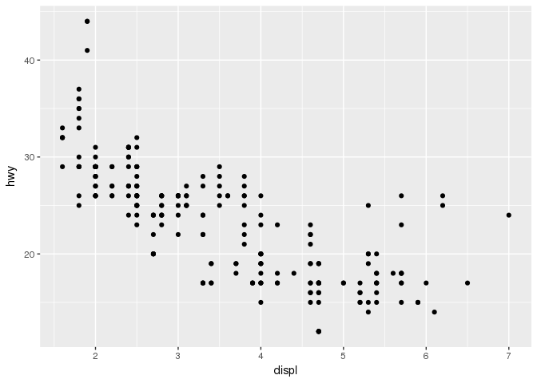

Reproducible research.
======================

I do not think it is necessary to explain the literal meaning of reproducible research. All of you can grasp what is about. But, from a data scientists' point of view the term it is probable slightly more complex.

In data science reproducible research is the possibility to reproduce every step in the process of data analysis. Meaning from the moment a data-file (sometimes in it's very rudimentary and raw form) is received, to the final reporting of all the steps that were undertaken to do an analysis. This process is usually characterized by the following steps:

1.  Getting data: getting data in the context of R means getting the (raw) data file into R

2.  Inspecting the data: means getting an idea of what kind of data the data file contains, how many variables, how many observations, what kind of experiment, what kind of groups and how many, so basically: getting an idea of the experimental design.

3.  Cleaning the data: Usually the data is not yet in an analyzable form. Cleaning the data to a tidy data frame, with consistent naming of variables e.g., normally takes a lot of time and is the most crucial step in preparation for any analysis to come after.

4.  Exploratory data analysis: In this step an initial set of graphical representations of the data are generated. It serves to identify trends, to get summarizing results of the data in a graph and to explore the data. This is a preparative step for the step hereafter.

5.  Statistical inference: the *formal* data analysis. The process of checking assumptions, relating the data to scientific questions and hypotheses. The analysis uses statistical methods, appropriate for the design of the data and the experiment.

6.  Reporting: The process of writing the analysis into a comprehensive report, according a set of rules, and compliant to the standard of the field of research. Preferable the report is written in such a way that reproduction of the whole of experiment + data analysis can be followed through by a peer, and reproduced if necessary.

An important tool in reproducible research in R are the "rmarkdown" and "knitr" packages. The document that is in front of you is an Rmd file, an "RMarkdown" file. Markdown is a simple mark-up language that potentiates the use of simply coding for layouting documents. One of the most famous and widely used mark-up languages is HTML, which is broadly used for \_marking up\_\_ web pages. RMarkdown is an implementation of Markdown language in R. Together with the *knitr* package, it is a powerful tool to bring the principle of *literate programming* into practice. It is one of the most important implementation tools for reproducible research in the R language.

For a full example of reproducible research, see: <https://rpubs.com/maddocent/storm>

Statistics and R
================

This workshop does not cover statistical applications of R. Allbeit that we will look at an example of a linear regression later on. Nowadays R is a versatile language and can be used for various applications, but it was originally designed as a language for performing statistical analyses. This is why very many statistical applcations are available for R. To start learning about statisics and R, I can highly recommend the book "Discovering Statistics Using R" by Dr. Andy Field: <https://uk.sagepub.com/en-gb/eur/discovering-statistics-using-r/book236067%20>

R is also a very useful tool in teaching students about statistics. The way that R can be used interactively in explaning difficult concepts like distributions, assumptions, expectations, probability and power and variance can be really helpful in the classroom.

For more on learning R in the context of statistics: start e.g. with:

<http://www.statsteachr.org/> or

<https://www.coursera.org/learn/statistical-inference/home/welcome> or

<https://www.youtube.com/watch?v=ACWuV16tdhY&index=21&list=PLqzoL9-eJTNBDdKgJgJzaQcY6OXmsXAHU> and

<https://www.youtube.com/watch?v=kvmSAXhX9Hs&index=29&list=PLqzoL9-eJTNBDdKgJgJzaQcY6OXmsXAHU>

and the rest of Mike Marin's lectures, that are a really great way to start learning R.

Basic topics for working with R
===============================

Packages
--------

### List of available CRAN packages

<http://cran.r-project.org/web/packages/available_packages_by_date.html>

### Biological Packages

For Biological application go to <http://www.bioconductor.org>

Installing Bioconductor packages is easy with `pacman::p_load` function

``` r
library(pacman)
## a CRAN package to analyze affymetrix expression data   
pacman::p_load(affy)

## loading affy package and the vignettes pages of this package
library(affy)
browseVignettes("affy")

## and a BIOCONDUCTOR package to analyze LCMS data
pacman::p_load(xcms)
library(xcms)
??xcms
browseVignettes("xcms")
```

Vignettes are long explanations and demos of a package. Commonly, a vignette contains examples and a workflow that shows how the package can be used and which (research) questions can be adressed with the functions and datasets in the package. It usually is a good place to start for examples. It also shows the so-called dependence of a package: it explains which other packages you would need and how the data should look to be able to work with the package the vignette belongs to.

### Getting Help for R functions and packages

``` r
install.packages("dplyr")
library(dplyr)
library(ggplot2)
??dplyr
??ggplot2
?mean
??mean  # go's to the page with functions related with '.mean.'
apropos("mean") # search on more options of or alternatives for a certain function
```

### Examples and demos on functions and packages

``` r
example(mean) # to see a worked example

demo(graphics) # demonstration of R functions
```

Data objects
============

Vectors
-------

R is an object oriented language: meaning you can create and work with (manipulate/index/access) objects. Vectors are R's elementary objects and come in different flavours:

1.  Nummeric vector: contains only numbers: decimal separator in R is "." (decimal point) and not "," (decimal comma) as is common in the English language.

2.  Character vector: contains only "words", but words can also be numbers: "23" or other items "100%" or "$2,000.00"

3.  An integer vector: an nummeric series: 1, 2, 3 is an integer of length 3.

4.  Logical: logical vectors contain only two values: "TRUE" and/or "FALSE"

5.  Mixed: Vectors do not need to be of one type. They can be mixed. They can only be of one class, so this operation will induce ***coercion***.

### Numeric vectors

``` r
c(2,8,5)    # combines its arguments to form a vector
```

    ## [1] 2 8 5

``` r
nv_1 <- c(2,8,5) # assignment statement (use 'alt' + '-' OR 'option' + '-')
nv_1 # view the content of the object "x"
```

    ## [1] 2 8 5

``` r
# combine commands on the same line seperate with ';'
nv_2 <- c(8.4,5.6,10.1,13.1,2.5,7.8,15.2,3.8,20.9); nv_2
```

    ## [1]  8.4  5.6 10.1 13.1  2.5  7.8 15.2  3.8 20.9

``` r
class(nv_2)
```

    ## [1] "numeric"

### Character vectors

``` r
cv <- c("this is", "an", "example of", "1", "character", "vector", "with length:", "length(cv)")
cv
```

    ## [1] "this is"      "an"           "example of"   "1"           
    ## [5] "character"    "vector"       "with length:" "length(cv)"

``` r
length(cv)
```

    ## [1] 8

``` r
class(cv)
```

    ## [1] "character"

### Integers

``` r
int <- as.integer(1:5)
int
```

    ## [1] 1 2 3 4 5

``` r
length(int)
```

    ## [1] 5

``` r
class(int)
```

    ## [1] "integer"

### Logical vectors

``` r
lv <- c(TRUE, FALSE, TRUE, TRUE)
lv
```

    ## [1]  TRUE FALSE  TRUE  TRUE

``` r
class(lv)
```

    ## [1] "logical"

``` r
## logical vectors can also be converted to numeric vectors
nlv <- as.numeric(lv)
nlv
```

    ## [1] 1 0 1 1

``` r
## note that coercion of a logical to a numeric vector changes the "TRUE" value to 1 and the "FALSE" value to 0
```

Manipulating vectors
--------------------

You can add/subtract/devide or use other arithmetic functions on numeric vectors

``` r
a <- c(1,3,5,7,9)
b <- c(2,4,6,8,10)

z1 <- a - b
z1
```

    ## [1] -1 -1 -1 -1 -1

``` r
z2 <- b - a
z2
```

    ## [1] 1 1 1 1 1

``` r
z3 <- a / b
z3
```

    ## [1] 0.5000000 0.7500000 0.8333333 0.8750000 0.9000000

``` r
z4 <- sum(a)
z4
```

    ## [1] 25

``` r
z5 <- max(a) - max(b)
z5
```

    ## [1] -1

You can get the individual items of a vector by using the index "[](#section-6)"

``` r
x<-c(8,5,10,13,2,7,15,3,20,8);x # create vector with 10 variables
```

    ##  [1]  8  5 10 13  2  7 15  3 20  8

``` r
length(x)
```

    ## [1] 10

``` r
mode(x) # information on data mode (numeric, character, logic)
```

    ## [1] "numeric"

``` r
class(x)
```

    ## [1] "numeric"

``` r
## using the index
x[3]
```

    ## [1] 10

``` r
## creating a subset by indexing:
x[c(3, 4, 7)]
```

    ## [1] 10 13 15

``` r
# apply a simple function
mean(x) # example of a function
```

    ## [1] 9.1

``` r
max(x)
```

    ## [1] 20

``` r
quantile(x)
```

    ##    0%   25%   50%   75%  100% 
    ##  2.00  5.50  8.00 12.25 20.00

``` r
## Using the vector index "[]" some more
# extra data from vector
x[5] # (i = 5), ith element
```

    ## [1] 2

``` r
x[-2] # all but the ith (second) element
```

    ## [1]  8 10 13  2  7 15  3 20  8

``` r
x[3:5] # element 3 to 5
```

    ## [1] 10 13  2

``` r
x[x>9] # all greater than some value
```

    ## [1] 10 13 15 20

``` r
# manipulations
y <- c(x,0,x); y # separate multiple commands on the same line with ";"
```

    ##  [1]  8  5 10 13  2  7 15  3 20  8  0  8  5 10 13  2  7 15  3 20  8

``` r
sum(y) # sum of elements in the vector
```

    ## [1] 182

### Plotting series/vectors

``` r
c <- c(1:7,9,11)
d <- c(1:9)

# performing a linear correlation
m1 <- lm(c ~ d)
summary(m1)
```

    ## 
    ## Call:
    ## lm(formula = c ~ d)
    ## 
    ## Residuals:
    ##      Min       1Q   Median       3Q      Max 
    ## -0.70000 -0.33333  0.03333  0.21667  0.93333 
    ## 
    ## Coefficients:
    ##             Estimate Std. Error t value Pr(>|t|)    
    ## (Intercept) -0.58333    0.38670  -1.508    0.175    
    ## d            1.18333    0.06872  17.220 5.47e-07 ***
    ## ---
    ## Signif. codes:  0 '***' 0.001 '**' 0.01 '*' 0.05 '.' 0.1 ' ' 1
    ## 
    ## Residual standard error: 0.5323 on 7 degrees of freedom
    ## Multiple R-squared:  0.9769, Adjusted R-squared:  0.9736 
    ## F-statistic: 296.5 on 1 and 7 DF,  p-value: 5.47e-07

``` r
# make a plot 
plot(c, d, ylim=c(0,13))
```

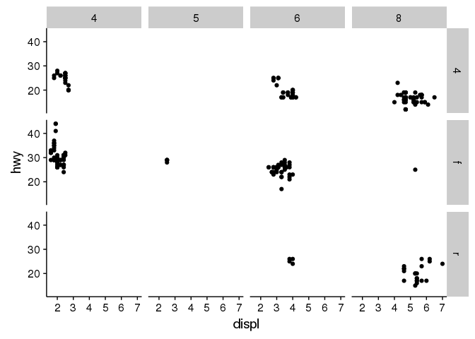

``` r
plot(c, d, ylim=c(0,13), abline(m1))  #abline plots the correaltion model in the graph
```

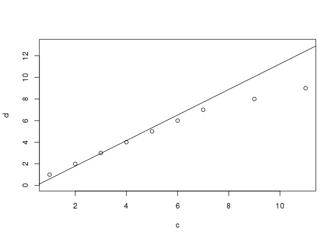

``` r
m1$coefficients
```

    ## (Intercept)           d 
    ##  -0.5833333   1.1833333

### Handeling character vectors

What happens if you use arithmetic functions on character vectors and numeric vector?

``` r
w <- c("1", "2")
u <- c("a", "b", "c")
z6 <- w-y  
z7 <- u+w
```

This does not work because the vectors are of different type

we can use the paste command for this

``` r
w <- c("1", "2")
u <- c("a", "b", "c")
z8 <- paste(u,w, sep = "_")
z8 ## because w is shorter than u, it get's recycled over u
```

    ## [1] "a_1" "b_2" "c_1"

Let's clean up the workspace
============================

``` r
rm(list=ls())

root <- find_root_file(criterion = is_rstudio_project)

## Note: never use this in code that is meant for others!!!
```

**The above is an effective way to clear all the items in the Global Environment, but is is not very friendly to use this in code you share with others: can you think of why?**

Data Structures: Lists and Dataframes
=====================================

When using R for data analysis you will most likely work with data in a matrix, an array, a list or even more likely: a dataframe.

A matrix is a table with only numeric values. An array consists of multiple matices. A list is collection of R objects of different data type. A dataframe is a table with variable names in the first row and observations in the consecutive rows. The columns in a dataframe represnet different variables.

The dataframe and the list are the most widely used datastructures when considering experimental Biological data.

Lists
-----

### Create a List

``` r
lst <-list(name="Fred", wife="Mary", no.children=3, child_ages=c(4,7,9))
lst # Lst is a list with 4 components
```

    ## $name
    ## [1] "Fred"
    ## 
    ## $wife
    ## [1] "Mary"
    ## 
    ## $no.children
    ## [1] 3
    ## 
    ## $child_ages
    ## [1] 4 7 9

``` r
str(lst) # display structure of lst
```

    ## List of 4
    ##  $ name       : chr "Fred"
    ##  $ wife       : chr "Mary"
    ##  $ no.children: num 3
    ##  $ child_ages : num [1:3] 4 7 9

### Accessing items in a list

There are 2 ways to select a single variable from a list The indexing of lists work also with square brackets or the dollars sign, but we will see there is a difference:

``` r
str(lst)
```

    ## List of 4
    ##  $ name       : chr "Fred"
    ##  $ wife       : chr "Mary"
    ##  $ no.children: num 3
    ##  $ child_ages : num [1:3] 4 7 9

``` r
lst$child_ages # MyListName$MyVariableName 
```

    ## [1] 4 7 9

``` r
lst[4]# MyListName[MyVariableColumnNumber] 
```

    ## $child_ages
    ## [1] 4 7 9

To select a single element from a variable in a list

``` r
lst$child_ages[2] 
```

    ## [1] 7

``` r
lst[[4]][2]
```

    ## [1] 7

``` r
# returns the value of the second element for your variable
```

The Dataframe
-------------

The dataframe is the most widely used data structure in the context of experimental biology and chemistry. **Remember "Tidy data!"**

### Create a data frame

``` r
people <- data.frame(age=c(24, 27, 19, 34),      
                       sex=c("F","F","M", "M"), 
                       weight=c(64,55,80, 70),
                     names = c("Christa", "Suzan", 
                     "Matt", "John"))
```

### Viewing the contents of a dataframe

``` r
summary(people)
```

    ##       age        sex       weight          names  
    ##  Min.   :19.00   F:2   Min.   :55.00   Christa:1  
    ##  1st Qu.:22.75   M:2   1st Qu.:61.75   John   :1  
    ##  Median :25.50         Median :67.00   Matt   :1  
    ##  Mean   :26.00         Mean   :67.25   Suzan  :1  
    ##  3rd Qu.:28.75         3rd Qu.:72.50              
    ##  Max.   :34.00         Max.   :80.00

``` r
table(people)
```

    ## , , weight = 55, names = Christa
    ## 
    ##     sex
    ## age  F M
    ##   19 0 0
    ##   24 0 0
    ##   27 0 0
    ##   34 0 0
    ## 
    ## , , weight = 64, names = Christa
    ## 
    ##     sex
    ## age  F M
    ##   19 0 0
    ##   24 1 0
    ##   27 0 0
    ##   34 0 0
    ## 
    ## , , weight = 70, names = Christa
    ## 
    ##     sex
    ## age  F M
    ##   19 0 0
    ##   24 0 0
    ##   27 0 0
    ##   34 0 0
    ## 
    ## , , weight = 80, names = Christa
    ## 
    ##     sex
    ## age  F M
    ##   19 0 0
    ##   24 0 0
    ##   27 0 0
    ##   34 0 0
    ## 
    ## , , weight = 55, names = John
    ## 
    ##     sex
    ## age  F M
    ##   19 0 0
    ##   24 0 0
    ##   27 0 0
    ##   34 0 0
    ## 
    ## , , weight = 64, names = John
    ## 
    ##     sex
    ## age  F M
    ##   19 0 0
    ##   24 0 0
    ##   27 0 0
    ##   34 0 0
    ## 
    ## , , weight = 70, names = John
    ## 
    ##     sex
    ## age  F M
    ##   19 0 0
    ##   24 0 0
    ##   27 0 0
    ##   34 0 1
    ## 
    ## , , weight = 80, names = John
    ## 
    ##     sex
    ## age  F M
    ##   19 0 0
    ##   24 0 0
    ##   27 0 0
    ##   34 0 0
    ## 
    ## , , weight = 55, names = Matt
    ## 
    ##     sex
    ## age  F M
    ##   19 0 0
    ##   24 0 0
    ##   27 0 0
    ##   34 0 0
    ## 
    ## , , weight = 64, names = Matt
    ## 
    ##     sex
    ## age  F M
    ##   19 0 0
    ##   24 0 0
    ##   27 0 0
    ##   34 0 0
    ## 
    ## , , weight = 70, names = Matt
    ## 
    ##     sex
    ## age  F M
    ##   19 0 0
    ##   24 0 0
    ##   27 0 0
    ##   34 0 0
    ## 
    ## , , weight = 80, names = Matt
    ## 
    ##     sex
    ## age  F M
    ##   19 0 1
    ##   24 0 0
    ##   27 0 0
    ##   34 0 0
    ## 
    ## , , weight = 55, names = Suzan
    ## 
    ##     sex
    ## age  F M
    ##   19 0 0
    ##   24 0 0
    ##   27 1 0
    ##   34 0 0
    ## 
    ## , , weight = 64, names = Suzan
    ## 
    ##     sex
    ## age  F M
    ##   19 0 0
    ##   24 0 0
    ##   27 0 0
    ##   34 0 0
    ## 
    ## , , weight = 70, names = Suzan
    ## 
    ##     sex
    ## age  F M
    ##   19 0 0
    ##   24 0 0
    ##   27 0 0
    ##   34 0 0
    ## 
    ## , , weight = 80, names = Suzan
    ## 
    ##     sex
    ## age  F M
    ##   19 0 0
    ##   24 0 0
    ##   27 0 0
    ##   34 0 0

``` r
head(people)            # gives the content of the data frame
```

    ##   age sex weight   names
    ## 1  24   F     64 Christa
    ## 2  27   F     55   Suzan
    ## 3  19   M     80    Matt
    ## 4  34   M     70    John

``` r
names(people) 
```

    ## [1] "age"    "sex"    "weight" "names"

``` r
str(people)
```

    ## 'data.frame':    4 obs. of  4 variables:
    ##  $ age   : num  24 27 19 34
    ##  $ sex   : Factor w/ 2 levels "F","M": 1 1 2 2
    ##  $ weight: num  64 55 80 70
    ##  $ names : Factor w/ 4 levels "Christa","John",..: 1 4 3 2

``` r
people$age # gives the content of the variable "age" from the data frame ""
```

    ## [1] 24 27 19 34

### Using Index on Dataframes

Using the index "[](#section-6)" on a dataframe is a bit tricky. The dataframe always consists of rows and columns. Indexing a dataframe goes like:

`dataframe[row number(s), column number(s)]`

``` r
people$age[1]   # first element of this vector
```

    ## [1] 24

``` r
people[,2]  # content of 2nd variable (column) which is a character vector -> factor
```

    ## [1] F F M M
    ## Levels: F M

``` r
people[1,]  # content of the 1st row
```

    ##   age sex weight   names
    ## 1  24   F     64 Christa

``` r
# multiple indices
people[2:3, c(1,3)] # remember to use c
```

    ##   age weight
    ## 2  27     55
    ## 3  19     80

Import data into R
==================

read.table reads space-delimited or tab delimited files
-------------------------------------------------------

``` r
gender_age <-read.table(paste0(root, "/data/gender.txt"), header=TRUE)

# getting the first few rows 
head(gender_age)
```

    ##   gender age
    ## 1      F  12
    ## 2      F  23
    ## 3      F  34
    ## 4      M  12
    ## 5      M  15
    ## 6      M  17

``` r
# getting information on the variable, the dimensions
str(gender_age)
```

    ## 'data.frame':    17 obs. of  2 variables:
    ##  $ gender: Factor w/ 2 levels "F","M": 1 1 1 2 2 2 1 1 2 1 ...
    ##  $ age   : int  12 23 34 12 15 17 18 14 56 67 ...

``` r
# selecting a variable
gender_age$gender
```

    ##  [1] F F F M M M F F M F M M M F F F M
    ## Levels: F M

``` r
gender_age$age
```

    ##  [1] 12 23 34 12 15 17 18 14 56 67 89 34 45 12  3  5 NA

``` r
gender_age[1:6,2]
```

    ## [1] 12 23 34 12 15 17

read\_csv
---------

CSV is a format of a data file that uses commas or semicolons as seprators for the columns.

``` r
library(readr)
skin <- read_csv(paste0(root, "/data/skincolumns.csv")) 
str(skin)
```

    ## Classes 'tbl_df', 'tbl' and 'data.frame':    15 obs. of  2 variables:
    ##  $ Genotype A: num  54.9 48.8 50.8 45 28.7 ...
    ##  $ Genotype B: num  30.5 24.8 24.2 27.9 18.8 ...
    ##  - attr(*, "spec")=List of 2
    ##   ..$ cols   :List of 2
    ##   .. ..$ Genotype A: list()
    ##   .. .. ..- attr(*, "class")= chr  "collector_double" "collector"
    ##   .. ..$ Genotype B: list()
    ##   .. .. ..- attr(*, "class")= chr  "collector_double" "collector"
    ##   ..$ default: list()
    ##   .. ..- attr(*, "class")= chr  "collector_guess" "collector"
    ##   ..- attr(*, "class")= chr "col_spec"

``` r
head(skin)   # content of the data frame
```

    ## # A tibble: 6 × 2
    ##   `Genotype A` `Genotype B`
    ##          <dbl>        <dbl>
    ## 1     54.89321     30.48837
    ## 2     48.77277     24.75629
    ## 3     50.75909     24.20443
    ## 4     44.96176     27.94116
    ## 5     28.74590     18.76385
    ## 6     35.31823     25.51043

``` r
dim(skin)
```

    ## [1] 15  2

``` r
attributes(skin)
```

    ## $class
    ## [1] "tbl_df"     "tbl"        "data.frame"
    ## 
    ## $row.names
    ##  [1]  1  2  3  4  5  6  7  8  9 10 11 12 13 14 15
    ## 
    ## $names
    ## [1] "Genotype A" "Genotype B"
    ## 
    ## $spec
    ## cols(
    ##   `Genotype A` = col_double(),
    ##   `Genotype B` = col_double()
    ## )

``` r
summary(skin)
```

    ##    Genotype A      Genotype B   
    ##  Min.   :28.75   Min.   :18.76  
    ##  1st Qu.:42.89   1st Qu.:23.95  
    ##  Median :47.98   Median :25.16  
    ##  Mean   :48.22   Mean   :25.73  
    ##  3rd Qu.:53.04   3rd Qu.:27.40  
    ##  Max.   :69.13   Max.   :31.59  
    ##                  NA's   :1

``` r
## ?read_csv     # help on the function

## dataset contains an NA, some functions do not work with NAs:
mean(skin$`Genotype A`)
```

    ## [1] 48.22066

``` r
mean(skin$`Genotype B`)
```

    ## [1] NA

``` r
# to remove the NA
skin_noNA <- na.omit(skin)
mean(skin_noNA$`Genotype B`)
```

    ## [1] 25.72858

Smoking example with multiple variables
---------------------------------------

Create data frame with 4 variables: gender, smoke, age, weigth

``` r
set.seed(6000) # set it at the same number, then we will all produce the same output
gender<-c(sample(c(1,2), size=1000, replace=TRUE))
smoke<-c(sample(c(1,2), size=1000, replace=TRUE))
age<-c(sample(c(1,2,3), size=1000, replace=TRUE))
weight<-round(rnorm(1000, mean=65, sd=10),1)
smoking <- data.frame(cbind(gender, smoke, age, weight))

head(smoking, 5)
```

    ##   gender smoke age weight
    ## 1      2     1   3   65.1
    ## 2      2     1   1   66.9
    ## 3      1     2   3   46.9
    ## 4      1     1   3   70.5
    ## 5      1     2   1   66.9

``` r
smoking[1:5,]
```

    ##   gender smoke age weight
    ## 1      2     1   3   65.1
    ## 2      2     1   1   66.9
    ## 3      1     2   3   46.9
    ## 4      1     1   3   70.5
    ## 5      1     2   1   66.9

### replace numbers by descriptive labels

``` r
# replace numbers by characters
smoking$genderf=factor(smoking$gender, labels=c("female","male"))
table(smoking$genderf,smoking$gender)
```

    ##         
    ##            1   2
    ##   female 497   0
    ##   male     0 503

``` r
smoking$smokef=factor(smoking$smoke, labels=c("Y","N"))
table(smoking$smokef,smoking$smoke)
```

    ##    
    ##       1   2
    ##   Y 521   0
    ##   N   0 479

``` r
smoking$agecf=factor(smoking$age, labels=c("A: <15","B: 15-30","C: >30"))
table(smoking$agecf,smoking$age)
```

    ##           
    ##              1   2   3
    ##   A: <15   332   0   0
    ##   B: 15-30   0 355   0
    ##   C: >30     0   0 313

``` r
summary(smoking)
```

    ##      gender          smoke            age            weight     
    ##  Min.   :1.000   Min.   :1.000   Min.   :1.000   Min.   :28.50  
    ##  1st Qu.:1.000   1st Qu.:1.000   1st Qu.:1.000   1st Qu.:58.40  
    ##  Median :2.000   Median :1.000   Median :2.000   Median :65.60  
    ##  Mean   :1.503   Mean   :1.479   Mean   :1.981   Mean   :65.47  
    ##  3rd Qu.:2.000   3rd Qu.:2.000   3rd Qu.:3.000   3rd Qu.:72.50  
    ##  Max.   :2.000   Max.   :2.000   Max.   :3.000   Max.   :98.60  
    ##    genderf    smokef       agecf    
    ##  female:497   Y:521   A: <15  :332  
    ##  male  :503   N:479   B: 15-30:355  
    ##                       C: >30  :313  
    ##                                     
    ##                                     
    ## 

### Subsetting data frame

``` r
library(tidyverse)
names(smoking)
```

    ## [1] "gender"  "smoke"   "age"     "weight"  "genderf" "smokef"  "agecf"

``` r
smoking_male <- smoking %>% filter(genderf == "male")
smoking_age_gender <- smoking %>% select(genderf, agecf)
```

Summarizing data
================

For summarizing data there are many ways in R (as is the case with many operations). I find the dplyr way the most intuitive. Using dplyr has the advantage that you can easily built on existing function and examples, because the code is faily easy to understand.

One thing that makes dplyr great is that it works with the "%&gt;%" symbol. Which is in programming jargon also called the "pipe" symbol. The pipe symbol takes the previous result of an operation and put it in the next. The pipe symbol can replace the use of annoying round brackets: or "(parentheses)"

Let's look at quite a simple example:

``` r
library(dplyr)
### IMPORTANT: RUN ALL THE LINES BELOW AT ONCE INCLUDING THE SET.SEET OPTION, BECAUSE OF REPRODUCIBILITY. (Cntrl + Shift + Enter)


## If we want to calculate the sum, of the square root of the mean, of two nummeric vectors (each of length = 1000) we could do:

set.seed(12345)    
zzz <- sqrt(mean(x <- rnorm(10000, mean = 34, sd = 2))) +
sqrt(mean(y <- rnorm(10000, mean = 23, sd = 4)))
zzz
```

    ## [1] 10.6257

``` r
## the above is almost impossible to read because of all the round brackets, note the closing brackets: 3 of them!!


## let's try the dplyr way with the %>% (pipe) operator

set.seed(12345)
qqq <- rnorm(10000, mean = 34, sd = 2) %>% mean() %>% sqrt() +
rnorm(10000, mean = 23, sd = 4) %>% mean() %>% sqrt()
qqq
```

    ## [1] 10.6257

``` r
zzz == qqq
```

    ## [1] TRUE

The dplyr way is a lot better is it not? Do you get what the above (dplyr-way) lines do?

1.  the result of the fist vector (1000 random numbers, with mean of 34 and a sd of 2 is piped into the function mean, which calculates the mean of these 1000 numbers (which will be around 34)

2.  From that the square root is taken by piping the mean in the function sqrt()

3.  The result of the firt vector is added to the calculation of the second vector (which is done the same way as the first).

4.  The result is qqq

5.  Is qqq equal to zzz, which we calculated the "old-fashioned" mathematical way? YES!

Let's apply the above to our smoking dataset
--------------------------------------------

Usually, if we want to make a graph we need some sort of summarizing variable that indicates hwat is going on, e.g. a group mean and standard deviation.

From the smoking dataset we will genrate a new dataframe with average weight, grouped by gender, age and grouped by smoking or non smoking. We will use dplyr verse to do so.

I will also show you how to sort the data, let's say to decreasing weight, by using the dplyr function 'arrange'.

``` r
## it is handy to have the names of the dataset variables at hand when writing pipes

names(smoking)
```

    ## [1] "gender"  "smoke"   "age"     "weight"  "genderf" "smokef"  "agecf"

``` r
str(smoking)
```

    ## 'data.frame':    1000 obs. of  7 variables:
    ##  $ gender : num  2 2 1 1 1 2 1 1 1 2 ...
    ##  $ smoke  : num  1 1 2 1 2 2 1 2 2 1 ...
    ##  $ age    : num  3 1 3 3 1 3 1 3 3 1 ...
    ##  $ weight : num  65.1 66.9 46.9 70.5 66.9 93 67.1 74.5 77.6 61.6 ...
    ##  $ genderf: Factor w/ 2 levels "female","male": 2 2 1 1 1 2 1 1 1 2 ...
    ##  $ smokef : Factor w/ 2 levels "Y","N": 1 1 2 1 2 2 1 2 2 1 ...
    ##  $ agecf  : Factor w/ 3 levels "A: <15","B: 15-30",..: 3 1 3 3 1 3 1 3 3 1 ...

``` r
smoking_weight <- smoking %>% select(genderf, smokef, weight, agecf) %>%
  group_by(genderf, smokef, agecf) %>% summarise(mean_weight = mean(weight)) %>%
  arrange(desc(mean_weight))

head(smoking_weight)
```

    ## Source: local data frame [6 x 4]
    ## Groups: genderf, smokef [4]
    ## 
    ##   genderf smokef    agecf mean_weight
    ##    <fctr> <fctr>   <fctr>       <dbl>
    ## 1  female      N   C: >30    67.07625
    ## 2  female      Y   A: <15    66.93647
    ## 3    male      Y B: 15-30    66.77500
    ## 4  female      Y   C: >30    66.35316
    ## 5    male      Y   C: >30    65.51786
    ## 6    male      N B: 15-30    65.32222

Let's look at what is going on above. The smoking\_weight datset contains newly created, more descriptive denominators, we will use those.

1.  The first step is to inspect the dataframe to see if the grouping variables are set to "factor"

2.  The second step is to select the proper variables to work with

3.  Than the data is grouped by the genderf, agecf and by the smokef variables

4.  Summarise creates a new variable "mean\_weight" that is what it says: the mean weight for the groups defined.

5.  Finally, the data is sorted, according the newly created mean\_weight variable, in decending order "(dec(mean\_weight))". If we want ascending order we can just use arrange(mean\_weight). Arrange has the default to order the variable in ascending order.

Explore data: Graphics
======================

We will use the demo dataset of the "Old Faithful" Geyser in US Yellowstone National Park

The dataset contains two variables "eruptions" and "waiting". Remember how to learn more on the dataset?

``` r
data("faithful")

?"faithful"

head(faithful)
```

    ##   eruptions waiting
    ## 1     3.600      79
    ## 2     1.800      54
    ## 3     3.333      74
    ## 4     2.283      62
    ## 5     4.533      85
    ## 6     2.883      55

``` r
hist(faithful$eruptions,breaks = 15)
```

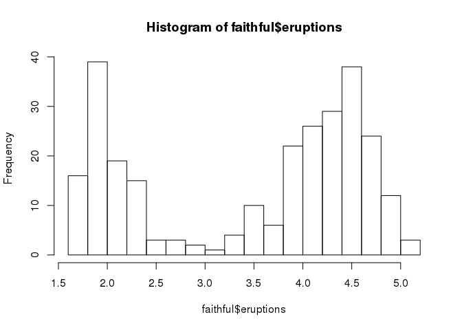

``` r
hist(faithful$waiting, breaks = 15)
```

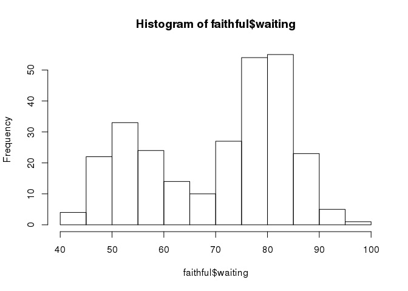

``` r
boxplot(faithful$eruptions)
```

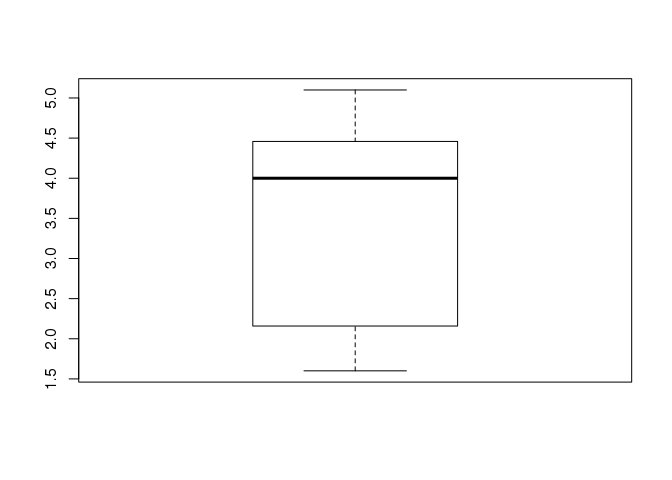

``` r
qqnorm(faithful$eruptions);qqline(faithful$eruptions)
```

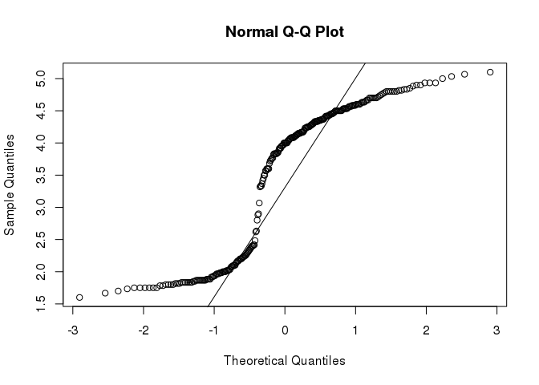

``` r
plot(faithful$eruptions,type="l")
```

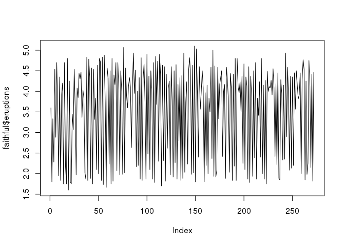

``` r
plot(faithful$eruptions, faithful$waiting)
```

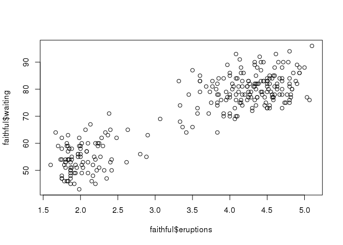

Grammar of Graphics (ggplot2 package)
-------------------------------------

ggplot2 is a data visualization package for the statistical programming language R. Created by Hadley Wickham in 2005, ggplot2 is an implementation of Leland Wilkinson's Grammar of Graphics—a general scheme for data visualization which breaks up graphs into semantic components such as scales and layers. ggplot2 can serve as a replacement for the base graphics in R and contains a number of defaults for web and print display of common scales. Since 2005, ggplot2 has grown in use to become one of the most popular R packages. It is licensed under GNU GPL v2.\[from Wikipedia, September, 2016\]

### **The ggplot2 package is very very versatile and can not be demonstrated to it's full abilities during this short workshop. Here we are barely scratching the ggplot2 surface. If you want to learn more about the power of R, you must start with exploring the posibilities of ggplot2, it is the future of data visualization.**

ggplot2 is also very good for creating heat-mas, which are very informative for visualization of large-scale and high deminensional data, e.g. obtained from genomics or proteomics experiments.

A good place to start learning more on The Grammar of Graphics: <http://www.cookbook-r.com/Graphs/>

We illustrate the workings of ggplot with two demo data-sets:

1.  "TootGrowth"
2.  "Household Power Consumption"

``` r
tg <- datasets::ToothGrowth
head(tg)
```

    ##    len supp dose
    ## 1  4.2   VC  0.5
    ## 2 11.5   VC  0.5
    ## 3  7.3   VC  0.5
    ## 4  5.8   VC  0.5
    ## 5  6.4   VC  0.5
    ## 6 10.0   VC  0.5

``` r
library(ggplot2)
g <- ggplot(data = tg, aes(len))
g + geom_histogram(bins = 25) 
```

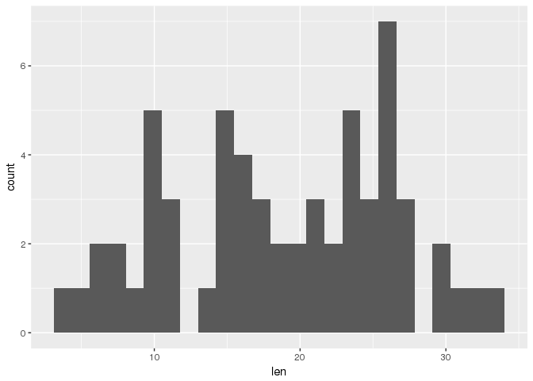

The graph shows a histogram of the Toothgrowth data (len = length teeth of Guinea pigs, treated with two different vitamine C food-sources).

This looks nice, but what if we would like to add a title to the graph: Simple we add

`+ ggtitle("ToothGrowth")`

``` r
g <- ggplot(data = tg, aes(len))
g + geom_histogram(bins = 30) + ggtitle("ToothGrowth")
```

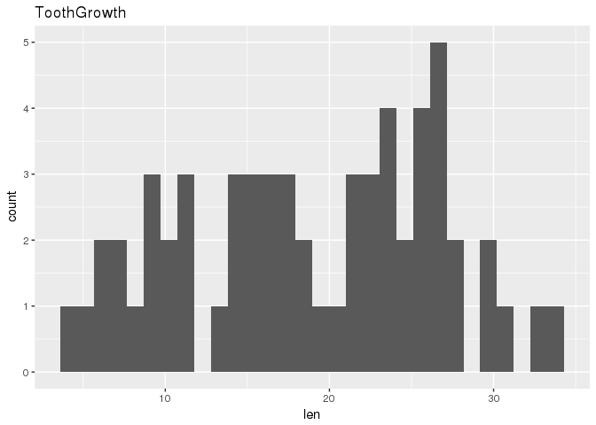

Let's see if we can make a more meaningfull graph, that shows something about the result of the treatment, on teeth growth.

``` r
g <- ggplot(data = tg, aes(x = dose, y = len, group = supp, colour = supp))
g + geom_point() + ggtitle("ToothGrowth")
```

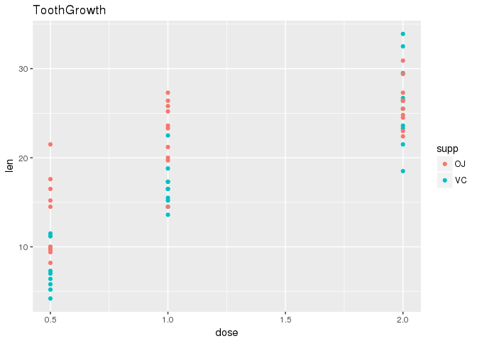

Now we get a scatterplot with colours indicating the different supplement. Already more informative, but not very pretty.

Let's try a panel plot:

``` r
str(ToothGrowth)
```

    ## 'data.frame':    60 obs. of  3 variables:
    ##  $ len : num  4.2 11.5 7.3 5.8 6.4 10 11.2 11.2 5.2 7 ...
    ##  $ supp: Factor w/ 2 levels "OJ","VC": 2 2 2 2 2 2 2 2 2 2 ...
    ##  $ dose: num  0.5 0.5 0.5 0.5 0.5 0.5 0.5 0.5 0.5 0.5 ...

``` r
g <- ggplot(data = tg, aes(x = dose, y = len, group = 1))
g + geom_point() + 
  facet_wrap(facets = "supp") + 
  geom_smooth() + ggtitle("ToothGrowth")
```

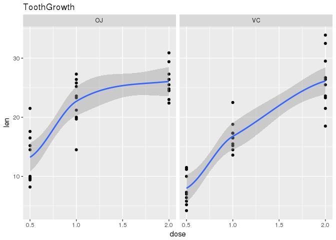

``` r
## ignore the warnings if you get them...
## clean up the workspace again
```

Hey, that's nice, now we have a panelplot, with in each panel a smoother line and data points, for each tratment. Which vitamine C supplement (OJ or VC) has the most potent effect on the growth of the teeth of the tested Guinea pigs?

First, clean up the workspace again.
------------------------------------

``` r
rm(list=ls())
root <- find_root_file(criterion = is_rstudio_project)


## Note: never use this in code that is meant for others!!!
```

GRAMMAR OF GRAPHICS DEMO ON A BIGGER DATASET
============================================

Want to work on a bigger dataset? I guessed you would want to do so, so I prepared a bit on "big(ger) data below"
-----------------------------------------------------------------------------------------------------------------

I have prepared a script that will analyze a big dataset &gt;2 million datapoints on power consumption by US households. The script is called "power\_households.R". The script handles a number of steps: 1) System settings and packages are handeled

1.  Getting the data, the data is downloaded directly from the web

2.  The data is cleaned up and subsets are selected (only data from 48 hrs of power consumption are included)

3.  A data summary dataframe is generated

4.  Exploratory data figures are generated to find trends and patterns in the data

5.  Statistical analysis and thourough exploration is not included

External scripts can be called by the 'source' command Try it below and look in the folder "images" to see the result. Do you see the items in the Global environment?

What is the name of the object used for generating the figures?

The code below will download the data and create a tidy version of a subset of the data. We will work with summarized data from a period of 48 hours of power consumption by US households.

Calling an external script
==========================

This script will add a new dataset to the Global Environment: "data\_twoDays"

``` r
source(paste0(root, "/code/power_households.R"))
```

    ## 'data.frame':    2075259 obs. of  9 variables:
    ##  $ Date                 : Factor w/ 1442 levels "1/1/2007","1/1/2008",..: 342 342 342 342 342 342 342 342 342 342 ...
    ##  $ Time                 : Factor w/ 1440 levels "00:00:00","00:01:00",..: 1045 1046 1047 1048 1049 1050 1051 1052 1053 1054 ...
    ##  $ Global_active_power  : num  4.22 5.36 5.37 5.39 3.67 ...
    ##  $ Global_reactive_power: num  0.418 0.436 0.498 0.502 0.528 0.522 0.52 0.52 0.51 0.51 ...
    ##  $ Voltage              : num  235 234 233 234 236 ...
    ##  $ Global_intensity     : num  18.4 23 23 23 15.8 15 15.8 15.8 15.8 15.8 ...
    ##  $ Sub_metering_1       : num  0 0 0 0 0 0 0 0 0 0 ...
    ##  $ Sub_metering_2       : num  1 1 2 1 1 2 1 1 1 2 ...
    ##  $ Sub_metering_3       : num  17 16 17 17 17 17 17 17 17 16 ...

``` r
glimpse(data_twoDays)
```

    ## Observations: 2,880
    ## Variables: 10
    ## $ date                  <chr> "1/2/2007", "1/2/2007", "1/2/2007", "1/2...
    ## $ time                  <chr> "00:00:00", "00:01:00", "00:02:00", "00:...
    ## $ global_active_power   <dbl> 0.326, 0.326, 0.324, 0.324, 0.322, 0.320...
    ## $ global_reactive_power <dbl> 0.128, 0.130, 0.132, 0.134, 0.130, 0.126...
    ## $ voltage               <dbl> 243.15, 243.32, 243.51, 243.90, 243.16, ...
    ## $ global_intensity      <dbl> 1.4, 1.4, 1.4, 1.4, 1.4, 1.4, 1.4, 1.4, ...
    ## $ sub_metering_1        <dbl> 0, 0, 0, 0, 0, 0, 0, 0, 0, 0, 0, 0, 0, 0...
    ## $ sub_metering_2        <dbl> 0, 0, 0, 0, 0, 0, 0, 0, 0, 0, 0, 0, 0, 0...
    ## $ sub_metering_3        <dbl> 0, 0, 0, 0, 0, 0, 0, 0, 0, 0, 0, 0, 0, 0...
    ## $ date_time             <dttm> 2007-02-01 00:00:00, 2007-02-01 00:01:0...

The code to create the graphs is included in the code chunck below.

Can you figure out what is shown in the graphs, and what exploratory data questions could be addressed by looking at these graphs individually?

### Plot 1: Base plotting system

``` r
# save the file


hist(data_twoDays$global_active_power, col = "red", 
     xlab = "Global Active Power", ylab = "Frequency", main = "Global Active Power")
```

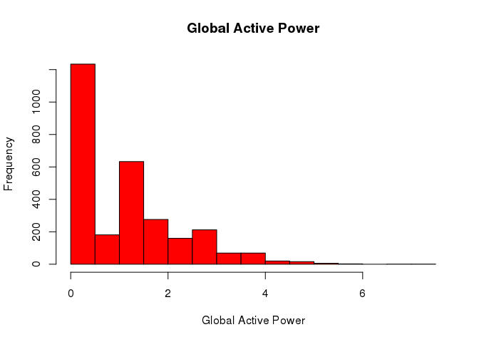

### Plot 2: ggplot2 example

``` r
## ---- Plot2--------------------------------------------------------------
levels_date <- levels(as.factor(data_twoDays$date))

## plot2.png in ggplot2 syntax 
names(data_twoDays)
```

    ##  [1] "date"                  "time"                 
    ##  [3] "global_active_power"   "global_reactive_power"
    ##  [5] "voltage"               "global_intensity"     
    ##  [7] "sub_metering_1"        "sub_metering_2"       
    ##  [9] "sub_metering_3"        "date_time"

``` r
plot2 <- ggplot(data_twoDays, aes(date_time, global_active_power)) + 
  geom_line() +
  scale_x_datetime(date_breaks = "1 day", 
                   date_labels = c("Sat", "Thu", "Fri")) +
  ylab("Global Active Power (kilowatts)") + xlab("Day") +
theme_bw() +
  theme(panel.grid.major = element_blank(),
        panel.grid.minor = element_blank(),
        panel.background = element_blank(),
        axis.title.x = element_blank(),
        axis.text.x = element_text(size = 14),
        axis.title.y = element_text(size = 14)) +
  theme(plot.margin = unit(c(1, 1, 1, 1), "cm"))

# saving the plot to disk
plot2
```

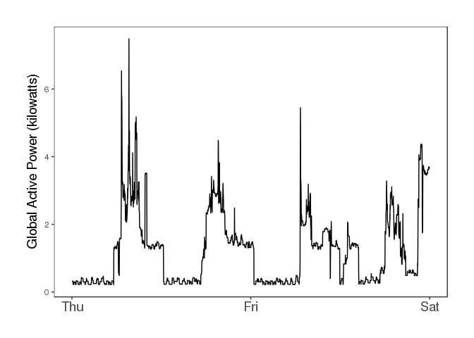

### Plot 3: ggplot2 example

``` r
## ---- Plot3--------------------------------------------------------------
# checking the names
names(data_twoDays)
```

    ##  [1] "date"                  "time"                 
    ##  [3] "global_active_power"   "global_reactive_power"
    ##  [5] "voltage"               "global_intensity"     
    ##  [7] "sub_metering_1"        "sub_metering_2"       
    ##  [9] "sub_metering_3"        "date_time"

``` r
# creating plot3 with ggplot
plot3 <- ggplot(data_twoDays, aes(x = date_time)) + 
  geom_line(aes(y = sub_metering_1, color = "Sub_metering_1")) +
  geom_line(aes(y = sub_metering_2, color = "Sub_metering_2")) +
  geom_line(aes(y = sub_metering_3, color = "Sub_metering_3")) +
  scale_x_datetime(date_breaks = "1 day", date_labels = c("Sat", "Thu", "Fri")) +
  ylab("Energy sub metering") +
  xlab("Day")
  scale_colour_manual("", values = c("Sub_metering_1" = "black", 
                                     "Sub_metering_2" = "red",
                                     "Sub_metering_3" = "blue")) +
theme_bw() +
theme(panel.grid.major = element_blank(),
        panel.grid.minor = element_blank(),
        panel.background = element_blank(),
        axis.title.x = element_blank(),
        axis.text.x = element_text(size = 14),
        axis.title.y = element_text(size = 14)) +
  theme(plot.margin = unit(c(1,1,1,1), "cm")) +
  theme(legend.position=c(0.7, 0.9)) +
  theme(legend.background = element_rect(fill="gray95", size=.3, linetype="dotted"))
```

    ## NULL

``` r
plot3
```

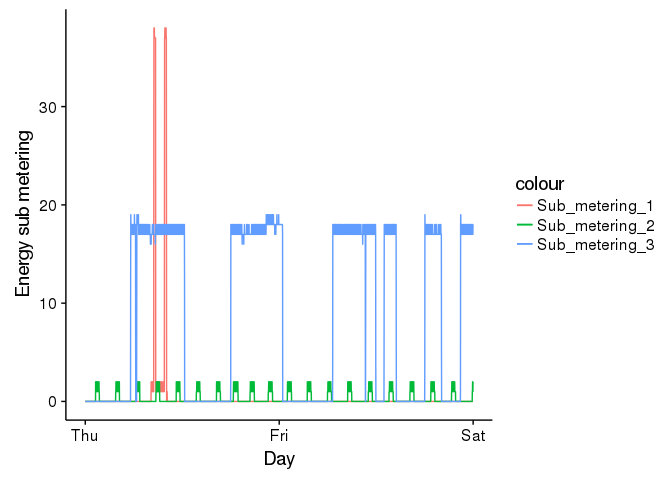

### Plot 4: ggplot2 example

``` r
## ---- Plot4--------------------------------------------------------------
# checking names
names(data_twoDays)
```

    ##  [1] "date"                  "time"                 
    ##  [3] "global_active_power"   "global_reactive_power"
    ##  [5] "voltage"               "global_intensity"     
    ##  [7] "sub_metering_1"        "sub_metering_2"       
    ##  [9] "sub_metering_3"        "date_time"

``` r
## plot 4 is a panel of four plots consiting of plot2, plot3 and two new plots
## first create the two additonal plots (plot5 and plot6) that have to go in the panel

## plot5 --> x = date_time, y = voltage
plot5 <- ggplot(data_twoDays, aes(x = date_time)) + 
  geom_line(aes(y = voltage)) +
  scale_x_datetime(date_breaks = "1 day", 
                   date_labels = c("Sat", "Thu", "Fri")) +
  ylab("Voltage") +
  xlab("Day") +
  theme_bw() +
theme(panel.grid.major = element_blank(),
        panel.grid.minor = element_blank(),
        panel.background = element_blank(),
        axis.text.x = element_text(size = 14),
        axis.title.y = element_text(size = 14)) +
theme(plot.margin = unit(c(1,1,1,1), "cm"))

## plot6 --> x = date_time, y = global_reactive_power
names(data_twoDays)
```

    ##  [1] "date"                  "time"                 
    ##  [3] "global_active_power"   "global_reactive_power"
    ##  [5] "voltage"               "global_intensity"     
    ##  [7] "sub_metering_1"        "sub_metering_2"       
    ##  [9] "sub_metering_3"        "date_time"

``` r
plot6 <- ggplot(data_twoDays, aes(x = date_time)) + 
  geom_line(aes(y = global_reactive_power)) +
  scale_x_datetime(date_breaks = "1 day", 
                   date_labels = c("Sat", "Thu", "Fri")) +
  ylab("Global_reactive_power") +
  xlab("Day") +
  theme_bw() +
theme(panel.grid.major = element_blank(),
        panel.grid.minor = element_blank(),
        panel.background = element_blank(),
        axis.text.x = element_text(size = 14),
        axis.title.y = element_text(size = 14)) + 
  theme(plot.margin = unit(c(1,1,1,1), "cm"))

plot5
```

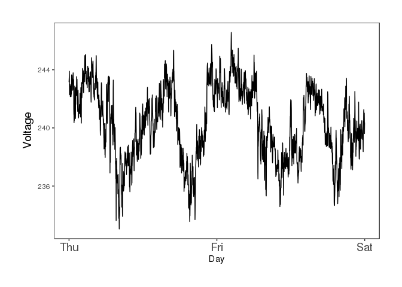

``` r
plot6
```

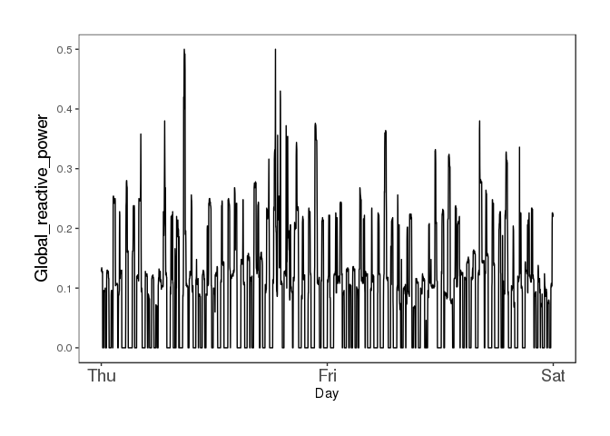

CREATING A PANEL PLOT
---------------------

``` r
# creating the panel with plot_grid 
panel <- plot_grid(plot2, plot5, plot3, plot6,
          labels=c("A", "C", "B", "D"), ncol = 2)

panel
```

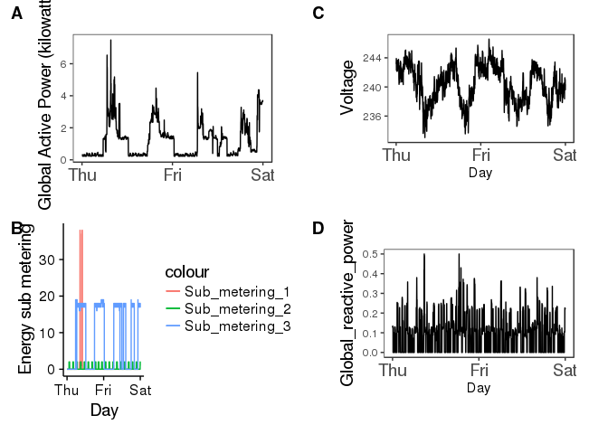

The above is meant as a demo for the strength of the Grammar of Graphics lingo. There is a lot more to ggplot2 than can be shown in this short demo. As mentioned above, a good place to start learning ggplot2 is:

<http://www.cookbook-r.com/Graphs/>.

Other resources are:

<https://www.google.nl/url?sa=t&rct=j&q>=&esrc=s&source=web&cd=9&cad=rja&uact=8&ved=0ahUKEwiK5ZeV0N3PAhUhBMAKHUt5A-gQtwIIXzAI&url=https%3A%2F%2Fwww.youtube.com%2Fwatch%3Fv%3DHeqHMM4ziXA&usg=AFQjCNGE4PNS-\_O1LzB3qiv8b9DI2Q\_FiA

and

<https://www.rstudio.com/wp-content/uploads/2015/03/ggplot2-cheatsheet.pdf>

The reason why I do not show examples from other plotting systems is that I think ggplot2 is the most advanced system that best puts the principles of "reproducible research" in practice.

################################################################ 

START BIONCONDUCTOR DEMO
========================

################################################################ 

Bioconductor packages installation

``` r
library(pacman)
p_load(Biostrings,
       XVector,
       BiocGenerics,
       IRanges,
       S4Vectors,
       GenomicRanges,
       BSgenome)
```

**First, clear the workspace to have an overview!**
---------------------------------------------------

``` r
library(rprojroot)

rm(list=ls())

root <- find_root_file(criterion = is_rstudio_project)
```

Let's work on some biological data.
-----------------------------------

Biological data can be sequence data, genomic information, proteomics and metabolomics data, expression array data, genomic alignments etc. etc.

As mentioned above www.bioconductor.org, but also packages from CRAN and packages people posted on www.github.com and www.bitbucket.org can be used to work with and analyze biological data.

Lets' work with an example from the Bioconductor package "Biostrings" To get help on packages and learn about BIOCONDUCTOR workflows visit: <https://www.bioconductor.org/help/workflows/>

Below we will show a little on the workflows: "Multiple Alignment" and "Sequencing / Pathway analysis. To get started we need two "BIOCONDUCTOR" packages:

``` r
library(Biostrings)
library(IRanges)
```

To view the vignettes (from which I distilled the code chunks below)

``` r
browseVignettes("Biostrings")
browseVignettes("IRanges")
```

### R code from vignette source 'Biostrings2Classes.Rnw'

Create a BString class object

``` r
b <- BString(c("I am a BString object"))
b
```

    ##   21-letter "BString" instance
    ## seq: I am a BString object

``` r
length(b)
```

    ## [1] 21

``` r
class(b)
```

    ## [1] "BString"
    ## attr(,"package")
    ## [1] "Biostrings"

Create a DNAString class object, with two ambiguous nucleotides

``` r
d <- DNAString("TTGAAAA-CTC-N")
d
```

    ##   13-letter "DNAString" instance
    ## seq: TTGAAAA-CTC-N

``` r
length(d)
```

    ## [1] 13

``` r
class(d)
```

    ## [1] "DNAString"
    ## attr(,"package")
    ## [1] "Biostrings"

``` r
DNA_ALPHABET
```

    ##  [1] "A" "C" "G" "T" "M" "R" "W" "S" "Y" "K" "V" "H" "D" "B" "N" "-" "+"
    ## [18] "."

To see the meaning of the "N" and the other UIPAC nucleotide ambiguity codes in this sequence:

<http://www.chick.manchester.ac.uk/SiteSeer/IUPAC_codes.html>

Indexing works the same as with **'normal'** vectors

``` r
d[3]
```

    ##   1-letter "DNAString" instance
    ## seq: G

``` r
d[7:12]
```

    ##   6-letter "DNAString" instance
    ## seq: A-CTC-

``` r
b[length(b):1] ## gets the reverse sequence (could be handy to use on DNAStrings...know why?)
```

    ##   21-letter "BString" instance
    ## seq: tcejbo gnirtSB a ma I

``` r
d[length(d):1] ## see that d gets reversed?!
```

    ##   13-letter "DNAString" instance
    ## seq: N-CTC-AAAAGTT

To get subsequencces of a larger sequence (e.g. to check primer sequences in a genomic sequence)

``` r
bb <- subseq(b, 3, 6)
bb
```

    ##   4-letter "BString" instance
    ## seq: am a

``` r
dd1 <- subseq(d, end=7)
dd1
```

    ##   7-letter "DNAString" instance
    ## seq: TTGAAAA

``` r
d
```

    ##   13-letter "DNAString" instance
    ## seq: TTGAAAA-CTC-N

``` r
dd2 <- subseq(d, start=8)
dd2
```

    ##   6-letter "DNAString" instance
    ## seq: -CTC-N

``` r
d
```

    ##   13-letter "DNAString" instance
    ## seq: TTGAAAA-CTC-N

To find a specific pattern (a substring) in a larget string

``` r
###################################################
### code chunk number 6: b1
###################################################
bb == "am a"
```

    ## [1] TRUE

``` r
dd2 != DNAString("TG") ## is not containing?
```

    ## [1] TRUE

DNAString, RNAString, Amino acid strings (protein)
--------------------------------------------------

Logically, we can als define RNA and proteins a string-object. Converting DNA to RNA **transcribes** the DNA string. Remember, what was so typical about RNA?

Tranlating a DNA string to protein \_\_translates the DNA sequence (triplets) to a string of amino acids. A physiologically relevant protein had a start, and a stop coding sequence.

``` r
r <- RNAString(d)
r
```

    ##   13-letter "RNAString" instance
    ## seq: UUGAAAA-CUC-N

``` r
r == d
```

    ## [1] TRUE

``` r
gene <- DNAString(c("ATGAAATTTGGGCGCGCTTTAAAATGGGCGCTGAACTCTTTCCCCCGCGCGCTTGTGTGTGAAATATATATGTAATAAATATTGCCCCCGCGCGCGTTTGTGTGGGGCTCGCCGCGCTTTTAG"))
                  


length(gene)
```

    ## [1] 123

``` r
protein <- Biostrings::translate(gene)                  
gene
```

    ##   123-letter "DNAString" instance
    ## seq: ATGAAATTTGGGCGCGCTTTAAAATGGGCGCTGA...CGCGCGTTTGTGTGGGGCTCGCCGCGCTTTTAG

``` r
length(gene)/3
```

    ## [1] 41

``` r
protein
```

    ##   41-letter "AAString" instance
    ## seq: MKFGRALKWALNSFPRALVCEIYM**ILPPRAFVWGSPRF*

Each triplet codes for one amino acid.

\_Notice the ambiguous amino acids indicated by \*.\_

Views on strings
----------------

IRanges Views are a way to describe the subsequences of a longer sequence.

``` r
v4 <- Views(dd2, start=3:0, end=5:8)
v4
```

    ##   Views on a 6-letter DNAString subject
    ## subject: -CTC-N
    ## views:
    ##     start end width
    ## [1]     3   5     3 [TC-]
    ## [2]     2   6     5 [CTC-N]
    ## [3]     1   7     7 [-CTC-N ]
    ## [4]     0   8     9 [ -CTC-N  ]

``` r
length(v4)
```

    ## [1] 4

``` r
v4[4:2]
```

    ##   Views on a 6-letter DNAString subject
    ## subject: -CTC-N
    ## views:
    ##     start end width
    ## [1]     0   8     9 [ -CTC-N  ]
    ## [2]     1   7     7 [-CTC-N ]
    ## [3]     2   6     5 [CTC-N]

``` r
v4[[2]]
```

    ##   5-letter "DNAString" instance
    ## seq: CTC-N

``` r
v12 <- Views(DNAString("TAATAATG"), start=-2:9, end=0:11)
v12
```

    ##   Views on a 8-letter DNAString subject
    ## subject: TAATAATG
    ## views:
    ##      start end width
    ##  [1]    -2   0     3 [   ]
    ##  [2]    -1   1     3 [  T]
    ##  [3]     0   2     3 [ TA]
    ##  [4]     1   3     3 [TAA]
    ##  [5]     2   4     3 [AAT]
    ##  ...   ... ...   ... ...
    ##  [8]     5   7     3 [AAT]
    ##  [9]     6   8     3 [ATG]
    ## [10]     7   9     3 [TG ]
    ## [11]     8  10     3 [G  ]
    ## [12]     9  11     3 [   ]

``` r
## a complete sequence can also be descibed as a views object, start, stop and width defines a string...
as(d, "Views")
```

    ##   Views on a 13-letter DNAString subject
    ## subject: TTGAAAA-CTC-N
    ## views:
    ##     start end width
    ## [1]     1  13    13 [TTGAAAA-CTC-N]

``` r
###################################################
as(d, "Views")[[1]]
```

    ##   13-letter "DNAString" instance
    ## seq: TTGAAAA-CTC-N

IRanges package to use views and strings for biological sequences
=================================================================

### R code from vignette source 'IRangesOverview.Rnw'

``` r
p_load(IRanges)
library(IRanges)
library(Biostrings)
```

Generating dummy DNA sequence
-----------------------------

### Encoding long strings and sequences

The storage of large sequences in a friendly, accessible and small format is feasibe for the very long sequences of DNA that we use in Biology. When ragarding a full genome we can easily have sequences over 50 milion bases. Considering the longest chomosome of the human (chromosome 1) is over 200 milion base pairs long, you can appriciate the neccessity to store these strings of nucleotides in a computational-and-storage-friendle format. In R this format is encoded by the Rle class of objects.

Let's look at Rle. Assume you have a short DNA sequence: AAATTGTGTGCCCTTT

This sequence can be converted to a DNAString

``` r
seq_demo <- DNAString("AAATTGTGTGCCCTTT")
seq_demo
```

    ##   16-letter "DNAString" instance
    ## seq: AAATTGTGTGCCCTTT

let's see what happens if we convert this sequence to an Rle object

``` r
seq_rle <- Rle(as.vector(seq_demo))

seq_rle
```

    ## factor-Rle of length 16 with 9 runs
    ##   Lengths: 3 2 1 1 1 1 1 3 3
    ##   Values : A T G T G T G C T
    ## Levels(18): A C G T M R W S Y K V H D B N - + .

Hey!, That is clever! So we can describe a DNAString as a collection of Lengths and Values. The fist three A nucleotides in this sequence can be described as Lengths = 3, Value = A, the consecutive two T nucleotides can be described by Lengths = 2, Value = T, and so on...

This encoding for DNA sequences, or other very long sequences, is used e.g. in sequencing files that contain the genomes. It is a way to condense the information and to prevent writing very very long sequences in a file, that are hard to work with. The sequence encoded in this way is also more easily accessible by the computer and this encoding will reduce computation time.

Let's create a longer sequence and some shorter ones that we want to match to the longer sequence. The shorter sequences ar stored in a dictionary. This disctionary can contain only sequence that are of equal lenth. Although, there are ways to do multiple matchings with sequences of unequal length we will not go into detail on this here.

``` r
## Our subject sequence (the longer sequence)
subject_seq <- DNAString(c("ATTTGTTGATCATCATCATGTTTTATGTTTGTGTGTATTATTATTATTTCCGCGCGTA"))

## the dictionary with a few three-base long sequences
dictionary <- PDict(c("ATC", "ATG", "ATT", "TAT", "TTA"))

## the actual matching of the dictionary against the subject DNA sequence
match <- Biostrings::matchPDict(pdict = dictionary, subject = subject_seq)
names_patterns <- c("ATC", "ATG", "ATT", "TAT", "TTA")

## the names of the pattern are added to the match object
match@NAMES <- c(names_patterns)
 str(match)
```

    ## Formal class 'ByPos_MIndex' [package "Biostrings"] with 7 slots
    ##   ..@ dups0          :Formal class 'Dups' [package "IRanges"] with 5 slots
    ##   .. .. ..@ high2low       : int [1:5] NA NA NA NA NA
    ##   .. .. ..@ low2high       :List of 5
    ##   .. .. .. ..$ : NULL
    ##   .. .. .. ..$ : NULL
    ##   .. .. .. ..$ : NULL
    ##   .. .. .. ..$ : NULL
    ##   .. .. .. ..$ : NULL
    ##   .. .. ..@ elementType    : chr "integer"
    ##   .. .. ..@ elementMetadata: NULL
    ##   .. .. ..@ metadata       : list()
    ##   ..@ ends           :List of 5
    ##   .. ..$ : int [1:3] 11 14 17
    ##   .. ..$ : int [1:2] 20 27
    ##   .. ..$ : int [1:5] 3 39 42 45 48
    ##   .. ..$ : int [1:5] 26 38 41 44 47
    ##   .. ..$ : int [1:4] 25 40 43 46
    ##   ..@ width0         : int [1:5] 3 3 3 3 3
    ##   ..@ NAMES          : chr [1:5] "ATC" "ATG" "ATT" "TAT" ...
    ##   ..@ elementType    : chr "IRanges"
    ##   ..@ elementMetadata: NULL
    ##   ..@ metadata       : list()

``` r
 match@NAMES
```

    ## [1] "ATC" "ATG" "ATT" "TAT" "TTA"

``` r
 ## contructing an IRangesList from match
ir <- lapply(match, IRanges::IRanges)
ir_list <- IRanges::IRangesList(ir)

head(ir_list, 2)
```

    ## IRangesList of length 2
    ## $ATC
    ## IRanges object with 3 ranges and 0 metadata columns:
    ##           start       end     width
    ##       <integer> <integer> <integer>
    ##   [1]         9        11         3
    ##   [2]        12        14         3
    ##   [3]        15        17         3
    ## 
    ## $ATG
    ## IRanges object with 2 ranges and 0 metadata columns:
    ##           start       end     width
    ##       <integer> <integer> <integer>
    ##   [1]        18        20         3
    ##   [2]        25        27         3

Although with the Views you could figure out for each pattern in the dictionary where the match to the subject is located and how many times it is represented in the subject sequence, we could use a plot here to see the details in an overview. Let's make a plot!

The code below is rather complicated, do not worry if you do not understand, you will understand the end-result, anyway.

``` r
### code chunk number 31: plotRanges
IRanges_plot <- function(IRanges_object, sep=0.5, height=1,
                         set_breaks=TRUE, labcol="grey",
                                                names=NULL, cov=FALSE, clear=FALSE,
                                                disjoint=NULL,
                                                color=NULL) {
    library(ggplot2)

  if (!is.null(colors)) stopifnot(length(colors) <= 3L)
    COLORS <- c("white", "#383838", "#DDDDDD")
    x <- list(IRanges_object)
    if (!is.null(names))
        names(x) <- names
    dl <- lapply(x, function(d) {
                             out <- as.data.frame(d)
                             out$y <- GenomicRanges::disjointBins(d)
                             out
                            })
    d <- do.call(rbind, dl)
    if (!is.null(disjoint))
        # manually assigned bins
        d$y <- disjoint
    d$ymin <- d$y * (sep + height) - height
    d$ymax <- d$ymin + height
    if (!is.null(color))
        d$color <- color
    if (length(x) > 1 && is.null(names(x)))
        stop("multiple ranges must be given names like
             plotRanges(rng1=y, rng2=x)")
    if (length(x) > 1)
        d$range <- factor(rep(names(x), sapply(x, length)), names(x))
    p <- ggplot2::ggplot(d)
    if (clear)
        p <- p + ggplot2::geom_rect(aes(ymin=ymin, ymax=ymax,
                               xmin=start-0.5, xmax=end+0.5),
                                             fill="white", color="grey30", size=0.3)
    else if(is.null(color))
        p <- p + ggplot2::geom_rect(aes(ymin=ymin, ymax=ymax, xmin=start-0.5,
                               xmax=end+0.5))
    else {
        p <- p + ggplot2::geom_rect(aes(ymin=ymin, ymax=ymax, xmin=start-0.5,
                                                     xmax=end+0.5, fill=color),
                                                     color="grey30", size=0.3)
        p <- p + ggplot2::scale_fill_manual("", guide=FALSE,
                                                             values=COLORS[1:length(unique(color))])
    }
    p <- p + ggplot2::theme_bw()
    if (!is.null(d$names)) {
        p <- p + ggplot2::geom_text(aes(x=start + width/2 - 0.5,
                                                     y=ymin+(ymax-ymin)/2, label=names),
                                                     size=4, color=labcol)
    }
    xmin <- min(d$start)
    xmax <- max(d$end)
    xbreaks <- seq(xmin - 1L, xmax + 1L)
    if (set_breaks)
        p <- p + ggplot2::scale_x_continuous(breaks=xbreaks)
    p <- p + ggplot2::theme(panel.grid.major=element_blank(),
                                 panel.grid.minor.y=element_blank(),
                                 axis.ticks=element_blank())
    if (!cov)
        p <- p + ggplot2::theme(axis.text.y=element_blank())
    p <- p + xlab("") + ylab("")
    if (length(unique(d$range)) > 1)
        p <- p + facet_wrap(~ range, ncol=1)
    if (cov)
        p <- p + ggplot2::geom_line(aes(x=pos, y=cov), covdf(coverage(rngs)),
                           color="red", size=3)
    p
}

## Calling the plot
plot_iranges <- IRanges_plot(unlist(ir_list))
plot_iranges
```

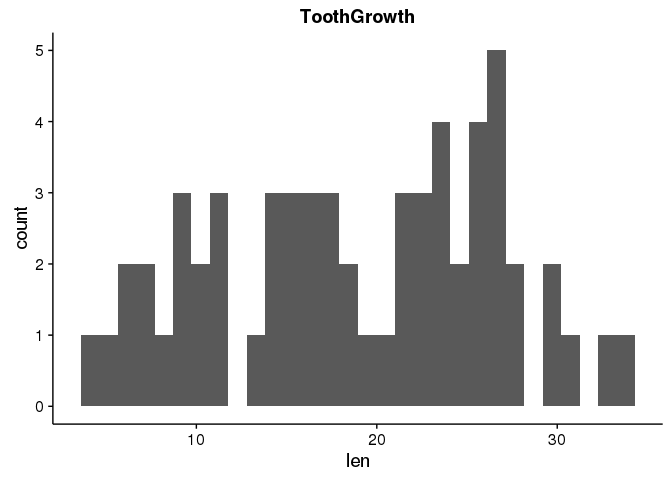

A coverage plot indicates the depth of coverage of sequence and a number of patterns. Look at the plot to understand how coverage works.
----------------------------------------------------------------------------------------------------------------------------------------

``` r
coverage_plot <- function(cx, start, end, min.depth, max.depth){
  plot.new()
  plot.window(c(start, end), c(min.depth, max.depth))
  axis(1)
  axis(2)
  axis(4)
  lines(start:end, cx[start:end], type="l")
}


## Get the coverage of the original subject:
cov3R <- as.integer(IRanges::coverage(match, width=length(subject_seq)))
max(cov3R)
```

    ## [1] 3

``` r
mean(cov3R)
```

    ## [1] 0.9827586

``` r
sum(cov3R != 0) / length(cov3R)
```

    ## [1] 0.5689655

``` r
## A plot that shows the depth of the coverage (depht on the y-axis,
## subject on the x-axis)

coverplot <- coverage_plot(cx = cov3R,
                           start = 1, end = 58,
                           min.depth = 0, max.depth = 5)
```

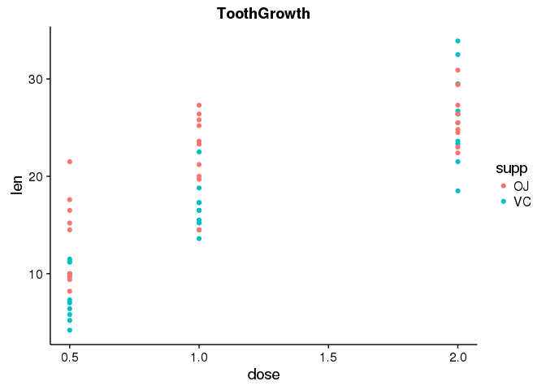

The above matching, Views, plotting an IRangesList and coverage are cocepts that play an important role in understanding the methodology of sequencing and how sequence data can be interpreted. If you want to learn more about analysis of sequence data in R, take a look at the BIOCONDUCTOR workflow below.

Sequencing workflow
===================

Commonly used workflows can be downloaded from the the BIOCONDUCTOR website. Workflows are installed as packages and demonstrate a data workflow for commond experiments and data types in Life Sciences and Chmeistry. Examples of workflows can be found at:

To start with a Biological workflow on sequencing data:
-------------------------------------------------------

``` r
BiocInstaller::biocValid()

## Full genome sequences for Homo sapiens (Human) as provided by UCSC (hg19, Feb. 2009) and stored in Biostrings objects.

## url <- c("http://bioconductor.org/packages/release/data/annotation/src/contrib/BSgenome.Hsapiens.UCSC.hg19_1.4.0.tar.gz")

## download.file(url = url, destfile = paste0(root, "/data/BSgenome.Hsapiens.UCSC.hg19_1.4.0.tar.gz"))

source("http://bioconductor.org/biocLite.R")

## installing Human genome from downloaded source file:

## install.packages("./data/BSgenome.Hsapiens.UCSC.hg19_1.4.0.tar.gz", 
##                 repo = NULL, type = "source")

## source("http://bioconductor.org/workflows.R")
## workflowInstall("sequencing", dependencies = TRUE, type = "source")
## browseVignettes("sequencing")
```

see also <http://bioconductor.org/packages/release/bioc/html/GenomicRanges.html> for learning annotation, gene IDs, pathway analysis and much more:

To start working on pathway analysis with KEGG and Bioreactome
--------------------------------------------------------------

``` r
library(pacman)
## url_kegg_package <- c("http://bioconductor.org/packages/release/data/annotation/src/contrib/KEGG.db_3.2.3.tar.gz")

## dir.create(paste0(root, "/tar_gz"))

## download.file(url = url_kegg_package, 
##              destfile = paste0(root, "/tar_gz/KEGG.db_3.2.3.tar.gz"))

## install.packages(paste0(root, "/tar_gz/KEGG.db_3.2.3.tar.gz"), repos = NULL, type = "source")

p_load(KEGGREST)

## url_reactome_db <- c("http://bioconductor.org/packages/release/data/annotation/src/contrib/reactome.db_1.58.0.tar.gz")

## download.file(url = url_reactome_db,
##              destfile = paste0(root, "/tar_gz/reactome.db_1.58.0.tar.gz"))

## install.packages(paste0(root, "/tar_gz/reactome.db_1.58.0.tar.gz"), repos = NULL, type = "source")

## An example with KEGG
## from: http://bioconductor.org/packages/release/bioc/vignettes/GenomicRanges/inst/doc/GenomicRangesHOWTOs.R

library(KEGG.db)
pathways <- toTable(KEGGPATHNAME2ID)
pathways[grepl("cancer", pathways$path_name, fixed=TRUE),] 

## For the complete how-to: see the link above.
```

Want to learn more about R and BIOCONDUCTOR?
============================================

Visit the BIOCONDUCTOR workflows: <https://www.bioconductor.org/help/workflows/>

To learn R interactively visit <http://swirlstats.com/>

There is a enormous amount of information on R freely available on the web. I find it realy helpful to use youtube tutorials, online tutorials, vignettes and workflows (BIOCONDUCTOR.org). Feel free to contact me for questions on which resource is best to start with or to advance your skills.

For statistics, which was not covered in this workshop: The book by Andy Field "Discovering Statistics Using R" kept me awake at night!! So it is a good place to start (if you have ambitions to becoming an insomniac).

E-books from Amazon are good tools, take a look at the ratings and the reviews before buying, though. I find the books from Publisher 'O Reilly very good starting points and a book can be helpful as a solid go-to.

One thing that will speed up your learning is running the code below. Good luck and let's **swirl!!**

``` r
install.packages("swirl")
library(swirl)
swirl()

## swirl will interact with you through the console. Type answers to the questions in the console, or run them in a script in the script editor.
```

Now what?
=========

One of the biggest advantages of using a system like R and RStudio over e.g. MS Excel or other spreadsheet applications is the reproducibility. You can run and re-run code as often as you like, tweaking it on the fly. Furthermore, you can exactly replicate things you have done in the nearby, or further away future. A big step forward in the way we work with data, if you ask me, is to introduce this concept of "Reproducible research" into our teachings.

**To my opinion, every future technician, scientist, or professional that works with data, will have to have some form of introduction in the "Reproducible Research" concept. And, yes! will have to learn a bit about programming**

**Everybody a programmer!**, will you join me?

And lastly: if you feel ready to take on this challenge, look me up and let's start a new **pRoject**.

This code can be used under the Creative Commons License. Author: Marc A.T. Teunis, 2016 For commercial applications contact the author at <marc.teunis@hu.nl>

Citations
=========

``` r
citation("base")
citation("ggplot2")
citation("seqinr")
citation("dplyr")
citation("knitr")
citation("sequencing")
```
