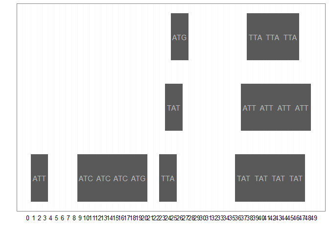
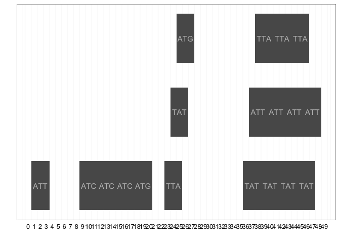

An introduction to data analysis using R
================
Marc A.T. Teunis
2016-10-20

### ****Important note: R is case-sensitive, meaning that it will matter whether you use capital or lower case, keep this in mind if you get a cryptic warning or error!****

How to run the code in the tutorial below?
==========================================

This document contains code chunks that start with

```` ```{r} ````

and end with

```` ``` ````

Run a code chucks as follows: place the cursor somewhere in a code chunk and between the ```` ```{r} ```` and the ```` ``` ```` and press the keys:

`Ctrl` `Shift` and `Enter` simultaneously.

The code will run and the results will show either in the console, or below the code chunck.

Run a line of code as follows: place the cursor somewhere on the line that you want to run. press the keys:

`Cntrl` and `Enter` simultaneously.

You can also run a piece of code by selecting the code by dragging the cursor and left-click mouse, and entering:

`Cntrl` and `Enter` simultaneously.

Introduction
============

This walkthough is part of the workshop "An introduction to data analysis using R". The workshop is meant as an introduction to R and to be able to use R for data exploration on your own data, obtained in a research project.

Setting up a project
--------------------

RStudio has the function to create projects that hold all your files in one place. Here we will create a project and set it's structure.

### Initializing a new project

Initialize a new project in RStudio under

`File` -&gt; `New Project`, choose `New Directory`.

Give the project the name: `ilc_r_workshop`

-   be sure to check the boxes 'git' and 'packrat'

System settings and project preparations
----------------------------------------

The root folder of a project is the folder where all the files of the project live. It is important to tell R what this root directory is. "rprojroot" is a package that handles project root folder settings. Run the following code to install the first package needed for this tutorial

`install.packages("rprojroot")`

than load the package by executing:

``` r
library(rprojroot)
root <- find_root_file(criterion = is_rstudio_project)
```

Knitr options and defining the root of the project
--------------------------------------------------

``` r
require("knitr") || utils::install.packages("knitr")
```

    ## Loading required package: knitr

    ## [1] TRUE

``` r
library(knitr)
knitr::opts_chunk$set(echo = TRUE)
knitr::opts_knit$set(root.dir = root)
```

Getting Started
===============

First things first
------------------

We will get the files necessary to run the code below, and also all the packages. Remember the wetransfer.com file? Did you download it? Great! Copy the file into the just created projectfolder. Unsure where to look? Look a the object "root" in the Gobal Envrionment. Store the wentransfer file in that folder.

Follow the steps outlined in the README.txt. This will (fingers crossed!!) unpack the bundle in your project directory. The bundle contains the data files, R scripts and package libraries to get going in the workshop. To view the README.txt file visit: <https://github.com/Maddocent/ilc_r_workshop/blob/master/README.md>

Project folder structure
------------------------

It is important to adapt a standard for your project structure. The code below will create a number of folders in the current project `minor_f_p` project. This functions as an example and you might want to adapt your own structure. Anything is basically good: as long as you are being consistent.

Installing required packages
----------------------------

``` r
# load packages at startup

# install packrat if not installed
require("packrat") || utils::install.packages("packrat")
```

    ## Loading required package: packrat

    ## [1] TRUE

``` r
library(packrat)

# installs "pacman" if not installed
require("pacman") || utils::install.packages("pacman")
```

    ## Loading required package: pacman

    ## [1] TRUE

``` r
library(pacman)

require("latticeExtra") || utils::install.packages("latticeExtra")
```

    ## Loading required package: latticeExtra

    ## Loading required package: lattice

    ## Loading required package: RColorBrewer

    ## [1] TRUE

``` r
library(latticeExtra)
# installs additonal R packages (CRAN and BIOCONDUCTOR packages)

p_load(car,
       dplyr,
       downloader,
       lubridate,
       gridExtra,
       cowplot,
       readr,
       gplots, 
       ggplot2, 
       reshape2, 
       RCurl, 
       knitr,
       Biostrings,
       tibble,
       XVector,
       BiocGenerics,
       xlsx,
       rJava,
       IRanges,
       S4Vectors,
       lattice,
       rmarkdown)
```

Project folders
---------------

It is wise to always have a standardized way of storing your files. I do it according the folders below

``` r
project_folders <- as.list(paste(root, c("/code",
                          "/images",
                          "/output",
                          "/data",
                          "/documentation",
                          "/rmarkdown"
                          ), sep = ""))

project_folders[[1]]
```

    ## [1] "C:/RWorkingDir/RProjects/ilc_r_workshop/code"

``` r
mkdir <- function(path){
ifelse(!dir.exists(file.path(path)),
       dir.create(file.path(path)), FALSE)
}
# lapply will apply the function to the list of folders
lapply(project_folders, mkdir)
```

    ## Warning in dir.create(file.path(path)): 'C:\RWorkingDir\RProjects
    ## \ilc_r_workshop\code' already exists

    ## Warning in dir.create(file.path(path)): 'C:\RWorkingDir\RProjects
    ## \ilc_r_workshop\images' already exists

    ## Warning in dir.create(file.path(path)): 'C:\RWorkingDir\RProjects
    ## \ilc_r_workshop\output' already exists

    ## Warning in dir.create(file.path(path)): 'C:\RWorkingDir\RProjects
    ## \ilc_r_workshop\data' already exists

    ## Warning in dir.create(file.path(path)): 'C:\RWorkingDir\RProjects
    ## \ilc_r_workshop\documentation' already exists

    ## Warning in dir.create(file.path(path)): 'C:\RWorkingDir\RProjects
    ## \ilc_r_workshop\rmarkdown' already exists

    ## [[1]]
    ## [1] FALSE
    ## 
    ## [[2]]
    ## [1] FALSE
    ## 
    ## [[3]]
    ## [1] FALSE
    ## 
    ## [[4]]
    ## [1] FALSE
    ## 
    ## [[5]]
    ## [1] FALSE
    ## 
    ## [[6]]
    ## [1] FALSE

``` r
# if a folder not already in your project this will state "TRUE", and "FALSE" if the folder already exist. 
```

### My first README.txt file

As mentioned, it is handy to have a README.txt file in a directory telling you what is in that directory. For now we will create the most important README.txt: the one that goes in the `data` directory.

``` r
file.create(paste0(root, "/data/README.md"))
```

    ## [1] TRUE

``` r
writeLines("# This is my first Markdown README.txt file. \n
## This file is now about nothing, but \n
### It will be about something in the future \n
## Markdown is a simple mark-up language", 
con = paste0(root, "/data/README.md"))
```

If we want to edit this readme file we can do this in RStudio by clicking on the file. You can edit the contents of the file just as you edit R scrips.

As shown in the example chunck above: you can also add content to the README.txt file directly from R... Nice ay!

Installing and loading additional packages
------------------------------------------

The code chunck below will take care of installing and loading all packages nessecary for this tutorial.

If you want to install a package manually, run:

`install.packages("package-name")`

To load a package manually:

`library(package-name)`

Please note the difference in use of *"double-quotes"* above.

    # Start Tutorial

Shiny Apps
==========

Shiny is an open source application that can powerfully inllustrate the use of R to generate visualizations. Here we look at an example on discision making in ants on two food sources. The sliders in the app are parameters specific for the food source. The graph shows the change in the number of ants visiting the food source.

``` r
if (!require("devtools")) install.packages("devtools")
devtools::install_github("swarm-lab/teachR", dependencies = TRUE)
if (!require("ggvis")) install.packages("ggvis")
if (!require("deSolve")) install.packages("deSolve")

library(ggvis)
library(teachR)
library(deSolve)

run_app("ant_collective_decision")
 
install.packages()
```

There are many, many more examples on nice shiny apps that can illustrate e.g. complex mathematical or statistical models. See <http://shiny.rstudio.com/> See e.g. the example on different chemical educational shiny apps: <http://dpuadweb.depauw.edu/harvey_web/shiny.html>

Reproducible research.
======================

I do not think it is neccessary to explain the literal meaning of reproducible research. All of you can grasp what is about. But, from a data scientists' point of view the term it is probabable slightly more complex.

In data science reproducible research is the possibility to reproduce every step in the process of data analysis. Meaning from the moment a data-file (sometimes in it's very rudimentary and raw form) is recieved, to the final reporting of all the steps that were undertaken to do an analysis. This process is usually characterized by the following steps:

1.  Getting data: getting data in the context of R means getting the the (raw) datafile into R

2.  Inspecting the data: means getting an idea of what kind of data the datafile contains, how many variables, how many observations, what kind of experiment, what kind of groups and how many, so basically: getting an idea of the experimental design.

3.  Cleaning the data: Usually the data is not yet in an analizable form. Cleaning the data to a tidy dataframe, with consistent naming of variables e.g., normally takes a lot of time and is the most crucial step in preparation for any analysis to come after.

4.  Exploratory data analysis: In this step an initial set of graphical representations of the data are generated. It serves to identify trends, to get summarizing results of the data in a graph and to explore the data. This is a preparative step for the step hereafter.

5.  Statistical inference: the **formal** data analysis. The process of checking assumptions, relating the data to scientitific questions and hypotheses. The analysis uses statical methods, appropriate for the design of the data and the experiment.

6.  Reporting: Th process of writing the analysis into a comprehensive report, according a set of rules, and compliant to the standard of the field of research. Preferable the report is written in such a way that reproduction of the whole of experiment + data analysis can be followed through by a peer, and reproduced if neccessary.

An important tool in reproducible research in R is RMarkdon, in combination of knitr. The document that is in fromt of you is an Rmd file, an "RMarkdown" file. Markdown is a simple mark-up language that potentiates the use of simply coding for layouting documents. One of the most famous and widely used mark-up languages is HTML, which is broadly used for **marking up** web pages. RMarkdown is an implementation of Markdown language in R. Together with the **knitr** package, it is a powerful tool to bring the principle of **literate programming** into practice. It is one of the most imporatant implementation tools for reproducible research in the R language.

For an eaxample of a full example of reproducible research, see: <https://rpubs.com/maddocent/storm>

Basic topics for working with R
===============================

Packages
--------

### List of available CRAN packages

<http://cran.r-project.org/web/packages/available_packages_by_date.html>

### Biological Packages

For Biological application go to www.bioconductor.org

Installing Bioconductor packages is easy with `pacman::p_load` function

``` r
library(pacman)
## a CRAN package to analyze DNA and protein sequences 
pacman::p_load(seqinr)

## a package that handles biological sequences
library(seqinr)
help("seqinr")

## and a BIOCONDUCTOR package to analyze LCMS data
pacman::p_load(xcms)
library(xcms)
??xcms
browseVignettes("xcms")
```

Vignettes are long explanations and demo's of a package. Commonly a vignette contains examples and a workflow that shows how the package can be used and which (research) questions can be adressed with the functions and datasets in the package. It usually is a good place to start for examples. It also shows the so-called dependence of a package: it explains which other packages you would need and how the data should look to be able to work with the package the vignette belongs to.

### Getting Help for R functions and packages

``` r
library(dplyr)
library(ggplot2)
??dplyr
??ggplot2
?mean
??mean  # go's to the page with functions related with '.mean.'
apropos("mean") # search on more options of or alternatives for a certain function
```

### Examples and demos on functions and packages

``` r
example(mean) # to see a worked example
demo(graphics) # demonstration of R functions
```

Data objects
============

Vectors
-------

R is an object oriented language: meaning you can create and work with (manipulate/index/access) objects. Vectors are R's elementary objects and come in different flavours:

1.  Nummeric vector: contains only numbers: decimal separator in R is "." (decimal point) and not "," (decimal comma) as is common in the English language.

2.  Character vector: contains only "words", but words can also be numbers: "23" or other items "100%" or "$2,000.00"

3.  An integer vector: an nummeric series: 1, 2, 3 is an integer of length 3.

4.  Logical: logical vectors contain only two values: "TRUE" and/or "FALSE"

5.  Mixed: Vectors do not need to be of one type. They can be mixed. They can only be of one class, so this operation will induce ***coercion***.

### Numeric vectors

``` r
c(2,8,5)    # combines its arguments to form a vector
```

    ## [1] 2 8 5

``` r
nv_1 <- c(2,8,5) # assignment statement (use 'alt' + '-' OR 'option' + '-')
nv_1 # view the content of the object "x"
```

    ## [1] 2 8 5

``` r
# combine commands on the same line seperate with ';'
nv_2 <- c(8.4,5.6,10.1,13.1,2.5,7.8,15.2,3.8,20.9); nv_2
```

    ## [1]  8.4  5.6 10.1 13.1  2.5  7.8 15.2  3.8 20.9

``` r
class(nv_2)
```

    ## [1] "numeric"

### Character vectors

``` r
cv <- c("this is", "an", "example of", "1", "character", "vector", "with length:", "length(cv)")
cv
```

    ## [1] "this is"      "an"           "example of"   "1"           
    ## [5] "character"    "vector"       "with length:" "length(cv)"

``` r
length(cv)
```

    ## [1] 8

``` r
class(cv)
```

    ## [1] "character"

### Integers

``` r
int <- as.integer(1:5)
int
```

    ## [1] 1 2 3 4 5

``` r
length(int)
```

    ## [1] 5

``` r
class(int)
```

    ## [1] "integer"

### Logical vectors

``` r
lv <- c(TRUE, FALSE, TRUE, TRUE)
lv
```

    ## [1]  TRUE FALSE  TRUE  TRUE

``` r
class(lv)
```

    ## [1] "logical"

``` r
## logical vectors can also be converted to numeric vectors
nlv <- as.numeric(lv)
nlv
```

    ## [1] 1 0 1 1

``` r
## note that coercion of a logical to a numeric vector changes the "TRUE" value to 1 and the "FALSE" value to 0
```

Manipulating vectors
--------------------

You can add/subtract/devide or use other arithmetic functions on numeric vectors

``` r
a <- c(1,3,5,7,9)
b <- c(2,4,6,8,10)

z1 <- a - b
z1
```

    ## [1] -1 -1 -1 -1 -1

``` r
z2 <- b - a
z2
```

    ## [1] 1 1 1 1 1

``` r
z3 <- a / b
z3
```

    ## [1] 0.5000000 0.7500000 0.8333333 0.8750000 0.9000000

``` r
z4 <- sum(a)
z4
```

    ## [1] 25

``` r
z5 <- max(a) - max(b)
z5
```

    ## [1] -1

You can get the individual items of a vector by using the index "\[\]"

``` r
x<-c(8,5,10,13,2,7,15,3,20,8);x # create vector with 10 variables
```

    ##  [1]  8  5 10 13  2  7 15  3 20  8

``` r
length(x)
```

    ## [1] 10

``` r
mode(x) # information on data mode (numeric, character, logic)
```

    ## [1] "numeric"

``` r
class(x)
```

    ## [1] "numeric"

``` r
## using the index
x[3]
```

    ## [1] 10

``` r
## creating a subset by indexing:
x[c(3, 4, 7)]
```

    ## [1] 10 13 15

``` r
# apply a simple function
mean(x) # example of a function
```

    ## [1] 9.1

``` r
max(x)
```

    ## [1] 20

``` r
quantile(x)
```

    ##    0%   25%   50%   75%  100% 
    ##  2.00  5.50  8.00 12.25 20.00

``` r
## Using the vector index "[]" some more
# extra data from vector
x[5] # (i = 5), ith element
```

    ## [1] 2

``` r
x[-2] # all but the ith (second) element
```

    ## [1]  8 10 13  2  7 15  3 20  8

``` r
x[3:5] # element 3 to 5
```

    ## [1] 10 13  2

``` r
x[x>9] # all greater than some value
```

    ## [1] 10 13 15 20

``` r
# manipulations
y <- c(x,0,x); y # separate multiple commands on the same line with ";"
```

    ##  [1]  8  5 10 13  2  7 15  3 20  8  0  8  5 10 13  2  7 15  3 20  8

``` r
sum(y) # sum of elements in the vector
```

    ## [1] 182

### Plotting series/vectors

``` r
c <- c(1:7,9,11)
d <- c(1:9)

# performing a linear correlation
m1 <- lm(c ~ d)
summary(m1)
```

    ## 
    ## Call:
    ## lm(formula = c ~ d)
    ## 
    ## Residuals:
    ##      Min       1Q   Median       3Q      Max 
    ## -0.70000 -0.33333  0.03333  0.21667  0.93333 
    ## 
    ## Coefficients:
    ##             Estimate Std. Error t value Pr(>|t|)    
    ## (Intercept) -0.58333    0.38670  -1.508    0.175    
    ## d            1.18333    0.06872  17.220 5.47e-07 ***
    ## ---
    ## Signif. codes:  0 '***' 0.001 '**' 0.01 '*' 0.05 '.' 0.1 ' ' 1
    ## 
    ## Residual standard error: 0.5323 on 7 degrees of freedom
    ## Multiple R-squared:  0.9769, Adjusted R-squared:  0.9736 
    ## F-statistic: 296.5 on 1 and 7 DF,  p-value: 5.47e-07

``` r
# make a plot 
plot(c, d, ylim=c(0,13))
```


``` r
plot(c, d, ylim=c(0,13), abline(m1))  #abline plots the correaltion model in the graph
```


``` r
m1$coefficients
```

    ## (Intercept)           d 
    ##  -0.5833333   1.1833333

### Handeling character vectors

What happens if you use arithmetic functions on character vectors and numeric vector?

``` r
w <- c("1", "2")
u <- c("a", "b", "c")
z6 <- w-y  
z7 <- u+w
```

This does not work because the vectors are of different type

we can use the paste command for this

``` r
w <- c("1", "2")
u <- c("a", "b", "c")
z8 <- paste(u,w, sep = "_")
z8 ## because w is shorter than u, it get's recycled over u
```

    ## [1] "a_1" "b_2" "c_1"

Let's clean up the workspace
============================

``` r
rm(list=ls())

root <- find_root_file(criterion = is_rstudio_project)

## Note: never use this in code that is meant for others!!!
```

It is an effective way to clear all the items in the Global Environment, but is is not very friendly to use this in code you share with others: can you think of why?

Data Structures: Lists and Dataframes
=====================================

When using R for data analysis you will most likely work with data in a matrix, an array, a list or even more likely: a dataframe.

A matrix is a table with only numeric values. An array consists of multiple matices. A list is collection of R objects of different data type. A dataframe is a table with variable names in the first row and observations in the consecutive rows. The columns in a dataframe represnet different variables.

The dataframe and the list are the most widely used datastructures when considering experimental Biological data.

Lists
-----

### Create a List

``` r
lst <-list(name="Fred", wife="Mary", no.children=3, child_ages=c(4,7,9))
lst # Lst is a list with 4 components
```

    ## $name
    ## [1] "Fred"
    ## 
    ## $wife
    ## [1] "Mary"
    ## 
    ## $no.children
    ## [1] 3
    ## 
    ## $child_ages
    ## [1] 4 7 9

``` r
str(lst) # display dtructure of R object
```

    ## List of 4
    ##  $ name       : chr "Fred"
    ##  $ wife       : chr "Mary"
    ##  $ no.children: num 3
    ##  $ child_ages : num [1:3] 4 7 9

### Accessing items in a list

There are 2 ways to select a single variable from a list The indexing of lists work also with square brackets or the dollars sign, but we will see there is a difference:

``` r
str(lst)
```

    ## List of 4
    ##  $ name       : chr "Fred"
    ##  $ wife       : chr "Mary"
    ##  $ no.children: num 3
    ##  $ child_ages : num [1:3] 4 7 9

``` r
lst$child_ages # MyListName$MyVariableName 
```

    ## [1] 4 7 9

``` r
lst[4]# MyListName[MyVariableColumnNumber] 
```

    ## $child_ages
    ## [1] 4 7 9

To select a single element from a variable in a list

``` r
lst$child_ages[2] 
```

    ## [1] 7

``` r
lst[[4]][2]
```

    ## [1] 7

``` r
# returns the value of the second element for your variable
```

The Dataframe
-------------

The dataframe is the most widely used data structure in the context of experimental biology and chemistry. **Remember "Tidy data!"**

### Create a data frame

``` r
people <- data.frame(age=c(24, 27, 19, 34),      
                       sex=c("F","F","M", "M"), 
                       weight=c(64,55,80, 70),
                     names = c("Christa", "Suzan", 
                     "Matt", "John"))
```

### Viewing the contents of a dataframe

``` r
head(people)            # gives the content of the data frame
```

    ##   age sex weight   names
    ## 1  24   F     64 Christa
    ## 2  27   F     55   Suzan
    ## 3  19   M     80    Matt
    ## 4  34   M     70    John

``` r
names(people) 
```

    ## [1] "age"    "sex"    "weight" "names"

``` r
str(people)
```

    ## 'data.frame':    4 obs. of  4 variables:
    ##  $ age   : num  24 27 19 34
    ##  $ sex   : Factor w/ 2 levels "F","M": 1 1 2 2
    ##  $ weight: num  64 55 80 70
    ##  $ names : Factor w/ 4 levels "Christa","John",..: 1 4 3 2

``` r
people$age # gives the content of the variable "age" from the data frame ""
```

    ## [1] 24 27 19 34

### Using Index on Dataframes

Using the index "\[\]" on a dataframe is a bit tricky. The dataframe always consists of rows and columns. Indexing a dataframe goes like:

`dataframe[row number(s), column number(s)]`

``` r
people$age[1]   # first element of this vector
```

    ## [1] 24

``` r
people[,2]  # content of 2nd variable (column) which is a character vector -> factor
```

    ## [1] F F M M
    ## Levels: F M

``` r
people[1,]  # content of the 1st row
```

    ##   age sex weight   names
    ## 1  24   F     64 Christa

``` r
# multiple indices
people[2:3, c(1,3)] # remember to use c
```

    ##   age weight
    ## 2  27     55
    ## 3  19     80

Import data into R
==================

read.table reads space-delimited or tab delimited files
-------------------------------------------------------

``` r
gender_age <-read.table(paste0(root, "/data/gender.txt"), header=TRUE)
```

    ## Warning in scan(file = file, what = what, sep = sep, quote = quote, dec =
    ## dec, : number of items read is not a multiple of the number of columns

``` r
# getting the first few rows 
head(gender_age)
```

    ##   gender age
    ## 1      F  12
    ## 2      F  23
    ## 3      F  34
    ## 4      M  12
    ## 5      M  15
    ## 6      M  17

``` r
# getting information on the variable, the dimensions
str(gender_age)
```

    ## 'data.frame':    17 obs. of  2 variables:
    ##  $ gender: Factor w/ 2 levels "F","M": 1 1 1 2 2 2 1 1 2 1 ...
    ##  $ age   : int  12 23 34 12 15 17 18 14 56 67 ...

``` r
# selecting a variable
gender_age$gender
```

    ##  [1] F F F M M M F F M F M M M F F F M
    ## Levels: F M

``` r
gender_age$age
```

    ##  [1] 12 23 34 12 15 17 18 14 56 67 89 34 45 12  3  5 NA

``` r
gender_age[1:6,2]
```

    ## [1] 12 23 34 12 15 17

read\_csv
---------

CSV is a format of a data file that uses commas or semicolons as seprators for the columns.

``` r
library(readr)
skin <- read_csv(paste0(root, "/data/skincolumns.csv")) 
```

    ## Parsed with column specification:
    ## cols(
    ##   `Genotype A` = col_double(),
    ##   `Genotype B` = col_double()
    ## )

``` r
str(skin)
```

    ## Classes 'tbl_df', 'tbl' and 'data.frame':    15 obs. of  2 variables:
    ##  $ Genotype A: num  54.9 48.8 50.8 45 28.7 ...
    ##  $ Genotype B: num  30.5 24.8 24.2 27.9 18.8 ...
    ##  - attr(*, "spec")=List of 2
    ##   ..$ cols   :List of 2
    ##   .. ..$ Genotype A: list()
    ##   .. .. ..- attr(*, "class")= chr  "collector_double" "collector"
    ##   .. ..$ Genotype B: list()
    ##   .. .. ..- attr(*, "class")= chr  "collector_double" "collector"
    ##   ..$ default: list()
    ##   .. ..- attr(*, "class")= chr  "collector_guess" "collector"
    ##   ..- attr(*, "class")= chr "col_spec"

``` r
skin     # content of the data frame
```

    ## # A tibble: 15 × 2
    ##    `Genotype A` `Genotype B`
    ##           <dbl>        <dbl>
    ## 1      54.89321     30.48837
    ## 2      48.77277     24.75629
    ## 3      50.75909     24.20443
    ## 4      44.96176     27.94116
    ## 5      28.74590     18.76385
    ## 6      35.31823     25.51043
    ## 7      67.69529     31.23472
    ## 8      54.06371     25.07816
    ## 9      45.69067     25.78900
    ## 10     47.97799     25.23590
    ## 11     35.17264     23.86699
    ## 12     69.12898           NA
    ## 13     52.01261     31.59287
    ## 14     47.30623     22.77589
    ## 15     40.81083     22.96212

``` r
dim(skin)
```

    ## [1] 15  2

``` r
attributes(skin)
```

    ## $class
    ## [1] "tbl_df"     "tbl"        "data.frame"
    ## 
    ## $row.names
    ##  [1]  1  2  3  4  5  6  7  8  9 10 11 12 13 14 15
    ## 
    ## $names
    ## [1] "Genotype A" "Genotype B"
    ## 
    ## $spec
    ## cols(
    ##   `Genotype A` = col_double(),
    ##   `Genotype B` = col_double()
    ## )

``` r
summary(skin)
```

    ##    Genotype A      Genotype B   
    ##  Min.   :28.75   Min.   :18.76  
    ##  1st Qu.:42.89   1st Qu.:23.95  
    ##  Median :47.98   Median :25.16  
    ##  Mean   :48.22   Mean   :25.73  
    ##  3rd Qu.:53.04   3rd Qu.:27.40  
    ##  Max.   :69.13   Max.   :31.59  
    ##                  NA's   :1

``` r
?read_csv    # help on the function
```

    ## starting httpd help server ...

    ##  done

``` r
## dataset contains an NA, some functions do not work with NAs:
mean(skin$`Genotype A`)
```

    ## [1] 48.22066

``` r
mean(skin$`Genotype B`)
```

    ## [1] NA

``` r
# to remove the NA
skin_noNA <- na.omit(skin)
mean(skin_noNA$`Genotype B`)
```

    ## [1] 25.72858

Example: create data frame with 3 variabels gender,
---------------------------------------------------

smoke, age category (&lt;15, 15-30, &gt;30)

``` r
set.seed(6000) # set it at the same number, then we will all produce the same output
gender<-c(sample(c(1,2), size=1000, replace=TRUE))
smoke<-c(sample(c(1,2), size=1000, replace=TRUE))
age<-c(sample(c(1,2,3), size=1000, replace=TRUE))
weight<-round(rnorm(1000, mean=65, sd=10),1); weight
```

    ##    [1] 65.1 66.9 46.9 70.5 66.9 93.0 67.1 74.5 77.6 61.6 70.9 57.5 62.3
    ##   [14] 69.3 60.4 81.9 50.8 48.5 67.7 57.6 57.3 70.4 70.4 80.2 63.8 59.8
    ##   [27] 75.3 80.6 73.0 65.4 65.7 57.5 64.3 48.0 74.9 64.5 73.4 45.3 57.4
    ##   [40] 75.2 82.7 49.6 58.6 71.7 67.8 46.4 52.5 68.0 63.2 66.1 64.4 69.7
    ##   [53] 67.6 65.3 67.3 62.1 49.3 66.6 65.0 60.5 72.4 77.3 70.7 56.8 74.7
    ##   [66] 65.8 59.5 77.5 91.8 78.2 81.4 52.6 56.7 71.0 67.2 63.8 83.3 58.8
    ##   [79] 63.8 63.3 75.2 52.7 68.4 74.4 71.7 44.9 86.9 64.6 62.2 65.5 63.9
    ##   [92] 78.4 98.6 72.8 78.3 68.4 88.3 56.1 69.5 54.8 75.9 65.4 76.5 76.4
    ##  [105] 71.9 57.6 61.2 85.2 64.6 71.4 66.5 64.3 63.2 65.4 53.8 88.1 65.0
    ##  [118] 60.4 53.5 84.3 56.1 53.5 53.3 56.4 68.6 67.6 70.8 61.2 71.8 74.8
    ##  [131] 79.0 68.1 68.9 46.7 75.8 43.8 77.9 67.2 63.8 87.5 89.2 54.6 69.7
    ##  [144] 56.5 61.2 72.9 64.3 76.7 76.1 66.2 61.0 55.8 70.7 47.9 75.4 66.5
    ##  [157] 82.7 52.9 43.5 67.9 59.6 69.0 84.4 70.7 69.0 64.5 73.3 70.2 68.6
    ##  [170] 70.7 42.7 58.4 69.0 64.7 52.8 81.5 72.1 74.3 63.0 60.1 76.0 68.8
    ##  [183] 39.3 59.3 59.6 62.6 75.4 74.9 48.6 63.4 63.2 76.9 64.7 62.5 84.0
    ##  [196] 54.0 69.9 68.2 81.5 60.1 66.2 93.4 68.3 60.6 63.6 45.4 64.0 81.7
    ##  [209] 57.9 59.8 70.1 64.4 62.7 71.8 54.5 62.4 73.0 63.8 69.5 67.1 50.3
    ##  [222] 79.6 55.5 51.4 76.8 61.9 77.1 70.3 80.3 81.4 67.5 46.0 74.6 56.1
    ##  [235] 59.3 58.0 79.0 56.8 68.3 69.4 55.9 79.1 82.6 65.2 51.7 65.2 55.1
    ##  [248] 75.8 64.7 57.5 51.9 73.1 54.5 73.8 61.1 71.3 66.7 51.8 58.1 68.6
    ##  [261] 53.9 63.8 49.0 75.5 73.5 67.3 75.4 71.9 48.2 60.9 72.6 63.0 50.5
    ##  [274] 77.3 67.4 60.3 63.7 62.4 62.0 78.2 56.3 47.5 69.4 53.3 66.6 79.7
    ##  [287] 61.3 58.2 53.0 70.1 77.3 67.4 66.0 73.7 67.9 62.5 66.8 50.9 60.4
    ##  [300] 88.7 64.5 77.5 69.5 69.6 63.6 53.0 65.3 51.6 69.7 70.4 56.2 58.6
    ##  [313] 60.2 66.3 56.3 71.9 57.6 60.5 56.0 71.7 80.9 88.0 71.5 53.0 79.6
    ##  [326] 72.3 73.7 49.1 63.4 70.0 68.5 69.4 73.9 49.7 53.3 61.3 55.3 52.0
    ##  [339] 70.3 60.2 56.1 49.7 64.0 64.8 72.5 45.0 82.5 47.3 58.6 75.2 55.3
    ##  [352] 54.0 47.8 66.3 62.2 55.9 61.4 66.2 60.7 72.3 65.5 45.5 57.3 63.8
    ##  [365] 62.0 74.1 61.9 57.6 81.3 75.0 60.6 55.4 70.1 63.1 48.2 65.4 75.8
    ##  [378] 47.7 56.0 64.4 76.7 70.7 56.3 74.3 70.2 67.7 69.5 53.4 71.3 57.5
    ##  [391] 54.9 74.2 72.2 54.9 68.2 69.3 73.2 72.0 63.6 76.1 81.7 74.6 66.7
    ##  [404] 67.7 67.6 69.7 72.5 58.5 66.8 53.6 62.1 76.3 63.1 73.3 65.3 64.1
    ##  [417] 71.3 63.1 74.7 81.3 62.0 54.0 72.4 55.2 57.0 62.0 76.3 82.6 68.4
    ##  [430] 75.3 69.6 48.3 54.0 70.3 42.6 60.2 61.1 76.4 81.4 66.3 58.8 58.8
    ##  [443] 64.6 72.3 56.7 64.0 58.3 82.1 74.3 56.7 59.1 54.3 66.2 74.0 54.9
    ##  [456] 45.4 86.8 70.3 62.1 59.4 90.3 71.5 65.9 72.6 73.6 68.0 64.3 67.0
    ##  [469] 65.2 63.5 60.3 78.0 74.2 66.1 68.4 70.9 74.3 56.1 59.3 58.6 64.2
    ##  [482] 65.7 71.4 61.3 74.5 70.8 65.1 77.2 76.7 53.7 57.0 73.7 71.9 57.1
    ##  [495] 72.9 64.4 58.5 81.0 55.6 71.3 62.2 54.7 69.2 68.4 81.1 71.4 69.2
    ##  [508] 63.6 54.2 54.3 84.8 54.5 66.2 57.9 55.5 61.2 69.7 54.6 58.9 68.9
    ##  [521] 71.8 60.2 78.7 48.6 43.8 58.1 70.6 52.2 45.7 56.5 50.1 67.0 58.1
    ##  [534] 46.8 79.2 70.8 52.9 62.6 52.2 56.4 72.2 56.7 58.1 85.2 60.4 51.6
    ##  [547] 85.4 60.0 53.2 73.5 69.8 53.5 76.2 50.7 64.7 72.9 76.9 74.7 55.0
    ##  [560] 63.8 67.0 66.0 71.7 59.0 62.3 77.5 77.4 62.8 78.4 68.7 70.8 67.5
    ##  [573] 76.1 67.3 79.9 58.2 68.7 67.7 80.4 57.3 80.1 63.4 70.6 61.8 51.1
    ##  [586] 63.3 51.6 49.1 46.4 65.3 64.2 74.2 48.0 70.0 69.8 69.5 71.0 64.0
    ##  [599] 74.8 61.0 49.7 65.8 46.6 69.3 61.1 43.6 52.1 58.3 59.9 52.9 73.8
    ##  [612] 60.2 58.1 75.6 63.3 63.6 66.8 54.9 56.6 66.4 71.4 58.0 84.7 46.6
    ##  [625] 70.1 61.8 56.7 80.9 71.7 48.5 64.5 66.2 63.5 70.8 73.8 60.6 65.3
    ##  [638] 71.8 58.2 80.3 74.2 61.4 62.6 66.5 67.5 70.4 62.5 63.7 75.7 59.9
    ##  [651] 51.6 41.5 53.0 81.6 49.7 54.2 65.7 58.3 73.1 61.6 59.9 60.4 72.7
    ##  [664] 53.5 45.6 58.2 61.6 77.5 66.1 69.2 62.8 56.3 57.0 65.9 69.9 80.6
    ##  [677] 57.6 88.3 74.1 62.0 74.2 66.1 76.0 79.3 66.5 70.8 68.3 47.7 56.2
    ##  [690] 78.1 56.8 60.5 69.4 62.2 58.9 59.9 61.0 82.4 71.5 64.9 61.0 77.6
    ##  [703] 49.1 63.4 75.9 52.7 64.4 72.8 74.0 62.4 75.1 71.9 65.9 54.7 73.6
    ##  [716] 74.0 58.4 56.8 68.3 61.6 62.7 65.0 52.2 76.3 48.6 72.8 77.2 45.1
    ##  [729] 68.2 76.6 79.6 76.2 61.4 68.3 50.8 60.0 68.4 58.9 75.2 80.6 65.8
    ##  [742] 62.7 65.3 49.1 49.0 61.1 58.6 79.6 67.1 53.7 67.4 70.2 67.5 49.0
    ##  [755] 69.0 78.6 80.8 65.0 57.7 56.2 53.9 63.6 60.8 70.4 62.3 67.6 68.6
    ##  [768] 54.5 51.9 71.8 71.7 76.4 73.7 55.7 54.4 78.0 72.6 77.8 66.8 36.7
    ##  [781] 62.4 58.9 58.1 45.5 53.0 77.7 68.7 71.7 42.7 83.9 61.1 65.5 69.2
    ##  [794] 73.9 68.0 73.5 60.8 62.9 70.4 56.8 77.1 58.3 69.5 46.6 89.6 70.8
    ##  [807] 77.6 64.3 47.0 55.3 73.1 68.6 60.1 69.9 67.9 61.3 69.8 80.2 73.2
    ##  [820] 69.7 55.3 57.0 70.1 59.1 53.0 67.8 77.1 81.3 78.2 75.1 64.2 74.2
    ##  [833] 73.1 72.3 50.8 53.4 74.6 67.6 56.6 62.9 65.1 67.4 53.2 56.4 59.5
    ##  [846] 79.1 84.2 62.4 63.5 63.1 80.4 69.9 77.8 53.6 51.9 67.6 64.4 67.4
    ##  [859] 48.7 59.9 60.9 63.3 65.5 70.3 56.5 77.0 53.8 78.4 72.0 79.7 59.9
    ##  [872] 55.9 77.4 52.7 75.4 52.4 68.5 48.0 56.5 63.2 62.4 85.7 75.2 62.0
    ##  [885] 60.5 71.2 82.9 73.6 74.5 69.1 50.0 68.4 78.2 62.6 28.5 78.4 37.3
    ##  [898] 60.3 59.6 67.8 68.2 68.1 94.7 79.2 63.2 74.6 53.7 73.6 72.8 50.7
    ##  [911] 60.0 69.8 60.5 75.5 65.1 55.1 51.1 58.7 78.5 71.3 61.4 74.9 65.3
    ##  [924] 76.3 68.0 63.9 63.4 47.2 77.9 76.2 60.9 64.4 73.2 65.5 67.3 62.1
    ##  [937] 65.4 64.4 89.0 54.7 59.0 70.5 42.2 71.3 65.4 55.2 76.9 68.8 65.5
    ##  [950] 77.8 67.4 55.5 76.6 69.3 69.9 45.2 71.9 65.9 60.0 58.4 57.7 60.6
    ##  [963] 66.9 67.0 71.4 66.3 53.0 65.8 50.8 64.0 72.8 62.9 63.7 76.6 73.8
    ##  [976] 77.7 73.4 74.8 64.1 78.5 39.9 54.1 78.6 76.7 83.0 71.8 58.8 57.9
    ##  [989] 59.3 69.1 67.0 78.4 68.0 68.9 64.3 73.4 74.5 70.7 56.0 76.0

``` r
smoking <- data.frame(cbind(gender, smoke, age, weight)); smoking
```

    ##      gender smoke age weight
    ## 1         2     1   3   65.1
    ## 2         2     1   1   66.9
    ## 3         1     2   3   46.9
    ## 4         1     1   3   70.5
    ## 5         1     2   1   66.9
    ## 6         2     2   3   93.0
    ## 7         1     1   1   67.1
    ## 8         1     2   3   74.5
    ## 9         1     2   3   77.6
    ## 10        2     1   1   61.6
    ## 11        2     1   3   70.9
    ## 12        2     2   1   57.5
    ## 13        2     1   1   62.3
    ## 14        1     2   3   69.3
    ## 15        2     2   3   60.4
    ## 16        2     2   1   81.9
    ## 17        2     2   3   50.8
    ## 18        1     1   3   48.5
    ## 19        1     2   2   67.7
    ## 20        2     1   3   57.6
    ## 21        2     2   2   57.3
    ## 22        1     1   3   70.4
    ## 23        1     1   3   70.4
    ## 24        2     1   3   80.2
    ## 25        1     2   3   63.8
    ## 26        2     1   1   59.8
    ## 27        1     2   3   75.3
    ## 28        2     1   1   80.6
    ## 29        2     2   1   73.0
    ## 30        1     1   2   65.4
    ## 31        1     2   3   65.7
    ## 32        1     2   2   57.5
    ## 33        2     1   3   64.3
    ## 34        1     2   1   48.0
    ## 35        1     2   1   74.9
    ## 36        2     1   2   64.5
    ## 37        1     1   1   73.4
    ## 38        2     2   2   45.3
    ## 39        2     1   1   57.4
    ## 40        1     1   2   75.2
    ## 41        2     1   1   82.7
    ## 42        2     2   1   49.6
    ## 43        1     2   1   58.6
    ## 44        2     2   1   71.7
    ## 45        2     1   1   67.8
    ## 46        1     1   2   46.4
    ## 47        2     1   2   52.5
    ## 48        2     2   1   68.0
    ## 49        1     2   2   63.2
    ## 50        1     2   1   66.1
    ## 51        1     1   1   64.4
    ## 52        1     2   1   69.7
    ## 53        1     1   1   67.6
    ## 54        2     2   2   65.3
    ## 55        2     1   1   67.3
    ## 56        1     1   1   62.1
    ## 57        1     2   1   49.3
    ## 58        1     1   1   66.6
    ## 59        1     1   2   65.0
    ## 60        2     2   3   60.5
    ## 61        1     1   3   72.4
    ## 62        2     1   2   77.3
    ## 63        1     1   3   70.7
    ## 64        2     1   1   56.8
    ## 65        2     2   3   74.7
    ## 66        1     1   1   65.8
    ## 67        2     1   2   59.5
    ## 68        1     2   3   77.5
    ## 69        2     2   1   91.8
    ## 70        1     2   2   78.2
    ## 71        1     2   2   81.4
    ## 72        2     1   3   52.6
    ## 73        2     1   1   56.7
    ## 74        1     1   1   71.0
    ## 75        1     1   1   67.2
    ## 76        1     2   2   63.8
    ## 77        2     1   2   83.3
    ## 78        1     2   2   58.8
    ## 79        2     1   3   63.8
    ## 80        1     1   2   63.3
    ## 81        1     1   3   75.2
    ## 82        2     2   1   52.7
    ## 83        2     2   2   68.4
    ## 84        2     1   3   74.4
    ## 85        1     1   3   71.7
    ## 86        2     1   1   44.9
    ## 87        1     2   3   86.9
    ## 88        2     2   3   64.6
    ## 89        2     1   3   62.2
    ## 90        2     2   2   65.5
    ## 91        1     1   3   63.9
    ## 92        1     2   2   78.4
    ## 93        1     2   3   98.6
    ## 94        1     2   1   72.8
    ## 95        1     1   3   78.3
    ## 96        1     1   3   68.4
    ## 97        1     1   3   88.3
    ## 98        2     1   2   56.1
    ## 99        2     2   3   69.5
    ## 100       2     2   3   54.8
    ## 101       2     2   1   75.9
    ## 102       2     1   1   65.4
    ## 103       1     2   3   76.5
    ## 104       1     1   3   76.4
    ## 105       1     1   3   71.9
    ## 106       2     1   2   57.6
    ## 107       1     2   1   61.2
    ## 108       1     1   3   85.2
    ## 109       2     2   1   64.6
    ## 110       2     2   1   71.4
    ## 111       2     2   3   66.5
    ## 112       1     2   3   64.3
    ## 113       2     1   1   63.2
    ## 114       1     2   1   65.4
    ## 115       1     1   1   53.8
    ## 116       2     1   2   88.1
    ## 117       2     1   1   65.0
    ## 118       2     1   3   60.4
    ## 119       1     2   2   53.5
    ## 120       1     2   3   84.3
    ## 121       2     1   2   56.1
    ## 122       1     1   2   53.5
    ## 123       2     1   1   53.3
    ## 124       1     2   1   56.4
    ## 125       2     1   3   68.6
    ## 126       1     2   1   67.6
    ## 127       1     1   2   70.8
    ## 128       1     2   2   61.2
    ## 129       2     2   2   71.8
    ## 130       2     2   1   74.8
    ## 131       2     2   1   79.0
    ## 132       2     1   2   68.1
    ## 133       2     2   2   68.9
    ## 134       1     2   2   46.7
    ## 135       1     2   3   75.8
    ## 136       2     1   1   43.8
    ## 137       1     1   2   77.9
    ## 138       1     1   2   67.2
    ## 139       2     2   1   63.8
    ## 140       1     1   2   87.5
    ## 141       2     2   2   89.2
    ## 142       2     1   2   54.6
    ## 143       1     1   1   69.7
    ## 144       1     2   1   56.5
    ## 145       2     2   1   61.2
    ## 146       1     2   1   72.9
    ## 147       2     2   2   64.3
    ## 148       2     1   2   76.7
    ## 149       2     2   3   76.1
    ## 150       1     2   2   66.2
    ## 151       1     1   3   61.0
    ## 152       1     1   3   55.8
    ## 153       1     2   1   70.7
    ## 154       1     1   1   47.9
    ## 155       1     1   2   75.4
    ## 156       1     2   1   66.5
    ## 157       1     2   2   82.7
    ## 158       1     2   2   52.9
    ## 159       2     2   1   43.5
    ## 160       2     1   2   67.9
    ## 161       1     1   2   59.6
    ## 162       1     2   3   69.0
    ## 163       1     2   3   84.4
    ## 164       2     1   3   70.7
    ## 165       1     1   3   69.0
    ## 166       2     2   2   64.5
    ## 167       2     1   1   73.3
    ## 168       2     2   2   70.2
    ## 169       1     1   2   68.6
    ## 170       1     1   3   70.7
    ## 171       2     2   3   42.7
    ## 172       1     2   2   58.4
    ## 173       1     2   2   69.0
    ## 174       1     2   2   64.7
    ## 175       1     2   3   52.8
    ## 176       1     2   1   81.5
    ## 177       1     1   2   72.1
    ## 178       2     2   1   74.3
    ## 179       2     1   3   63.0
    ## 180       1     2   2   60.1
    ## 181       2     1   1   76.0
    ## 182       2     2   3   68.8
    ## 183       2     1   3   39.3
    ## 184       1     1   3   59.3
    ## 185       1     1   1   59.6
    ## 186       1     1   3   62.6
    ## 187       1     2   1   75.4
    ## 188       1     2   2   74.9
    ## 189       1     2   3   48.6
    ## 190       1     2   1   63.4
    ## 191       1     2   1   63.2
    ## 192       1     2   1   76.9
    ## 193       2     1   3   64.7
    ## 194       2     2   2   62.5
    ## 195       1     2   2   84.0
    ## 196       1     2   1   54.0
    ## 197       1     1   2   69.9
    ## 198       2     1   1   68.2
    ## 199       1     1   2   81.5
    ## 200       1     2   3   60.1
    ## 201       2     2   2   66.2
    ## 202       1     2   2   93.4
    ## 203       2     1   2   68.3
    ## 204       2     1   3   60.6
    ## 205       1     2   1   63.6
    ## 206       2     2   1   45.4
    ## 207       2     1   2   64.0
    ## 208       1     2   3   81.7
    ## 209       1     2   1   57.9
    ## 210       1     2   3   59.8
    ## 211       2     2   1   70.1
    ## 212       1     2   2   64.4
    ## 213       1     2   3   62.7
    ## 214       1     2   2   71.8
    ## 215       1     1   2   54.5
    ## 216       1     2   3   62.4
    ## 217       2     1   1   73.0
    ## 218       2     2   2   63.8
    ## 219       1     1   2   69.5
    ## 220       2     2   2   67.1
    ## 221       2     1   1   50.3
    ## 222       2     2   3   79.6
    ## 223       1     1   2   55.5
    ## 224       1     1   1   51.4
    ## 225       1     2   3   76.8
    ## 226       2     2   2   61.9
    ## 227       2     1   2   77.1
    ## 228       1     1   3   70.3
    ## 229       1     2   2   80.3
    ## 230       2     2   1   81.4
    ## 231       2     2   2   67.5
    ## 232       1     1   2   46.0
    ## 233       2     2   1   74.6
    ## 234       2     2   2   56.1
    ## 235       1     2   1   59.3
    ## 236       1     1   1   58.0
    ## 237       1     1   3   79.0
    ## 238       1     2   3   56.8
    ## 239       1     1   3   68.3
    ## 240       2     1   2   69.4
    ## 241       1     1   1   55.9
    ## 242       2     2   1   79.1
    ## 243       2     2   2   82.6
    ## 244       1     1   1   65.2
    ## 245       1     2   3   51.7
    ## 246       2     1   3   65.2
    ## 247       2     2   1   55.1
    ## 248       2     1   1   75.8
    ## 249       2     2   3   64.7
    ## 250       1     1   2   57.5
    ## 251       2     1   1   51.9
    ## 252       1     1   3   73.1
    ## 253       1     1   2   54.5
    ## 254       1     1   2   73.8
    ## 255       2     2   1   61.1
    ## 256       1     1   3   71.3
    ## 257       2     2   1   66.7
    ## 258       1     1   1   51.8
    ## 259       1     1   1   58.1
    ## 260       2     2   1   68.6
    ## 261       2     1   2   53.9
    ## 262       2     1   1   63.8
    ## 263       2     1   3   49.0
    ## 264       1     2   3   75.5
    ## 265       2     2   2   73.5
    ## 266       2     2   1   67.3
    ## 267       1     2   2   75.4
    ## 268       1     2   3   71.9
    ## 269       2     2   3   48.2
    ## 270       2     1   1   60.9
    ## 271       1     2   3   72.6
    ## 272       1     1   2   63.0
    ## 273       2     2   3   50.5
    ## 274       2     2   3   77.3
    ## 275       1     1   2   67.4
    ## 276       2     2   2   60.3
    ## 277       2     1   3   63.7
    ## 278       2     1   2   62.4
    ## 279       1     2   2   62.0
    ## 280       2     1   2   78.2
    ## 281       2     2   2   56.3
    ## 282       2     2   3   47.5
    ## 283       2     1   2   69.4
    ## 284       1     1   3   53.3
    ## 285       2     2   3   66.6
    ## 286       1     2   3   79.7
    ## 287       2     2   2   61.3
    ## 288       2     2   1   58.2
    ## 289       1     1   2   53.0
    ## 290       2     2   2   70.1
    ## 291       2     1   1   77.3
    ## 292       2     2   3   67.4
    ## 293       1     1   3   66.0
    ## 294       2     1   3   73.7
    ## 295       2     2   1   67.9
    ## 296       2     2   2   62.5
    ## 297       1     2   2   66.8
    ## 298       2     1   2   50.9
    ## 299       1     1   3   60.4
    ## 300       1     1   3   88.7
    ## 301       2     2   3   64.5
    ## 302       2     1   2   77.5
    ## 303       2     1   1   69.5
    ## 304       1     2   2   69.6
    ## 305       2     1   2   63.6
    ## 306       2     1   1   53.0
    ## 307       1     1   3   65.3
    ## 308       2     2   3   51.6
    ## 309       1     2   3   69.7
    ## 310       2     1   3   70.4
    ## 311       2     1   1   56.2
    ## 312       1     2   2   58.6
    ## 313       2     1   1   60.2
    ## 314       2     2   2   66.3
    ## 315       1     1   2   56.3
    ## 316       2     1   3   71.9
    ## 317       2     1   3   57.6
    ## 318       1     1   1   60.5
    ## 319       2     2   2   56.0
    ## 320       1     1   2   71.7
    ## 321       2     2   3   80.9
    ## 322       2     1   3   88.0
    ## 323       1     2   1   71.5
    ## 324       1     2   3   53.0
    ## 325       2     1   2   79.6
    ## 326       1     2   3   72.3
    ## 327       2     1   3   73.7
    ## 328       1     1   3   49.1
    ## 329       1     1   1   63.4
    ## 330       1     2   1   70.0
    ## 331       1     1   3   68.5
    ## 332       1     2   1   69.4
    ## 333       2     1   1   73.9
    ## 334       1     1   1   49.7
    ## 335       2     1   3   53.3
    ## 336       1     1   3   61.3
    ## 337       2     2   1   55.3
    ## 338       1     2   2   52.0
    ## 339       1     1   1   70.3
    ## 340       1     1   1   60.2
    ## 341       2     1   3   56.1
    ## 342       2     1   3   49.7
    ## 343       1     2   1   64.0
    ## 344       2     1   3   64.8
    ## 345       1     1   1   72.5
    ## 346       2     2   1   45.0
    ## 347       2     2   3   82.5
    ## 348       1     2   3   47.3
    ## 349       2     2   1   58.6
    ## 350       1     2   2   75.2
    ## 351       1     2   2   55.3
    ## 352       2     2   1   54.0
    ## 353       1     2   2   47.8
    ## 354       2     1   3   66.3
    ## 355       1     2   1   62.2
    ## 356       1     2   1   55.9
    ## 357       1     2   1   61.4
    ## 358       1     1   2   66.2
    ## 359       1     1   3   60.7
    ## 360       1     2   2   72.3
    ## 361       1     2   3   65.5
    ## 362       2     1   1   45.5
    ## 363       2     1   2   57.3
    ## 364       2     2   1   63.8
    ## 365       2     2   3   62.0
    ## 366       2     1   3   74.1
    ## 367       1     2   2   61.9
    ## 368       2     1   1   57.6
    ## 369       2     2   2   81.3
    ## 370       2     1   2   75.0
    ## 371       2     1   2   60.6
    ## 372       1     1   2   55.4
    ## 373       1     1   2   70.1
    ## 374       2     2   1   63.1
    ## 375       2     1   1   48.2
    ## 376       2     2   2   65.4
    ## 377       1     1   1   75.8
    ## 378       2     2   2   47.7
    ## 379       1     2   2   56.0
    ## 380       1     1   2   64.4
    ## 381       1     2   1   76.7
    ## 382       1     1   3   70.7
    ## 383       1     1   2   56.3
    ## 384       1     2   3   74.3
    ## 385       1     2   3   70.2
    ## 386       1     1   1   67.7
    ## 387       2     1   1   69.5
    ## 388       2     1   1   53.4
    ## 389       1     1   1   71.3
    ## 390       1     1   2   57.5
    ## 391       1     2   2   54.9
    ## 392       2     2   2   74.2
    ## 393       1     1   2   72.2
    ## 394       1     1   3   54.9
    ## 395       2     2   1   68.2
    ## 396       1     1   3   69.3
    ## 397       1     2   2   73.2
    ## 398       1     1   2   72.0
    ## 399       1     2   2   63.6
    ## 400       2     1   1   76.1
    ## 401       1     1   1   81.7
    ## 402       1     2   2   74.6
    ## 403       2     1   2   66.7
    ## 404       2     1   2   67.7
    ## 405       1     2   2   67.6
    ## 406       1     2   3   69.7
    ## 407       1     1   2   72.5
    ## 408       1     1   3   58.5
    ## 409       2     2   1   66.8
    ## 410       1     2   3   53.6
    ## 411       1     1   3   62.1
    ## 412       1     2   3   76.3
    ## 413       2     1   3   63.1
    ## 414       1     1   2   73.3
    ## 415       2     1   3   65.3
    ## 416       2     1   2   64.1
    ## 417       2     1   2   71.3
    ## 418       1     1   3   63.1
    ## 419       1     2   3   74.7
    ## 420       2     1   2   81.3
    ## 421       2     2   2   62.0
    ## 422       1     1   2   54.0
    ## 423       2     1   2   72.4
    ## 424       1     1   2   55.2
    ## 425       2     1   3   57.0
    ## 426       2     2   1   62.0
    ## 427       1     2   2   76.3
    ## 428       1     1   1   82.6
    ## 429       2     1   2   68.4
    ## 430       2     2   1   75.3
    ## 431       2     1   2   69.6
    ## 432       1     1   1   48.3
    ## 433       1     1   1   54.0
    ## 434       1     2   2   70.3
    ## 435       2     1   2   42.6
    ## 436       2     1   2   60.2
    ## 437       1     2   3   61.1
    ## 438       1     2   2   76.4
    ## 439       2     1   1   81.4
    ## 440       2     2   3   66.3
    ## 441       2     1   1   58.8
    ## 442       2     1   2   58.8
    ## 443       1     2   1   64.6
    ## 444       1     1   3   72.3
    ## 445       1     1   3   56.7
    ## 446       1     2   2   64.0
    ## 447       2     2   1   58.3
    ## 448       2     2   2   82.1
    ## 449       1     1   1   74.3
    ## 450       2     1   1   56.7
    ## 451       2     1   3   59.1
    ## 452       2     2   2   54.3
    ## 453       2     1   3   66.2
    ## 454       2     2   3   74.0
    ## 455       1     2   3   54.9
    ## 456       2     1   1   45.4
    ## 457       1     2   2   86.8
    ## 458       2     2   2   70.3
    ## 459       1     1   3   62.1
    ## 460       1     1   1   59.4
    ## 461       2     1   2   90.3
    ## 462       2     2   2   71.5
    ## 463       1     1   3   65.9
    ## 464       2     2   3   72.6
    ## 465       1     1   1   73.6
    ## 466       2     1   2   68.0
    ## 467       2     2   2   64.3
    ## 468       1     1   1   67.0
    ## 469       2     2   3   65.2
    ## 470       1     1   1   63.5
    ## 471       2     1   2   60.3
    ## 472       2     2   2   78.0
    ## 473       2     1   3   74.2
    ## 474       1     2   2   66.1
    ## 475       2     1   2   68.4
    ## 476       1     1   3   70.9
    ## 477       1     1   1   74.3
    ## 478       2     1   2   56.1
    ## 479       1     2   1   59.3
    ## 480       2     2   2   58.6
    ## 481       1     2   1   64.2
    ## 482       2     1   3   65.7
    ## 483       1     1   2   71.4
    ## 484       1     1   1   61.3
    ## 485       2     1   3   74.5
    ## 486       2     2   3   70.8
    ## 487       2     1   2   65.1
    ## 488       2     1   3   77.2
    ## 489       2     1   1   76.7
    ## 490       1     1   2   53.7
    ## 491       2     1   1   57.0
    ## 492       1     1   1   73.7
    ## 493       2     2   3   71.9
    ## 494       1     2   1   57.1
    ## 495       1     1   2   72.9
    ## 496       1     1   3   64.4
    ## 497       1     2   3   58.5
    ## 498       1     1   2   81.0
    ## 499       1     2   1   55.6
    ## 500       2     1   3   71.3
    ## 501       1     2   1   62.2
    ## 502       2     2   2   54.7
    ## 503       2     2   1   69.2
    ## 504       1     2   3   68.4
    ## 505       2     1   2   81.1
    ## 506       2     1   3   71.4
    ## 507       2     2   2   69.2
    ## 508       1     1   3   63.6
    ## 509       2     1   2   54.2
    ## 510       1     1   2   54.3
    ## 511       2     1   3   84.8
    ## 512       2     1   3   54.5
    ## 513       2     1   2   66.2
    ## 514       2     1   2   57.9
    ## 515       2     1   2   55.5
    ## 516       2     2   1   61.2
    ## 517       2     1   2   69.7
    ## 518       2     2   1   54.6
    ## 519       1     1   2   58.9
    ## 520       2     1   1   68.9
    ## 521       2     2   3   71.8
    ## 522       1     1   3   60.2
    ## 523       2     1   2   78.7
    ## 524       1     1   3   48.6
    ## 525       2     2   3   43.8
    ## 526       2     2   2   58.1
    ## 527       2     2   2   70.6
    ## 528       1     2   2   52.2
    ## 529       1     1   3   45.7
    ## 530       1     2   3   56.5
    ## 531       1     1   2   50.1
    ## 532       2     2   2   67.0
    ## 533       1     2   3   58.1
    ## 534       2     1   2   46.8
    ## 535       1     2   1   79.2
    ## 536       2     1   3   70.8
    ## 537       2     2   1   52.9
    ## 538       1     1   3   62.6
    ## 539       2     1   1   52.2
    ## 540       2     2   3   56.4
    ## 541       1     1   3   72.2
    ## 542       1     2   3   56.7
    ## 543       1     2   2   58.1
    ## 544       1     1   1   85.2
    ## 545       2     1   2   60.4
    ## 546       2     2   2   51.6
    ## 547       1     1   2   85.4
    ## 548       1     2   2   60.0
    ## 549       2     2   2   53.2
    ## 550       2     1   3   73.5
    ## 551       1     2   3   69.8
    ## 552       2     1   3   53.5
    ## 553       1     1   1   76.2
    ## 554       2     2   3   50.7
    ## 555       2     1   2   64.7
    ## 556       2     1   1   72.9
    ## 557       2     1   3   76.9
    ## 558       1     2   3   74.7
    ## 559       1     2   2   55.0
    ## 560       1     2   1   63.8
    ## 561       2     2   2   67.0
    ## 562       2     2   3   66.0
    ## 563       1     1   2   71.7
    ## 564       1     1   2   59.0
    ## 565       2     1   3   62.3
    ## 566       1     1   3   77.5
    ## 567       2     2   2   77.4
    ## 568       2     2   1   62.8
    ## 569       2     1   2   78.4
    ## 570       1     1   3   68.7
    ## 571       2     1   1   70.8
    ## 572       1     1   2   67.5
    ## 573       1     1   2   76.1
    ## 574       1     2   1   67.3
    ## 575       1     1   1   79.9
    ## 576       1     1   2   58.2
    ## 577       2     1   3   68.7
    ## 578       2     1   2   67.7
    ## 579       2     1   3   80.4
    ## 580       2     2   2   57.3
    ## 581       2     1   2   80.1
    ## 582       2     1   1   63.4
    ## 583       1     1   1   70.6
    ## 584       2     1   2   61.8
    ## 585       2     2   3   51.1
    ## 586       1     1   2   63.3
    ## 587       1     2   1   51.6
    ## 588       2     1   1   49.1
    ## 589       2     2   1   46.4
    ## 590       1     2   3   65.3
    ## 591       1     1   3   64.2
    ## 592       2     1   1   74.2
    ## 593       1     2   2   48.0
    ## 594       2     2   2   70.0
    ## 595       1     1   1   69.8
    ## 596       2     1   1   69.5
    ## 597       1     1   1   71.0
    ## 598       2     1   1   64.0
    ## 599       1     2   1   74.8
    ## 600       2     1   2   61.0
    ## 601       1     2   2   49.7
    ## 602       2     1   2   65.8
    ## 603       2     2   2   46.6
    ## 604       2     2   3   69.3
    ## 605       2     2   3   61.1
    ## 606       1     1   1   43.6
    ## 607       1     2   3   52.1
    ## 608       1     1   1   58.3
    ## 609       1     1   2   59.9
    ## 610       2     2   3   52.9
    ## 611       2     2   2   73.8
    ## 612       2     1   3   60.2
    ## 613       1     1   2   58.1
    ## 614       1     2   1   75.6
    ## 615       2     2   1   63.3
    ## 616       2     1   1   63.6
    ## 617       2     2   2   66.8
    ## 618       2     1   3   54.9
    ## 619       1     1   1   56.6
    ## 620       2     2   3   66.4
    ## 621       2     2   2   71.4
    ## 622       2     1   1   58.0
    ## 623       1     2   1   84.7
    ## 624       2     1   1   46.6
    ## 625       1     1   2   70.1
    ## 626       2     1   2   61.8
    ## 627       1     1   2   56.7
    ## 628       2     1   3   80.9
    ## 629       1     1   2   71.7
    ## 630       2     2   1   48.5
    ## 631       1     1   1   64.5
    ## 632       1     1   1   66.2
    ## 633       1     2   3   63.5
    ## 634       1     1   3   70.8
    ## 635       1     1   3   73.8
    ## 636       2     2   1   60.6
    ## 637       2     2   2   65.3
    ## 638       2     2   2   71.8
    ## 639       2     2   1   58.2
    ## 640       1     1   2   80.3
    ## 641       2     1   3   74.2
    ## 642       2     1   3   61.4
    ## 643       1     1   2   62.6
    ## 644       2     1   2   66.5
    ## 645       1     1   1   67.5
    ## 646       1     2   2   70.4
    ## 647       1     1   2   62.5
    ## 648       2     1   2   63.7
    ## 649       2     1   1   75.7
    ## 650       1     2   2   59.9
    ## 651       2     2   3   51.6
    ## 652       1     2   1   41.5
    ## 653       2     2   2   53.0
    ## 654       2     2   2   81.6
    ## 655       1     2   2   49.7
    ## 656       1     1   2   54.2
    ## 657       1     2   3   65.7
    ## 658       2     1   3   58.3
    ## 659       1     2   1   73.1
    ## 660       1     1   2   61.6
    ## 661       2     1   1   59.9
    ## 662       1     2   3   60.4
    ## 663       2     1   2   72.7
    ## 664       2     2   1   53.5
    ## 665       1     2   2   45.6
    ## 666       2     2   1   58.2
    ## 667       1     2   3   61.6
    ## 668       1     2   2   77.5
    ## 669       1     1   2   66.1
    ## 670       1     1   3   69.2
    ## 671       1     2   2   62.8
    ## 672       1     1   3   56.3
    ## 673       2     1   1   57.0
    ## 674       1     1   3   65.9
    ## 675       1     1   2   69.9
    ## 676       1     2   3   80.6
    ## 677       1     2   2   57.6
    ## 678       1     2   1   88.3
    ## 679       2     1   3   74.1
    ## 680       2     1   1   62.0
    ## 681       2     2   2   74.2
    ## 682       1     1   2   66.1
    ## 683       1     1   1   76.0
    ## 684       1     2   2   79.3
    ## 685       2     2   2   66.5
    ## 686       1     1   2   70.8
    ## 687       1     2   2   68.3
    ## 688       2     2   1   47.7
    ## 689       2     2   3   56.2
    ## 690       2     2   1   78.1
    ## 691       1     2   2   56.8
    ## 692       2     2   1   60.5
    ## 693       1     1   1   69.4
    ## 694       2     1   3   62.2
    ## 695       2     2   2   58.9
    ## 696       2     2   3   59.9
    ## 697       2     1   3   61.0
    ## 698       1     2   2   82.4
    ## 699       1     1   1   71.5
    ## 700       1     1   2   64.9
    ## 701       2     2   3   61.0
    ## 702       1     1   3   77.6
    ## 703       1     2   2   49.1
    ## 704       2     2   2   63.4
    ## 705       2     1   1   75.9
    ## 706       2     2   2   52.7
    ## 707       2     1   3   64.4
    ## 708       1     1   1   72.8
    ## 709       1     2   3   74.0
    ## 710       2     1   1   62.4
    ## 711       1     2   2   75.1
    ## 712       1     2   1   71.9
    ## 713       2     2   1   65.9
    ## 714       2     2   3   54.7
    ## 715       1     1   2   73.6
    ## 716       1     2   3   74.0
    ## 717       1     2   2   58.4
    ## 718       1     1   2   56.8
    ## 719       1     1   3   68.3
    ## 720       2     1   2   61.6
    ## 721       2     2   1   62.7
    ## 722       1     1   1   65.0
    ## 723       1     2   1   52.2
    ## 724       2     2   3   76.3
    ## 725       1     2   1   48.6
    ## 726       1     2   1   72.8
    ## 727       2     1   1   77.2
    ## 728       1     1   3   45.1
    ## 729       2     1   3   68.2
    ## 730       2     1   2   76.6
    ## 731       1     1   3   79.6
    ## 732       1     2   1   76.2
    ## 733       1     1   1   61.4
    ## 734       2     1   1   68.3
    ## 735       2     2   3   50.8
    ## 736       2     2   2   60.0
    ## 737       1     1   1   68.4
    ## 738       2     1   1   58.9
    ## 739       1     1   1   75.2
    ## 740       1     1   1   80.6
    ## 741       2     2   3   65.8
    ## 742       2     1   3   62.7
    ## 743       1     1   2   65.3
    ## 744       2     1   3   49.1
    ## 745       1     2   1   49.0
    ## 746       2     2   2   61.1
    ## 747       2     2   2   58.6
    ## 748       1     2   3   79.6
    ## 749       1     1   1   67.1
    ## 750       2     1   1   53.7
    ## 751       2     1   2   67.4
    ## 752       2     1   1   70.2
    ## 753       2     1   3   67.5
    ## 754       1     2   1   49.0
    ## 755       1     2   3   69.0
    ## 756       2     2   2   78.6
    ## 757       2     1   2   80.8
    ## 758       1     2   1   65.0
    ## 759       2     2   2   57.7
    ## 760       2     2   1   56.2
    ## 761       1     1   2   53.9
    ## 762       2     2   1   63.6
    ## 763       2     2   3   60.8
    ## 764       1     1   1   70.4
    ## 765       2     1   3   62.3
    ## 766       2     2   3   67.6
    ## 767       2     1   1   68.6
    ## 768       1     1   3   54.5
    ## 769       2     1   1   51.9
    ## 770       2     1   2   71.8
    ## 771       1     2   1   71.7
    ## 772       2     1   1   76.4
    ## 773       2     1   3   73.7
    ## 774       2     2   1   55.7
    ## 775       1     2   3   54.4
    ## 776       2     2   1   78.0
    ## 777       2     1   3   72.6
    ## 778       2     2   1   77.8
    ## 779       2     2   1   66.8
    ## 780       1     1   3   36.7
    ## 781       1     2   1   62.4
    ## 782       1     2   3   58.9
    ## 783       2     1   3   58.1
    ## 784       1     2   1   45.5
    ## 785       1     2   3   53.0
    ## 786       2     1   1   77.7
    ## 787       2     1   1   68.7
    ## 788       2     2   3   71.7
    ## 789       2     2   1   42.7
    ## 790       2     2   3   83.9
    ## 791       1     2   3   61.1
    ## 792       2     1   3   65.5
    ## 793       1     1   2   69.2
    ## 794       2     2   3   73.9
    ## 795       1     2   1   68.0
    ## 796       1     1   2   73.5
    ## 797       1     2   2   60.8
    ## 798       2     2   3   62.9
    ## 799       1     1   2   70.4
    ## 800       2     2   1   56.8
    ## 801       1     2   1   77.1
    ## 802       2     2   3   58.3
    ## 803       2     1   2   69.5
    ## 804       1     1   1   46.6
    ## 805       2     2   3   89.6
    ## 806       2     1   2   70.8
    ## 807       2     2   1   77.6
    ## 808       2     1   1   64.3
    ## 809       1     2   1   47.0
    ## 810       1     2   2   55.3
    ## 811       1     2   2   73.1
    ## 812       2     2   3   68.6
    ## 813       1     1   3   60.1
    ## 814       1     1   3   69.9
    ## 815       1     1   2   67.9
    ## 816       1     2   1   61.3
    ## 817       1     2   3   69.8
    ## 818       2     1   3   80.2
    ## 819       2     2   3   73.2
    ## 820       2     2   2   69.7
    ## 821       2     1   1   55.3
    ## 822       1     2   3   57.0
    ## 823       1     1   2   70.1
    ## 824       1     2   2   59.1
    ## 825       2     1   2   53.0
    ## 826       2     2   1   67.8
    ## 827       2     1   2   77.1
    ## 828       2     2   1   81.3
    ## 829       1     2   1   78.2
    ## 830       1     1   1   75.1
    ## 831       2     1   1   64.2
    ## 832       1     1   1   74.2
    ## 833       2     2   2   73.1
    ## 834       1     1   1   72.3
    ## 835       2     1   3   50.8
    ## 836       1     2   3   53.4
    ## 837       2     1   1   74.6
    ## 838       2     2   3   67.6
    ## 839       1     2   3   56.6
    ## 840       1     2   1   62.9
    ## 841       2     1   2   65.1
    ## 842       1     1   1   67.4
    ## 843       2     1   3   53.2
    ## 844       2     1   3   56.4
    ## 845       2     2   1   59.5
    ## 846       1     1   1   79.1
    ## 847       2     2   2   84.2
    ## 848       1     1   1   62.4
    ## 849       2     2   1   63.5
    ## 850       2     1   2   63.1
    ## 851       1     1   1   80.4
    ## 852       1     2   1   69.9
    ## 853       2     2   1   77.8
    ## 854       2     2   2   53.6
    ## 855       1     1   1   51.9
    ## 856       2     2   1   67.6
    ## 857       2     1   1   64.4
    ## 858       1     2   3   67.4
    ## 859       1     2   1   48.7
    ## 860       2     1   1   59.9
    ## 861       2     1   2   60.9
    ## 862       1     2   2   63.3
    ## 863       1     2   3   65.5
    ## 864       2     1   1   70.3
    ## 865       1     1   2   56.5
    ## 866       1     1   3   77.0
    ## 867       2     1   1   53.8
    ## 868       1     2   2   78.4
    ## 869       1     2   3   72.0
    ## 870       1     2   1   79.7
    ## 871       2     1   2   59.9
    ## 872       1     1   2   55.9
    ## 873       2     2   2   77.4
    ## 874       1     2   2   52.7
    ## 875       2     2   1   75.4
    ## 876       1     2   1   52.4
    ## 877       1     1   3   68.5
    ## 878       2     1   3   48.0
    ## 879       2     1   2   56.5
    ## 880       1     2   2   63.2
    ## 881       2     1   3   62.4
    ## 882       1     1   1   85.7
    ## 883       1     1   2   75.2
    ## 884       1     2   2   62.0
    ## 885       1     2   3   60.5
    ## 886       2     1   1   71.2
    ## 887       2     2   2   82.9
    ## 888       2     1   3   73.6
    ## 889       1     2   3   74.5
    ## 890       1     1   1   69.1
    ## 891       1     1   3   50.0
    ## 892       1     2   1   68.4
    ## 893       2     2   1   78.2
    ## 894       2     2   2   62.6
    ## 895       1     1   2   28.5
    ## 896       2     2   3   78.4
    ## 897       2     1   1   37.3
    ## 898       1     1   1   60.3
    ## 899       2     2   1   59.6
    ## 900       1     1   3   67.8
    ## 901       1     2   2   68.2
    ## 902       2     1   2   68.1
    ## 903       2     1   2   94.7
    ## 904       2     2   3   79.2
    ## 905       1     1   1   63.2
    ## 906       1     2   2   74.6
    ## 907       2     2   2   53.7
    ## 908       2     1   3   73.6
    ## 909       2     1   2   72.8
    ## 910       2     1   2   50.7
    ## 911       2     1   1   60.0
    ## 912       1     1   1   69.8
    ## 913       1     1   3   60.5
    ## 914       1     1   2   75.5
    ## 915       1     1   2   65.1
    ## 916       1     1   1   55.1
    ## 917       2     1   2   51.1
    ## 918       2     2   1   58.7
    ## 919       1     2   3   78.5
    ## 920       1     1   1   71.3
    ## 921       2     2   3   61.4
    ## 922       2     1   1   74.9
    ## 923       1     1   1   65.3
    ## 924       1     2   1   76.3
    ## 925       2     2   2   68.0
    ## 926       2     2   2   63.9
    ## 927       1     2   2   63.4
    ## 928       1     1   2   47.2
    ## 929       1     1   3   77.9
    ## 930       1     2   1   76.2
    ## 931       2     1   3   60.9
    ## 932       1     1   1   64.4
    ## 933       2     2   2   73.2
    ## 934       1     1   3   65.5
    ## 935       1     2   3   67.3
    ## 936       1     1   2   62.1
    ## 937       1     1   3   65.4
    ## 938       1     2   2   64.4
    ## 939       1     1   1   89.0
    ## 940       2     1   1   54.7
    ## 941       1     2   2   59.0
    ## 942       2     1   3   70.5
    ## 943       2     2   2   42.2
    ## 944       1     2   2   71.3
    ## 945       1     1   2   65.4
    ## 946       2     1   1   55.2
    ## 947       2     1   2   76.9
    ## 948       2     2   2   68.8
    ## 949       1     2   3   65.5
    ## 950       1     1   1   77.8
    ## 951       2     1   1   67.4
    ## 952       2     2   2   55.5
    ## 953       1     2   3   76.6
    ## 954       1     1   2   69.3
    ## 955       2     1   1   69.9
    ## 956       2     2   3   45.2
    ## 957       1     2   1   71.9
    ## 958       2     1   3   65.9
    ## 959       2     2   3   60.0
    ## 960       1     2   2   58.4
    ## 961       2     2   2   57.7
    ## 962       2     2   2   60.6
    ## 963       1     1   1   66.9
    ## 964       1     2   2   67.0
    ## 965       2     1   2   71.4
    ## 966       2     1   3   66.3
    ## 967       2     2   2   53.0
    ## 968       1     2   1   65.8
    ## 969       1     2   1   50.8
    ## 970       2     2   2   64.0
    ## 971       1     1   3   72.8
    ## 972       1     2   3   62.9
    ## 973       1     1   2   63.7
    ## 974       1     2   3   76.6
    ## 975       2     2   3   73.8
    ## 976       2     2   3   77.7
    ## 977       1     1   1   73.4
    ## 978       2     1   1   74.8
    ## 979       2     2   1   64.1
    ## 980       1     1   2   78.5
    ## 981       2     2   3   39.9
    ## 982       2     2   3   54.1
    ## 983       1     1   3   78.6
    ## 984       2     2   2   76.7
    ## 985       2     1   2   83.0
    ## 986       1     1   2   71.8
    ## 987       2     1   1   58.8
    ## 988       2     1   2   57.9
    ## 989       2     2   2   59.3
    ## 990       2     1   1   69.1
    ## 991       1     1   2   67.0
    ## 992       2     2   2   78.4
    ## 993       2     2   2   68.0
    ## 994       1     1   2   68.9
    ## 995       2     2   1   64.3
    ## 996       2     1   3   73.4
    ## 997       2     2   3   74.5
    ## 998       2     1   3   70.7
    ## 999       2     2   1   56.0
    ## 1000      2     1   1   76.0

``` r
head(smoking)
```

    ##   gender smoke age weight
    ## 1      2     1   3   65.1
    ## 2      2     1   1   66.9
    ## 3      1     2   3   46.9
    ## 4      1     1   3   70.5
    ## 5      1     2   1   66.9
    ## 6      2     2   3   93.0

``` r
smoking[1:10,]
```

    ##    gender smoke age weight
    ## 1       2     1   3   65.1
    ## 2       2     1   1   66.9
    ## 3       1     2   3   46.9
    ## 4       1     1   3   70.5
    ## 5       1     2   1   66.9
    ## 6       2     2   3   93.0
    ## 7       1     1   1   67.1
    ## 8       1     2   3   74.5
    ## 9       1     2   3   77.6
    ## 10      2     1   1   61.6

### replace numbers by characters

``` r
# replace numbers by characters
smoking$genderf=factor(smoking$gender, labels=c("female","male"))
table(smoking$genderf,smoking$gender)
```

    ##         
    ##            1   2
    ##   female 497   0
    ##   male     0 503

``` r
smoking$smokef=factor(smoking$smoke, labels=c("Y","N"))
table(smoking$smokef,smoking$smoke)
```

    ##    
    ##       1   2
    ##   Y 521   0
    ##   N   0 479

``` r
smoking$agecf=factor(smoking$age, labels=c("A: <15","B: 15-30","C: >30"))
table(smoking$agecf,smoking$age)
```

    ##           
    ##              1   2   3
    ##   A: <15   332   0   0
    ##   B: 15-30   0 355   0
    ##   C: >30     0   0 313

``` r
summary(smoking)
```

    ##      gender          smoke            age            weight     
    ##  Min.   :1.000   Min.   :1.000   Min.   :1.000   Min.   :28.50  
    ##  1st Qu.:1.000   1st Qu.:1.000   1st Qu.:1.000   1st Qu.:58.40  
    ##  Median :2.000   Median :1.000   Median :2.000   Median :65.60  
    ##  Mean   :1.503   Mean   :1.479   Mean   :1.981   Mean   :65.47  
    ##  3rd Qu.:2.000   3rd Qu.:2.000   3rd Qu.:3.000   3rd Qu.:72.50  
    ##  "problems" Max.   :2.000   Max.   :3.000   Max.   :98.60  
    ##    genderf    smokef       agecf    
    ##  female:497   Y:521   A: <15  :332  
    ##  male  :503   N:479   B: 15-30:355  
    ##                       C: >30  :313  
    ##                                     
    ##                                     
    ## 

### Subsetting data frame

``` r
names(smoking)
```

    ## [1] "gender"  "smoke"   "age"     "weight"  "genderf" "smokef"  "agecf"

``` r
smoking_male <- smoking %>% filter(genderf == "male")
smoking_age_gender <- smoking %>% select(genderf, agecf)
```

Summarizing data
================

For summarizing data there are many ways in R (as is the case with many operations). I find the dplyr way the most intuitive. Using dplyr has the advantage that you can easily built on existing function and examples, because the code is faily easy to understand.

One thing that makes dplyr great is that it works with the "%&gt;%" symbol. Which is in programming jargon also called the "pipe" symbol.

The pipe symbol takes the previous result of an operation and put it in the next

The pipe symbol can replace the use of annoying round brackets: or "(parentheses)"

Let's look at a simple example:

``` r
### IMPORTANT: RUN ALL THE LINES AT ONCE INCLUDING THE SET.SEET OPTION, BECAUSE OF REPRODUCIBILITY. (Cntrl + Shift + Enter)


## If we want to calculate the sum, of the square root of the mean, of two nummeric vectors we could do:

set.seed(12345)    
zzz <- mean((sqrt(mean(x <- rnorm(10000, mean = 34, sd = 2))))) +
mean((sqrt(mean(y <- rnorm(10000, mean = 23, sd = 4)))))
zzz
```

    ## [1] 10.6257

``` r
## the above is alomost impossible to read because of all the round brackets, note the closing brackets: 5 of them!!


## let's try the dplyr way with the %>% (pipe) operator

set.seed(12345)
qqq <- rnorm(10000, mean = 34, sd = 2) %>% mean() %>% sqrt() +
rnorm(10000, mean = 23, sd = 4) %>% mean() %>% sqrt()
qqq
```

    ## [1] 10.6257

``` r
zzz == qqq
```

    ## [1] TRUE

The dplyr way is a lot better is it not? Do you get what the above (dplyr-way) rules do?

1.  the result of the fist vector (1000 random numbers, with mean of 34 and a sd of 2 is piped into the function mean, which calculates the mean of these 1000 numbers

2.  From that the square root is taken by piping the mean in the function sqrt()

3.  The result of the firt vector is added to the calculation of the second vector (which is done the same way as the first).

4.  The result is qqq

5.  Is qqq equal to zzz, which we calculated the "old-fashioned" mathematical way: YES!

Let's apply the above to our smoking dataset
--------------------------------------------

Usually, if we want to make a graph we need some sort of summarizing variable that indicates hwat is going on, e.g. a group mean and standard deviation.

From the smoking dataset we will genrate a new dataframe with average weight, grouped by gender, age and grouped by smoking or non smoking. We will use dplyr verse to do so.

I will also show you how to sort the data, let's say to decreasing weight, by using the dplyr function 'arrange'.

``` r
## it is handy to have the names of the dataset variables at hand when writing pipes

names(smoking)
```

    ## [1] "gender"  "smoke"   "age"     "weight"  "genderf" "smokef"  "agecf"

``` r
str(smoking)
```

    ## 'data.frame':    1000 obs. of  7 variables:
    ##  $ gender : num  2 2 1 1 1 2 1 1 1 2 ...
    ##  $ smoke  : num  1 1 2 1 2 2 1 2 2 1 ...
    ##  $ age    : num  3 1 3 3 1 3 1 3 3 1 ...
    ##  $ weight : num  65.1 66.9 46.9 70.5 66.9 93 67.1 74.5 77.6 61.6 ...
    ##  $ genderf: Factor w/ 2 levels "female","male": 2 2 1 1 1 2 1 1 1 2 ...
    ##  $ smokef : Factor w/ 2 levels "Y","N": 1 1 2 1 2 2 1 2 2 1 ...
    ##  $ agecf  : Factor w/ 3 levels "A: <15","B: 15-30",..: 3 1 3 3 1 3 1 3 3 1 ...

``` r
smoking_weight <- smoking %>% select(genderf, smokef, weight, agecf) %>%
  group_by(genderf, smokef, agecf) %>% summarise(mean_weight = mean(weight)) %>%
  arrange(desc(mean_weight))

head(smoking_weight)
```

    ## Source: local data frame [6 x 4]
    ## Groups: genderf, smokef [4]
    ## 
    ##   genderf smokef    agecf mean_weight
    ##    <fctr> <fctr>   <fctr>       <dbl>
    ## 1  female      N   C: >30    67.07625
    ## 2  female      Y   A: <15    66.93647
    ## 3    male      Y B: 15-30    66.77500
    ## 4  female      Y   C: >30    66.35316
    ## 5    male      Y   C: >30    65.51786
    ## 6    male      N B: 15-30    65.32222

Let's look at what is going on above. The smoking\_weight datset contains newly created, more descriptive denominators, we will use those.

1.  The first step is to inspect the dataframe to see if the grouping variables are set to "factor"

2.  The second step is to select the proper variables to work with

3.  Than the data is grouped by the genderf, agecf and by the smokef variables

4.  Summarise creates a new variable "mean\_weight" that is what it says: the mean weight for the groups defined.

5.  Finally, the data is sorted, according the newly created mean\_weight variable, in decending order "(dec(mean\_weight))". If we want ascending order we can just use arrange(mean\_weight). Arrange has the default to order the variable in ascending order.

Explore data: Graphics
======================

We will use the demo dataset of the "Old Faithful" Geyser in US Yellowstone National Park

The dataset contains two variables "eruptions" and "waiting". Remember how to learn more on the dataset?

``` r
data("faithful")

?"faithful"

head(faithful)
```

    ##   eruptions waiting
    ## 1     3.600      79
    ## 2     1.800      54
    ## 3     3.333      74
    ## 4     2.283      62
    ## 5     4.533      85
    ## 6     2.883      55

``` r
hist(faithful$eruptions,breaks = 15)
```


``` r
hist(faithful$waiting, breaks = 15)
```


``` r
boxplot(faithful$eruptions)
```


``` r
qqnorm(faithful$eruptions);qqline(faithful$eruptions)
```


``` r
plot(faithful$eruptions,type="l")
```


``` r
plot(faithful$eruptions, faithful$waiting)
```


Grammar of Graphics (ggplot2 package)
-------------------------------------

ggplot2 is a data visualization package for the statistical programming language R. Created by Hadley Wickham in 2005, ggplot2 is an implementation of Leland Wilkinson's Grammar of Graphics—a general scheme for data visualization which breaks up graphs into semantic components such as scales and layers. ggplot2 can serve as a replacement for the base graphics in R and contains a number of defaults for web and print display of common scales. Since 2005, ggplot2 has grown in use to become one of the most popular R packages. It is licensed under GNU GPL v2.\[from Wikipedia, September, 2016\]

### **The ggplot2 package is very very versatile and can not be demonstrated to it's full abilities during this short workshop. Here we are barely scratching the surface. If you want to learn more about the power of R, you must start with exploring the posibilities of ggplot2, it is the future of data visualization.**

A good place to start learning more Grammar of Graphics: <http://www.cookbook-r.com/Graphs/>

We illustrate the workings of ggplot with two demo data-sets: "TootGrowth" and "Household Power Consumption"

``` r
data("ToothGrowth")
library(ggplot2)
g <- ggplot(data = ToothGrowth, aes(len))
g + geom_histogram() 
```

    ## `stat_bin()` using `bins = 30`. Pick better value with `binwidth`.


The graph shows a histogram of the Toothgrowth data (len = length teeth of Guinea pigs, treated with two different vitamine C food-sources).

This looks nice, but what if we would like to add a title to the graph: Simple we add

`+ ggtitle("ToothGrowth")`

``` r
g <- ggplot(data = ToothGrowth, aes(len))
g + geom_histogram(bins = 30) + ggtitle("ToothGrowth")
```


Let's see if we can make a more meaningfull graph, that shows something about the result of the treatment, on teeth growth.

``` r
g <- ggplot(data = ToothGrowth, aes(x = dose, y = len, group = supp, colour = supp))
g + geom_point() + ggtitle("ToothGrowth")
```


Now we get a scatterplot with colours indicating the different supplement. Already more informative, but not very pretty.

Let's try a panel plot:

``` r
str(ToothGrowth)
```

    ## 'data.frame':    60 obs. of  3 variables:
    ##  $ len : num  4.2 11.5 7.3 5.8 6.4 10 11.2 11.2 5.2 7 ...
    ##  $ supp: Factor w/ 2 levels "OJ","VC": 2 2 2 2 2 2 2 2 2 2 ...
    ##  $ dose: num  0.5 0.5 0.5 0.5 0.5 0.5 0.5 0.5 0.5 0.5 ...

``` r
g <- ggplot(data = ToothGrowth, aes(x = dose, y = len, group = 1))
g + geom_point() + 
  facet_wrap(facets = "supp") + 
  geom_smooth() + ggtitle("ToothGrowth")
```

    ## Warning in simpleLoess(y, x, w, span, degree = degree, parametric =
    ## parametric, : pseudoinverse used at 0.4925

    ## Warning in simpleLoess(y, x, w, span, degree = degree, parametric =
    ## parametric, : neighborhood radius 1.5075

    ## Warning in simpleLoess(y, x, w, span, degree = degree, parametric =
    ## parametric, : reciprocal condition number 1.5661e-016

    ## Warning in simpleLoess(y, x, w, span, degree = degree, parametric =
    ## parametric, : There are other near singularities as well. 2.2726

    ## Warning in predLoess(object$y, object$x, newx = if
    ## (is.null(newdata)) object$x else if (is.data.frame(newdata))
    ## as.matrix(model.frame(delete.response(terms(object)), : pseudoinverse used
    ## at 0.4925

    ## Warning in predLoess(object$y, object$x, newx = if
    ## (is.null(newdata)) object$x else if (is.data.frame(newdata))
    ## as.matrix(model.frame(delete.response(terms(object)), : neighborhood radius
    ## 1.5075

    ## Warning in predLoess(object$y, object$x, newx = if
    ## (is.null(newdata)) object$x else if (is.data.frame(newdata))
    ## as.matrix(model.frame(delete.response(terms(object)), : reciprocal
    ## condition number 1.5661e-016

    ## Warning in predLoess(object$y, object$x, newx = if
    ## (is.null(newdata)) object$x else if (is.data.frame(newdata))
    ## as.matrix(model.frame(delete.response(terms(object)), : There are other
    ## near singularities as well. 2.2726

    ## Warning in simpleLoess(y, x, w, span, degree = degree, parametric =
    ## parametric, : pseudoinverse used at 0.4925

    ## Warning in simpleLoess(y, x, w, span, degree = degree, parametric =
    ## parametric, : neighborhood radius 1.5075

    ## Warning in simpleLoess(y, x, w, span, degree = degree, parametric =
    ## parametric, : reciprocal condition number 1.5661e-016

    ## Warning in simpleLoess(y, x, w, span, degree = degree, parametric =
    ## parametric, : There are other near singularities as well. 2.2726

    ## Warning in predLoess(object$y, object$x, newx = if
    ## (is.null(newdata)) object$x else if (is.data.frame(newdata))
    ## as.matrix(model.frame(delete.response(terms(object)), : pseudoinverse used
    ## at 0.4925

    ## Warning in predLoess(object$y, object$x, newx = if
    ## (is.null(newdata)) object$x else if (is.data.frame(newdata))
    ## as.matrix(model.frame(delete.response(terms(object)), : neighborhood radius
    ## 1.5075

    ## Warning in predLoess(object$y, object$x, newx = if
    ## (is.null(newdata)) object$x else if (is.data.frame(newdata))
    ## as.matrix(model.frame(delete.response(terms(object)), : reciprocal
    ## condition number 1.5661e-016

    ## Warning in predLoess(object$y, object$x, newx = if
    ## (is.null(newdata)) object$x else if (is.data.frame(newdata))
    ## as.matrix(model.frame(delete.response(terms(object)), : There are other
    ## near singularities as well. 2.2726


``` r
## ignore the warnings if you get them...

## clean up the workspace again
```

He, that's nice, now we have a panelplot, with in each panel a smoother line and data points, for each tratment. Which vitamine C supplement has the most potent effect on the growth of the teeth of the tested Guinea pigs?

<sub><sub><sub><sub><sub><sub><sub><sub><sub><sub><sub><sub><sub><sub><sub>~</sub></sub></sub></sub></sub></sub></sub></sub></sub></sub></sub></sub></sub></sub><sub><sub><sub><sub><sub><sub><sub><sub><sub><sub><sub><sub><sub><sub><sub>~</sub></sub></sub></sub></sub></sub></sub></sub></sub></sub></sub></sub></sub></sub></sub><sub><sub><sub><sub><sub><sub>~</sub></sub></sub></sub></sub></sub></sub>

First, clean up the workspace again.

``` r
rm(list=ls())
root <- find_root_file(criterion = is_rstudio_project)

## Note: never use this in code that is meant for others!!!
```

GRAMMAR OF GRAPHICS DEMO ON A BIGGER DATASET
============================================

Want to work on a bigger dataset? I guessed you would want to do so, so I prepared a bit on "big(ger) data below"
=================================================================================================================

I have prepared a script that will analyze a big dataset &gt;2 million datapoints on power consumption by US households. The script is called "power\_households.R". The script handles a number of steps: 1) System settings and packages are handeled

1.  Getting the data, the dat is downloaded directly from the web

2.  The data is cleaned up and subsets are selected (only data from 48 hrs of power consumption are included)

3.  A data summary dataframe is generated

4.  Exploratory data figures are generated to find trends and patterns in the data

5.  Statistical analysis and thourough exploration is not included

External scripts can be called by the 'source' command Try it below and look in the folder "images" to see the result. Do you see the items in the Global environment?

What is the name of the object used for generating the figures?

The code below will download the data and create a tidy version of a subset of the data. We will work with summarized data from a period of 48 hours of power consumption by US households.

Calling an external script
==========================

This script will add a new dataset to the Global Environment: "data\_twoDays"

``` r
source(paste0(root, "/code/power_households.R"))
```

    ## 'data.frame':    2075259 obs. of  9 variables:
    ##  $ Date                 : Factor w/ 1442 levels "1/1/2007","1/1/2008",..: 342 342 342 342 342 342 342 342 342 342 ...
    ##  $ Time                 : Factor w/ 1440 levels "00:00:00","00:01:00",..: 1045 1046 1047 1048 1049 1050 1051 1052 1053 1054 ...
    ##  $ Global_active_power  : num  4.22 5.36 5.37 5.39 3.67 ...
    ##  $ Global_reactive_power: num  0.418 0.436 0.498 0.502 0.528 0.522 0.52 0.52 0.51 0.51 ...
    ##  $ Voltage              : num  235 234 233 234 236 ...
    ##  $ Global_intensity     : num  18.4 23 23 23 15.8 15 15.8 15.8 15.8 15.8 ...
    ##  $ Sub_metering_1       : num  0 0 0 0 0 0 0 0 0 0 ...
    ##  $ Sub_metering_2       : num  1 1 2 1 1 2 1 1 1 2 ...
    ##  $ Sub_metering_3       : num  17 16 17 17 17 17 17 17 17 16 ...

``` r
glimpse(data_twoDays)
```

    ## Observations: 2,880
    ## Variables: 10
    ## $ date                  <chr> "1/2/2007", "1/2/2007", "1/2/2007", "1/2...
    ## $ time                  <chr> "00:00:00", "00:01:00", "00:02:00", "00:...
    ## $ global_active_power   <dbl> 0.326, 0.326, 0.324, 0.324, 0.322, 0.320...
    ## $ global_reactive_power <dbl> 0.128, 0.130, 0.132, 0.134, 0.130, 0.126...
    ## $ voltage               <dbl> 243.15, 243.32, 243.51, 243.90, 243.16, ...
    ## $ global_intensity      <dbl> 1.4, 1.4, 1.4, 1.4, 1.4, 1.4, 1.4, 1.4, ...
    ## $ sub_metering_1        <dbl> 0, 0, 0, 0, 0, 0, 0, 0, 0, 0, 0, 0, 0, 0...
    ## $ sub_metering_2        <dbl> 0, 0, 0, 0, 0, 0, 0, 0, 0, 0, 0, 0, 0, 0...
    ## $ sub_metering_3        <dbl> 0, 0, 0, 0, 0, 0, 0, 0, 0, 0, 0, 0, 0, 0...
    ## $ date_time             <dttm> 2007-02-01 00:00:00, 2007-02-01 00:01:0...

The code to create the graphs is included in the code chunck below.

Can you figure out what is shown in the graphs, and what exploratory data questions could be addressed by looking at these graphs individually?

### Plot 1: Base plotting system

``` r
# save the file


hist(data_twoDays$global_active_power, col = "red", 
     xlab = "Global Active Power", ylab = "Frequency", main = "Global Active Power")
```


### Plot 2: ggplot2 example

``` r
## ---- Plot2--------------------------------------------------------------
levels_date <- levels(as.factor(data_twoDays$date))

## plot2.png in ggplot2 syntax 
names(data_twoDays)
```

    ##  [1] "date"                  "time"                 
    ##  [3] "global_active_power"   "global_reactive_power"
    ##  [5] "voltage"               "global_intensity"     
    ##  [7] "sub_metering_1"        "sub_metering_2"       
    ##  [9] "sub_metering_3"        "date_time"

``` r
plot2 <- ggplot(data_twoDays, aes(date_time, global_active_power)) + 
  geom_line() +
  scale_x_datetime(date_breaks = "1 day", 
                   date_labels = c("Sat", "Thu", "Fri")) +
  ylab("Global Active Power (kilowatts)") + xlab("Day") +
theme_bw() +
  theme(panel.grid.major = element_blank(),
        panel.grid.minor = element_blank(),
        panel.background = element_blank(),
        axis.title.x = element_blank(),
        axis.text.x = element_text(size = 14),
        axis.title.y = element_text(size = 14)) +
  theme(plot.margin = unit(c(1, 1, 1, 1), "cm"))

# saving the plot to disk
plot2
```


### Plot 3: ggplot2 example

``` r
## ---- Plot3--------------------------------------------------------------
# checking the names
names(data_twoDays)
```

    ##  [1] "date"                  "time"                 
    ##  [3] "global_active_power"   "global_reactive_power"
    ##  [5] "voltage"               "global_intensity"     
    ##  [7] "sub_metering_1"        "sub_metering_2"       
    ##  [9] "sub_metering_3"        "date_time"

``` r
# creating plot3 with ggplot
plot3 <- ggplot(data_twoDays, aes(x = date_time)) + 
  geom_line(aes(y = sub_metering_1, color = "Sub_metering_1")) +
  geom_line(aes(y = sub_metering_2, color = "Sub_metering_2")) +
  geom_line(aes(y = sub_metering_3, color = "Sub_metering_3")) +
  scale_x_datetime(date_breaks = "1 day", date_labels = c("Sat", "Thu", "Fri")) +
  ylab("Energy sub metering") +
  xlab("Day")
  scale_colour_manual("", values = c("Sub_metering_1" = "black", 
                                     "Sub_metering_2" = "red",
                                     "Sub_metering_3" = "blue")) +
theme_bw() +
theme(panel.grid.major = element_blank(),
        panel.grid.minor = element_blank(),
        panel.background = element_blank(),
        axis.title.x = element_blank(),
        axis.text.x = element_text(size = 14),
        axis.title.y = element_text(size = 14)) +
  theme(plot.margin = unit(c(1,1,1,1), "cm")) +
  theme(legend.position=c(0.7, 0.9)) +
  theme(legend.background = element_rect(fill="gray95", size=.3, linetype="dotted"))
```

    ## NULL

``` r
plot3
```


### Plot 4: ggplot2 example

``` r
## ---- Plot4--------------------------------------------------------------
# checking names
names(data_twoDays)
```

    ##  [1] "date"                  "time"                 
    ##  [3] "global_active_power"   "global_reactive_power"
    ##  [5] "voltage"               "global_intensity"     
    ##  [7] "sub_metering_1"        "sub_metering_2"       
    ##  [9] "sub_metering_3"        "date_time"

``` r
## plot 4 is a panel of four plots consiting of plot2, plot3 and two new plots
## first create the two additonal plots (plot5 and plot6) that have to go in the panel

## plot5 --> x = date_time, y = voltage
plot5 <- ggplot(data_twoDays, aes(x = date_time)) + 
  geom_line(aes(y = voltage)) +
  scale_x_datetime(date_breaks = "1 day", 
                   date_labels = c("Sat", "Thu", "Fri")) +
  ylab("Voltage") +
  xlab("Day") +
  theme_bw() +
theme(panel.grid.major = element_blank(),
        panel.grid.minor = element_blank(),
        panel.background = element_blank(),
        axis.text.x = element_text(size = 14),
        axis.title.y = element_text(size = 14)) +
theme(plot.margin = unit(c(1,1,1,1), "cm"))

## plot6 --> x = date_time, y = global_reactive_power
names(data_twoDays)
```

    ##  [1] "date"                  "time"                 
    ##  [3] "global_active_power"   "global_reactive_power"
    ##  [5] "voltage"               "global_intensity"     
    ##  [7] "sub_metering_1"        "sub_metering_2"       
    ##  [9] "sub_metering_3"        "date_time"

``` r
plot6 <- ggplot(data_twoDays, aes(x = date_time)) + 
  geom_line(aes(y = global_reactive_power)) +
  scale_x_datetime(date_breaks = "1 day", 
                   date_labels = c("Sat", "Thu", "Fri")) +
  ylab("Global_reactive_power") +
  xlab("Day") +
  theme_bw() +
theme(panel.grid.major = element_blank(),
        panel.grid.minor = element_blank(),
        panel.background = element_blank(),
        axis.text.x = element_text(size = 14),
        axis.title.y = element_text(size = 14)) + 
  theme(plot.margin = unit(c(1,1,1,1), "cm"))

plot5
```


``` r
plot6
```


CREATING A PANEL PLOT
---------------------

``` r
# creating the panel with plot_grid 
panel <- plot_grid(plot2, plot5, plot3, plot6,
          labels=c("A", "B", "C", "D"), ncol = 2)

png(filename = paste0(root, "/images/panel_energy.png"),
    res = 300, height = 20, width = 25, units = "cm")
panel
dev.off()
```

    ## png 
    ##   2

The above is meant as a demo for the strength of the Grammar of Graphics lingo. There is a lot more to ggplot2 than can be shown in this short demo. As mentioned above, a good place to start learning ggplot2 is

<http://www.cookbook-r.com/Graphs/>.

Other resources are:

<https://www.google.nl/url?sa=t&rct=j&q>=&esrc=s&source=web&cd=9&cad=rja&uact=8&ved=0ahUKEwiK5ZeV0N3PAhUhBMAKHUt5A-gQtwIIXzAI&url=https%3A%2F%2Fwww.youtube.com%2Fwatch%3Fv%3DHeqHMM4ziXA&usg=AFQjCNGE4PNS-\_O1LzB3qiv8b9DI2Q\_FiA

and

<https://www.rstudio.com/wp-content/uploads/2015/03/ggplot2-cheatsheet.pdf>

The reason why I do not show examples from other plotting systems is that I think ggplot2 is the most advaced system that best puts the principles of "reproducible research" in practice.

    # START BIONCONDUCTOR DEMO 

**First, clear the workspace to have an overview!**
---------------------------------------------------

``` r
library(rprojroot)

rm(list=ls())

root <- find_root_file(criterion = is_rstudio_project)
```

Let's work on some biological data.
-----------------------------------

Biological data can be sequence data, genomic information, proteomics and metabolomics data, expression array data, genomic alignments etc. etc.

As mentioned above www.bioconductor.org, but also packages from CRAN and packages people posted on www.github.com and www.bitbucket.org can be used to work with and analyze biological data.

Lets' work with an example from the Bioconductor package "Biostrings" To get help on packages and learn about BIOCONDUCTOR workflows visit: <https://www.bioconductor.org/help/workflows/>

Today we will show a little on the workflows: "Multiple Alignment" To get started we need two packages

``` r
library(Biostrings)
library(IRanges)
```

To view the vignettes (from which I distilled the code chuncks below)

``` r
browseVignettes("Biostrings")
browseVignettes("IRanges")
```

### R code from vignette source 'Biostrings2Classes.Rnw'

### Encoding: ISO8859-1

Create a BString class object

``` r
b <- BString("I am a BString object")
b
```

    ##   21-letter "BString" instance
    ## seq: I am a BString object

``` r
length(b)
```

    ## [1] 21

``` r
class(b)
```

    ## [1] "BString"
    ## attr(,"package")
    ## [1] "Biostrings"

Create a DNAString class object, with two ambiguous nucleotides

``` r
d <- DNAString("TTGAAAA-CTC-N")
d
```

    ##   13-letter "DNAString" instance
    ## seq: TTGAAAA-CTC-N

``` r
length(d)
```

    ## [1] 13

``` r
class(d)
```

    ## [1] "DNAString"
    ## attr(,"package")
    ## [1] "Biostrings"

``` r
DNA_ALPHABET
```

    ##  [1] "A" "C" "G" "T" "M" "R" "W" "S" "Y" "K" "V" "H" "D" "B" "N" "-" "+"
    ## [18] "."

To see the meaning of the "N" and the other UIPAC nucleotide ambiguity codes in this sequence:

<http://www.chick.manchester.ac.uk/SiteSeer/IUPAC_codes.html>

Indexing works the same as with **'normal'** vectors

``` r
d[3]
```

    ##   1-letter "DNAString" instance
    ## seq: G

``` r
d[7:12]
```

    ##   6-letter "DNAString" instance
    ## seq: A-CTC-

``` r
b[length(b):1] ## gets the reverse sequence (could be handy to use on DNAStrings...know why?)
```

    ##   21-letter "BString" instance
    ## seq: tcejbo gnirtSB a ma I

``` r
d[length(d):1] ## see that d gets reversed?!
```

    ##   13-letter "DNAString" instance
    ## seq: N-CTC-AAAAGTT

To get subsequencces of a larger sequence (e.g. to check primer sequences in a genomic sequence)

``` r
bb <- subseq(b, 3, 6)
bb
```

    ##   4-letter "BString" instance
    ## seq: am a

``` r
dd1 <- subseq(d, end=7)
dd1
```

    ##   7-letter "DNAString" instance
    ## seq: TTGAAAA

``` r
d
```

    ##   13-letter "DNAString" instance
    ## seq: TTGAAAA-CTC-N

``` r
dd2 <- subseq(d, start=8)
dd2
```

    ##   6-letter "DNAString" instance
    ## seq: -CTC-N

``` r
d
```

    ##   13-letter "DNAString" instance
    ## seq: TTGAAAA-CTC-N

To find a specific pattern (a substring) in a larget string

``` r
###################################################
### code chunk number 6: b1
###################################################
bb == "am a"
```

    ## [1] TRUE

``` r
dd2 != DNAString("TG") ## is not containing?
```

    ## [1] TRUE

DNAString, RNAString, Amino acid strings (protein)
--------------------------------------------------

Logically, we can als define RNA and proteins a string-object. Converting DNA to RNA **transcribes** the DNA string. Remember, what was so typical about RNA?

Tranlating a DNA string to protein \_\_translates the DNA sequence (triplets) to a string of amino acids. A physiologically relevant protein had a start, and a stop coding sequence.

``` r
r <- RNAString(d)
r
```

    ##   13-letter "RNAString" instance
    ## seq: UUGAAAA-CUC-N

``` r
r == d
```

    ## [1] TRUE

``` r
gene <- DNAString(c("ATGAAATTTGGGCGCGCTTTAAAATGGGCGCTGAACTCTTTCCCCCGCGCGCTTGTGTGTGAAATATATATGTAATAAATATTGCCCCCGCGCGCGTTTGTGTGGGGCTCGCCGCGCTTTTAG"))
                  
protein <- Biostrings::translate(gene)                  
gene
```

    ##   123-letter "DNAString" instance
    ## seq: ATGAAATTTGGGCGCGCTTTAAAATGGGCGCTGA...CGCGCGTTTGTGTGGGGCTCGCCGCGCTTTTAG

``` r
length(gene)/3
```

    ## [1] 41

``` r
protein
```

    ##   41-letter "AAString" instance
    ## seq: MKFGRALKWALNSFPRALVCEIYM**ILPPRAFVWGSPRF*

Each triplet codes for one amino acid.

Mind the ambiguous amino acids indicated by \*.

Views on strings
----------------

Views are a way to descibe the subsequences of a longer sequence.

``` r
v4 <- Views(dd2, start=3:0, end=5:8)
v4
```

    ##   Views on a 6-letter DNAString subject
    ## subject: -CTC-N
    ## views:
    ##     start end width
    ## [1]     3   5     3 [TC-]
    ## [2]     2   6     5 [CTC-N]
    ## [3]     1   7     7 [-CTC-N ]
    ## [4]     0   8     9 [ -CTC-N  ]

``` r
length(v4)
```

    ## [1] 4

``` r
v4[4:2]
```

    ##   Views on a 6-letter DNAString subject
    ## subject: -CTC-N
    ## views:
    ##     start end width
    ## [1]     0   8     9 [ -CTC-N  ]
    ## [2]     1   7     7 [-CTC-N ]
    ## [3]     2   6     5 [CTC-N]

``` r
v4[[2]]
```

    ##   5-letter "DNAString" instance
    ## seq: CTC-N

``` r
v12 <- Views(DNAString("TAATAATG"), start=-2:9, end=0:11)
v12
```

    ##   Views on a 8-letter DNAString subject
    ## subject: TAATAATG
    ## views:
    ##      start end width
    ##  [1]    -2   0     3 [   ]
    ##  [2]    -1   1     3 [  T]
    ##  [3]     0   2     3 [ TA]
    ##  [4]     1   3     3 [TAA]
    ##  [5]     2   4     3 [AAT]
    ##  ...   ... ...   ... ...
    ##  [8]     5   7     3 [AAT]
    ##  [9]     6   8     3 [ATG]
    ## [10]     7   9     3 [TG ]
    ## [11]     8  10     3 [G  ]
    ## [12]     9  11     3 [   ]

``` r
## a complete sequence can also be descibed as a views object, start, stop and width defines a string...
as(d, "Views")
```

    ##   Views on a 13-letter DNAString subject
    ## subject: TTGAAAA-CTC-N
    ## views:
    ##     start end width
    ## [1]     1  13    13 [TTGAAAA-CTC-N]

``` r
###################################################
as(d, "Views")[[1]]
```

    ##   13-letter "DNAString" instance
    ## seq: TTGAAAA-CTC-N

IRanages package to use views and strings for biological sequences
==================================================================

### R code from vignette source 'IRangesOverview.Rnw'

### Encoding: ISO8859-1

``` r
p_load(IRanges)
library(IRanges)
```

Generating some dummy sequences
-------------------------------

Let's look at Rle. What is this for an object. Assume you have a DNA sequence: AAATTGTGTGCCCTTT

This sequence can be converted to a DNAString

``` r
seq_demo <- DNAString("AAATTGTGTGCCCTTT")
seq_demo
```

    ##   16-letter "DNAString" instance
    ## seq: AAATTGTGTGCCCTTT

``` r
Views(seq_demo)
```

    ##   Views on a 16-letter DNAString subject
    ## subject: AAATTGTGTGCCCTTT
    ## views: NONE

let's see what happens if we convert this sequence to an Rle object

``` r
seq_rle <- Rle(as.vector(seq_demo))

seq_rle
```

    ## factor-Rle of length 16 with 9 runs
    ##   Lengths: 3 2 1 1 1 1 1 3 3
    ##   Values : A T G T G T G C T
    ## Levels(18): A C G T M R W S Y K V H D B N - + .

Hey!, That is clever! So we can describe a DNAString as a collection of Lengths and Values. So the fist three A nucleotides can be described as Lengths = 3, Value = A, the consecutive two T nucleotides can be described by Lengths = 2, Value = T, and so on...

This encoding for DNA sequences, or other very long sequences, is used e.g. in sequencing files that contain the genomes. It is a way to condense the information and to prevent writing very very long sequences in a file, that are hard to work with. The sequence encoded in this way is also more easily accessible.

Let's create a sequence

``` r
###################################################
### code chunk number 31: plotRanges
###################################################
IRanges_plot <- function(IRanges_object, sep=0.5, height=1,
                         set_breaks=TRUE, labcol="grey",
                                                names=NULL, cov=FALSE, clear=FALSE,
                                                disjoint=NULL,
                                                color=NULL) {
    library(ggplot2)

  if (!is.null(colors)) stopifnot(length(colors) <= 3L)
    COLORS <- c("white", "#383838", "#DDDDDD")
    x <- list(IRanges_object)
    if (!is.null(names))
        names(x) <- names
    dl <- lapply(x, function(d) {
                             out <- as.data.frame(d)
                             out$y <- GenomicRanges::disjointBins(d)
                             out
                            })
    d <- do.call(rbind, dl)
    if (!is.null(disjoint))
        # manually assigned bins
        d$y <- disjoint
    d$ymin <- d$y * (sep + height) - height
    d$ymax <- d$ymin + height
    if (!is.null(color))
        d$color <- color
    if (length(x) > 1 && is.null(names(x)))
        stop("multiple ranges must be given names like
             plotRanges(rng1=y, rng2=x)")
    if (length(x) > 1)
        d$range <- factor(rep(names(x), sapply(x, length)), names(x))
    p <- ggplot2::ggplot(d)
    if (clear)
        p <- p + ggplot2::geom_rect(aes(ymin=ymin, ymax=ymax,
                               xmin=start-0.5, xmax=end+0.5),
                                             fill="white", color="grey30", size=0.3)
    else if(is.null(color))
        p <- p + ggplot2::geom_rect(aes(ymin=ymin, ymax=ymax, xmin=start-0.5,
                               xmax=end+0.5))
    else {
        p <- p + ggplot2::geom_rect(aes(ymin=ymin, ymax=ymax, xmin=start-0.5,
                                                     xmax=end+0.5, fill=color),
                                                     color="grey30", size=0.3)
        p <- p + ggplot2::scale_fill_manual("", guide=FALSE,
                                                             values=COLORS[1:length(unique(color))])
    }
    p <- p + ggplot2::theme_bw()
    if (!is.null(d$names)) {
        p <- p + ggplot2::geom_text(aes(x=start + width/2 - 0.5,
                                                     y=ymin+(ymax-ymin)/2, label=names),
                                                     size=4, color=labcol)
    }
    xmin <- min(d$start)
    xmax <- max(d$end)
    xbreaks <- seq(xmin - 1L, xmax + 1L)
    if (set_breaks)
        p <- p + ggplot2::scale_x_continuous(breaks=xbreaks)
    p <- p + ggplot2::theme(panel.grid.major=element_blank(),
                                 panel.grid.minor.y=element_blank(),
                                 axis.ticks=element_blank())
    if (!cov)
        p <- p + ggplot2::theme(axis.text.y=element_blank())
    p <- p + xlab("") + ylab("")
    if (length(unique(d$range)) > 1)
        p <- p + facet_wrap(~ range, ncol=1)
    if (cov)
        p <- p + ggplot2::geom_line(aes(x=pos, y=cov), covdf(coverage(rngs)),
                           color="red", size=3)
    p
}


dict <- PDict(c("ATC", "ATG", "ATT", "TAT", "TTA"))
subj <- DNAString(c("ATTTGTTGATCATCATCATGTTTTATGTTTGTGTGTATTATTATTATTTCCGCGCGTA"))
match <- Biostrings::matchPDict(dict, subj)
names_patterns <- c("ATC", "ATG", "ATT", "TAT", "TTA")
match@NAMES <- c(names_patterns)
 str(match)
```

    ## Formal class 'ByPos_MIndex' [package "Biostrings"] with 7 slots
    ##   ..@ dups0          :Formal class 'Dups' [package "IRanges"] with 5 slots
    ##   .. .. ..@ high2low       : int [1:5] NA NA NA NA NA
    ##   .. .. ..@ low2high       :List of 5
    ##   .. .. .. ..$ : NULL
    ##   .. .. .. ..$ : NULL
    ##   .. .. .. ..$ : NULL
    ##   .. .. .. ..$ : NULL
    ##   .. .. .. ..$ : NULL
    ##   .. .. ..@ elementType    : chr "integer"
    ##   .. .. ..@ elementMetadata: NULL
    ##   .. .. ..@ metadata       : list()
    ##   ..@ ends           :List of 5
    ##   .. ..$ : int [1:3] 11 14 17
    ##   .. ..$ : int [1:2] 20 27
    ##   .. ..$ : int [1:5] 3 39 42 45 48
    ##   .. ..$ : int [1:5] 26 38 41 44 47
    ##   .. ..$ : int [1:4] 25 40 43 46
    ##   ..@ width0         : int [1:5] 3 3 3 3 3
    ##   ..@ NAMES          : chr [1:5] "ATC" "ATG" "ATT" "TAT" ...
    ##   ..@ elementType    : chr "IRanges"
    ##   ..@ elementMetadata: NULL
    ##   ..@ metadata       : list()

``` r
 match@NAMES
```

    ## [1] "ATC" "ATG" "ATT" "TAT" "TTA"

``` r
 ## contructing an IRangesList from match
ir <- lapply(match, IRanges::IRanges)
ir_list <- IRanges::IRangesList(ir)

## Calling the plot
plot_iranges <- IRanges_plot(unlist(ir_list))
plot_iranges
```



A coverage plot indicates the depth of coverage of sequence and a number of patterns. Look at the plot to understand how coverage works.
----------------------------------------------------------------------------------------------------------------------------------------

``` r
coverage_plot <- function(cx, start, end, min.depth, max.depth){
  plot.new()
  plot.window(c(start, end), c(min.depth, max.depth))
  axis(1)
  axis(2)
  axis(4)
  lines(start:end, cx[start:end], type="l")
}


## Get the coverage of the original subject:
cov3R <- as.integer(IRanges::coverage(match, width=length(subj)))
max(cov3R)
```

    ## [1] 3

``` r
mean(cov3R)
```

    ## [1] 0.9827586

``` r
sum(cov3R != 0) / length(cov3R)
```

    ## [1] 0.5689655

``` r
## A plot that shows the depth of the coverage (depht on the y-axis,
## subject on the x-axis)

coverplot <- coverage_plot(cx = cov3R,
                           start = 1, end = 58,
                           min.depth = 0, max.depth = 5)
```



Sequencing workflow
===================

Commonly used workflows can be downloaded from the the BIOCONDUCTOR website. Workflows are installed as packages and demonstrate a data workflow for commond experiments and data types in Life Sciences and Chmeistry. Examples of workflows can be found at:

To start with a Biological workflow on sewquencing data:

``` r
## BiocInstaller::biocValid()

## Full genome sequences for Homo sapiens (Human) as provided by UCSC (hg19, Feb. 2009) and stored in Biostrings objects.

## url <- c("http://bioconductor.org/packages/release/data/annotation/src/contrib/BSgenome.Hsapiens.UCSC.hg19_1.4.0.tar.gz")

## download(url = url, destfile = "./BSgenome.Hsapiens.UCSC.hg19_1.4.0.tar.gz")

## source("http://bioconductor.org/biocLite.R")

## ?biocLite

## installing Human genome from downloaded source file:

install.packages("BSgenome.Hsapiens.UCSC.hg19_1.4.0.tar.gz", repo = NULL, 
                 type = "source")
```

    ## Installing package into 'C:/RWorkingDir/RProjects/ilc_r_workshop/packrat/lib/x86_64-w64-mingw32/3.3.1'
    ## (as 'lib' is unspecified)

    ## Warning: running command '"C:/PROGRA~1/R/R-33~1.1/bin/x64/R" CMD INSTALL
    ## -l "C:\RWorkingDir\RProjects\ilc_r_workshop\packrat\lib\x86_64-w64-
    ## mingw32\3.3.1" "BSgenome.Hsapiens.UCSC.hg19_1.4.0.tar.gz"' had status 1

    ## Warning in install.packages("BSgenome.Hsapiens.UCSC.hg19_1.4.0.tar.gz", :
    ## installation of package 'BSgenome.Hsapiens.UCSC.hg19_1.4.0.tar.gz' had non-
    ## zero exit status

``` r
source("http://bioconductor.org/workflows.R")
```

    ## Bioconductor version 3.3 (BiocInstaller 1.22.3), ?biocLite for help

    ## A newer version of Bioconductor is available for this version of R,
    ##   ?BiocUpgrade for help

``` r
workflowInstall("sequencing", dependencies = TRUE)
```

    ## Installing package into 'C:/RWorkingDir/RProjects/ilc_r_workshop/packrat/lib/x86_64-w64-mingw32/3.3.1'
    ## (as 'lib' is unspecified)

    ## package 'sequencing' successfully unpacked and MD5 sums checked
    ## 
    ## The downloaded binary packages are in
    ##  C:\Users\marct\AppData\Local\Temp\Rtmp0e0xAo\downloaded_packages

``` r
browseVignettes("sequencing")
```

Want to learn more R?
=====================

To learn R interactively visit <http://swirlstats.com/>

There is a enormous amount of information on R freely available on the web. I find it realy helpful to use youtube tutorials, online tutorials, vignettes and workflows (BIOCONDUCTOR.org). Feel free to contact me for questions on which resource is best.

For statistics, which was not covered in this workshop: The book by Andy Field "Discovering Statistics Using R" kept me awake at night!! So it is a good place to start (if you have ambitions to becoming an insomniac).

E-books from Amazon are good tools, take a look at the ratings and the reviews before buying, though. I find the books from Publisher 'O Reilly very good starting points and a book can be helpful as a solid go-to.

One thing that will speed up your learning is running the code below. Good luck and let's **swirl!!**

``` r
install.packages("swirl")
library(swirl)
swirl()

## swirl will interact with you through the console. Type answers to the questions in the console, or run them in a script in the script editor.
```

Now what?
=========

One of the biggest advantages of using a system like R and RStudio over e.g. MS Excel or other spreadsheet applications is the reproducibility. You can run and re-run code as often as you like, tweaking it on the fly. Furthermore, you can exactly replicate things you have done in the nearby, or further away future. A big step forward in the way we would have to work with data, if you ask me, is to introduce this concept of "Reproducible research" into our teachings.

**To my opinion, every future technician, scientist, or professional that works with data, will have to have some form of introducton in the "Reproducible Research" concept. And, yes! Will have to learn a bit about programming!!**

**Everybody a programmer**, will you join me?

And lastly: if you feel ready to take on this challenge, look me up and let's start a new **pRoject**.

This code can be used under the Creative Commons License. Author: Marc A.T. Teunis, 2016 For commercial applications contact the author at <marc.teunis@hu.nl>

Citations
=========

``` r
citation("base")
```

    ## 
    ## To cite R in publications use:
    ## 
    ##   R Core Team (2016). R: A language and environment for
    ##   statistical computing. R Foundation for Statistical Computing,
    ##   Vienna, Austria. URL https://www.R-project.org/.
    ## 
    ## A BibTeX entry for LaTeX users is
    ## 
    ##   @Manual{,
    ##     title = {R: A Language and Environment for Statistical Computing},
    ##     author = {{R Core Team}},
    ##     organization = {R Foundation for Statistical Computing},
    ##     address = {Vienna, Austria},
    ##     year = {2016},
    ##     url = {https://www.R-project.org/},
    ##   }
    ## 
    ## We have invested a lot of time and effort in creating R, please
    ## cite it when using it for data analysis. See also
    ## 'citation("pkgname")' for citing R packages.

``` r
citation("ggplot2")
```

    ## 
    ## To cite ggplot2 in publications, please use:
    ## 
    ##   H. Wickham. ggplot2: Elegant Graphics for Data Analysis.
    ##   Springer-Verlag New York, 2009.
    ## 
    ## A BibTeX entry for LaTeX users is
    ## 
    ##   @Book{,
    ##     author = {Hadley Wickham},
    ##     title = {ggplot2: Elegant Graphics for Data Analysis},
    ##     publisher = {Springer-Verlag New York},
    ##     year = {2009},
    ##     isbn = {978-0-387-98140-6},
    ##     url = {http://ggplot2.org},
    ##   }

``` r
citation("seqinr")
```

    ## 
    ## To cite seqinR in publications use:
    ## 
    ##   Charif, D. and Lobry, J.R. (2007)
    ## 
    ## A BibTeX entry for LaTeX users is
    ## 
    ##   @InCollection{,
    ##     author = {D. Charif and J.R. Lobry},
    ##     title = {Seqin{R} 1.0-2: a contributed package to the {R} project for statistical computing devoted to biological sequences retrieval and analysis.},
    ##     booktitle = {Structural approaches to sequence evolution: Molecules, networks, populations},
    ##     year = {2007},
    ##     editor = {U. Bastolla and M. Porto and H.E. Roman and M. Vendruscolo},
    ##     series = {Biological and Medical Physics, Biomedical Engineering},
    ##     pages = {207-232},
    ##     address = {New York},
    ##     publisher = {Springer Verlag},
    ##     note = {{ISBN :} 978-3-540-35305-8},
    ##   }

``` r
citation("dplyr")
```

    ## 
    ## To cite package 'dplyr' in publications use:
    ## 
    ##   Hadley Wickham and Romain Francois (2016). dplyr: A Grammar of
    ##   Data Manipulation. R package version 0.5.0.
    ##   https://CRAN.R-project.org/package=dplyr
    ## 
    ## A BibTeX entry for LaTeX users is
    ## 
    ##   @Manual{,
    ##     title = {dplyr: A Grammar of Data Manipulation},
    ##     author = {Hadley Wickham and Romain Francois},
    ##     year = {2016},
    ##     note = {R package version 0.5.0},
    ##     url = {https://CRAN.R-project.org/package=dplyr},
    ##   }

``` r
citation("knitr")
```

    ## 
    ## To cite the 'knitr' package in publications use:
    ## 
    ##   Yihui Xie (2016). knitr: A General-Purpose Package for Dynamic
    ##   Report Generation in R. R package version 1.14.
    ## 
    ##   Yihui Xie (2015) Dynamic Documents with R and knitr. 2nd
    ##   edition. Chapman and Hall/CRC. ISBN 978-1498716963
    ## 
    ##   Yihui Xie (2014) knitr: A Comprehensive Tool for Reproducible
    ##   Research in R. In Victoria Stodden, Friedrich Leisch and Roger
    ##   D. Peng, editors, Implementing Reproducible Computational
    ##   Research. Chapman and Hall/CRC. ISBN 978-1466561595

``` r
citation("sequencing")
```

    ## Warning in citation("sequencing"): no date field in DESCRIPTION file of
    ## package 'sequencing'

    ## 
    ## To cite package 'sequencing' in publications use:
    ## 
    ##   Bioconductor Package Maintainer (2016). sequencing: Dummy
    ##   Package. R package version 0.99.120890.
    ## 
    ## A BibTeX entry for LaTeX users is
    ## 
    ##   @Manual{,
    ##     title = {sequencing: Dummy Package},
    ##     author = {Bioconductor Package Maintainer},
    ##     year = {2016},
    ##     note = {R package version 0.99.120890},
    ##   }
